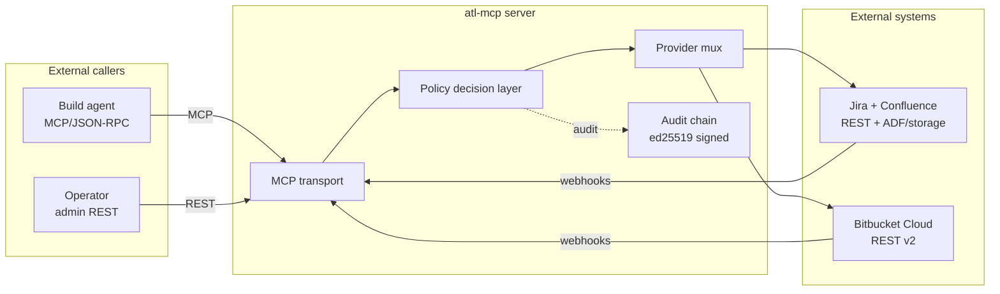
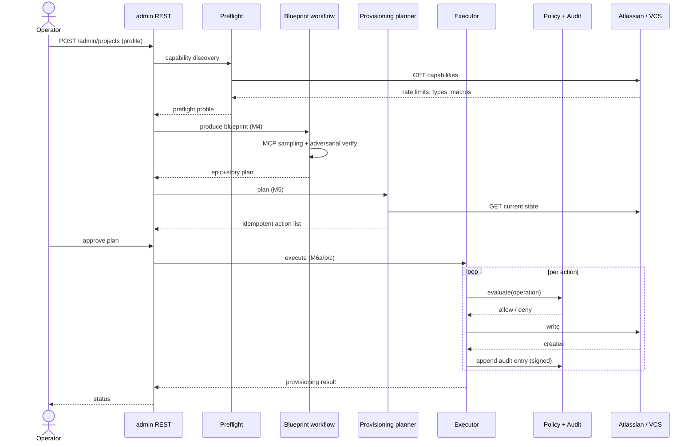
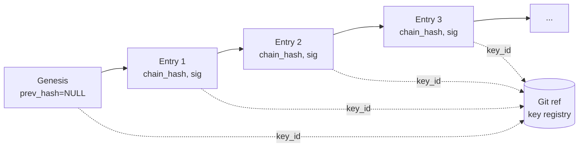

# Architecture Overview

> **Mirror of the Confluence centerpiece page** at [`ACO/Architecture Overview`](https://lateapexllc.atlassian.net/wiki/spaces/ACO).
> **TL;DR:** atl-mcp is an MCP server that ingests project requirements and emits agent-ready Jira + Confluence + Bitbucket workspaces. It runs on a dual-port HTTP transport (admin REST on one port, MCP streamable HTTP on the other — v6 §22). Storage is Postgres in production and pglite in development (ADR-0001). Writes are gated by a policy decision layer (v6 §7.2) and recorded in a hash-chained ed25519-signed audit log (v6 §30.1).

---

## System context

The system has three trust boundaries: **external callers → server → external systems**. Each boundary has explicit auth + audit obligations.

```
              External callers                         External systems
              ----------------                         ----------------
                Build agent                            Jira / Confluence
                    |   (MCP/JSON-RPC)                    ^
                    v                                     |
        +-----------+-----------+                         |
        |     atl-mcp server     |                        |
        |   .---------------.    |   REST + ADF/storage   |
        |   | MCP transport |    |---------+              |
        |   '---------------'    |          \             |
        |        |               |           \            |
        |        v               |            v           |
        |   .---------------.    |        Bitbucket       |
        |   | Policy layer  |    |        (REST v2)       |
        |   '---------------'    |            ^           |
        |        |               |            |           |
        |        v               |            |           |
        |   .---------------.    |            |           |
        |   | Provider mux  |----------------+           |
        |   '---------------'    |                        |
        |        |               |                        |
        |        v               |                        |
        |   .---------------.    |                        |
        |   | Audit chain   |    |                        |
        |   |   (ed25519)   |    |                        |
        |   '---------------'    |                        |
        +------------------------+
                ^
                |   (admin REST)
            Operator
```

Mermaid version (renders in GitHub markdown):



### Trust boundaries

1. **External callers → server.** Build agents authenticate at MCP session start. Operators authenticate via admin REST. Both auth flows live in `src/mcp/sessionCapabilities.ts` and the (separate, non-MCP) admin REST handlers.
2. **Server → external systems.** Atlassian uses API token or OAuth 3LO ([`src/providers/atlassian/auth/`](../../src/providers/atlassian/auth/), v6 §20). Bitbucket uses app password or OAuth (ADR-0004). Tokens are encrypted at rest ([`src/security/tokenEncryption.ts`](../../src/security/tokenEncryption.ts), ADR-0002) and held only in memory during request signing.
3. **Audit boundary.** Every state-changing operation crosses this boundary. Anything that mutates external systems generates an audit entry ([`src/storage/schema/auditEntries.ts`](../../src/storage/schema/auditEntries.ts), v6 §30.1, ADR-0005), signed and chained.

---

## Dataflow: requirement → provisioned workspace



The flow:

1. **Intake.** Operator provides a project profile (structured JSON or markdown). The server validates against the `ProjectProfile` schema in [`src/domain/projectProfile.ts`](../../src/domain/projectProfile.ts).
2. **Preflight.** Capability discovery runs against the live Atlassian + VCS targets to produce a preflight profile ([`src/preflight/preflightWorkflow.ts`](../../src/preflight/preflightWorkflow.ts)). Failures here block downstream work.
3. **Blueprint.** The blueprint workflow (M4) turns the profile into an epic-and-story plan via MCP sampling (v6 §23). Output validated by an adversarial verification triplet (v6 §18.1).
4. **Plan.** The provisioning planner diffs the blueprint against the live workspace state to produce an ordered, idempotent action list (v6 §18, milestone M5).
5. **Execute.** The Jira executor (M6a) runs first — it's the first shippable slice. Confluence (M6b) and VCS (M6c) follow.
6. **Audit.** Every executor wraps its writes in `policyDecisionLayer.evaluate()` + `auditEntries.append()`. The audit chain is verifiable post-hoc.

---

## Audit chain (the architecturally interesting part)



For each entry:

- `prev_hash = SHA-256(canonical JSON of previous entry, including its signature)`.
- `payload_hash = SHA-256(canonical JSON of this entry's payload)`.
- `chain_hash = SHA-256(prev_hash || payload_hash)`.
- `signature = ed25519_sign(active_signing_key, chain_hash)`.
- `key_id` references a row in the git-ref-versioned key registry.

Genesis: `prev_hash = NULL`, signed identically. Verifier handles it as a special case.

Verifier walks the chain in order, recomputes each `chain_hash`, validates each `signature` against the key registered for that `key_id` at the relevant git-ref commit. Any mismatch surfaces with the failing entry id and the specific failure mode.

Full design: [ADR-0005](../adr/0005-audit-signing-pipeline.md), v6 §30.1, the Confluence [Audit Chain Design](https://lateapexllc.atlassian.net/wiki/spaces/ACO) page.

Implementation: [`src/storage/schema/auditEntries.ts`](../../src/storage/schema/auditEntries.ts).

---

## Key tradeoffs

| Decision | Alternative | Why we chose it | Cost |
|---|---|---|---|
| ADF as default Confluence body format ([ADR-0003](../adr/0003-confluence-storage-default-adf-flagged.md)) | storage format only | JSON validates and round-trips cleanly | Dual renderer with ongoing maintenance |
| Bitbucket app-password ([ADR-0004](../adr/0004-bitbucket-app-password-vs-oauth.md)) | OAuth 2.0 only | Simpler ops; no refresh races | Per-user tokens; manual rotation |
| pglite for dev ([ADR-0001](../adr/0001-pglite-for-dev.md)) | sqlite or full Postgres locally | Real Postgres semantics, zero-config | One more abstraction in dev path |
| @noble/ciphers for token encryption ([ADR-0002](../adr/0002-token-encryption-noble-ciphers.md)) | Node crypto, libsodium-wrappers | Audited primitives, pure-JS, no native build | Slightly slower than native |
| Hash-chain + ed25519 audit ([ADR-0005](../adr/0005-audit-signing-pipeline.md)) | append-only with periodic snapshots | Tamper-evident with cheap verification | Single-tenant baked in; multi-tenant requires refactor (v6 §7.3) |
| Single-message Task dispatch for parallel sub-agents | independent message-per-Task | Claude Code only parallelizes within a single message | Documentation overhead in CLAUDE.md |
| `lint:no-stdout` enforced in CI | trust convention | Protocol-level invariant must be tooling, not vibes (Incident A) | Custom lint to maintain |

---

## Where things live in the repo

| Concern | Path |
|---|---|
| MCP transport | [`src/mcp/`](../../src/mcp/) |
| Domain types | [`src/domain/`](../../src/domain/) (18 files) |
| Storage | [`src/storage/`](../../src/storage/) (schema, migrations, repositories) |
| Atlassian providers | [`src/providers/atlassian/`](../../src/providers/atlassian/) |
| VCS provider | [`src/providers/vcs/`](../../src/providers/vcs/) |
| Security primitives | [`src/security/`](../../src/security/) |
| Observability | [`src/observability/logger.ts`](../../src/observability/logger.ts) |
| Preflight | [`src/preflight/preflightWorkflow.ts`](../../src/preflight/preflightWorkflow.ts) |
| Build prompts (per milestone) | v6 §29 prompts 1–13 |
| ADRs | [`docs/adr/`](../adr/) (10 records) |
| Demo seeds | [`scripts/demo/seed-jira.py`](../../scripts/demo/seed-jira.py), [`scripts/demo/seed-confluence.py`](../../scripts/demo/seed-confluence.py) |

---

## What's out of scope (v1)

- **Multi-tenant.** The audit chain and key registry are single-tenant by design. Multi-tenant runway documented in v6 §7.3.
- **Persistent agent memory across sessions.** Deferred (v6 §4 non-goals; see [`docs/partners/hindsight.md`](../partners/hindsight.md)).
- **GitHub / GitLab / Linear.** Bitbucket only in v1 (v6 §3).
- **Bitbucket Data Center / Server.** Cloud only in v1 (v6 §3).
- **OpenAPI codegen for the admin REST API.** Hand-typed for v1 (v6 §40 F-151).

---

## Linked artifacts

- **Spec:** v6 §2, §7, §10, §14, §18, §19, §22, §30
- **ADRs:** [0001](../adr/0001-pglite-for-dev.md), [0002](../adr/0002-token-encryption-noble-ciphers.md), [0003](../adr/0003-confluence-storage-default-adf-flagged.md), [0004](../adr/0004-bitbucket-app-password-vs-oauth.md), [0005](../adr/0005-audit-signing-pipeline.md), [0006](../adr/0006-operator-control-plane-admin-mcp-tools.md), [0007](../adr/0007-project-scoped-persistent-agent-memory.md), [0008](../adr/0008-frontend-plus-mcp-shared-workflow.md), [0009](../adr/0009-github-v1-after-bitbucket-parity.md)
- **Code:** see "Where things live" above.
- **Jira:** [PCO-1](https://lateapexllc.atlassian.net/browse/PCO-1) (Runtime), [PCO-2](https://lateapexllc.atlassian.net/browse/PCO-2) (Domain+Storage), [PCO-3](https://lateapexllc.atlassian.net/browse/PCO-3) (Atlassian providers), [PCO-4](https://lateapexllc.atlassian.net/browse/PCO-4) (VCS), [PCO-7](https://lateapexllc.atlassian.net/browse/PCO-7) (Audit+Policy), flagship [PCO-9](https://lateapexllc.atlassian.net/browse/PCO-9) (audit chain implementation).

*Last reviewed: 2026-04-27 by Chris.*
