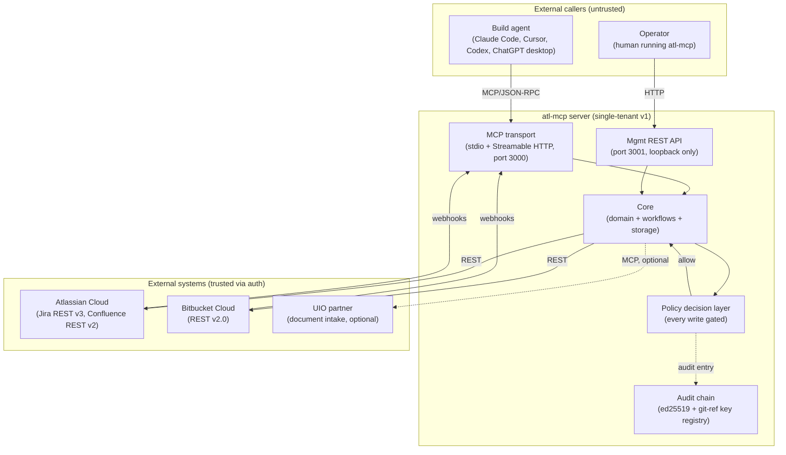

# Architecture Overview — C4 Level 1 (System Context)

> **TL;DR:** atl-mcp is an MCP server that ingests project requirements and emits agent-ready Jira + Confluence + Bitbucket workspaces. It runs on a dual-port HTTP transport, gates writes through a policy decision layer, and records every state change in a tamper-evident audit log. Three trust boundaries: external callers → server → external systems. Single-tenant in v1; multi-tenant runway is documented but not implemented.

This is the system-context view (C4 Level 1). Containers (L2) live in [`containers.md`](containers.md). Module-level design (L3) lives in [`../04-design/module-*.md`](../04-design/).

---

## System context diagram

## What's inside, in one paragraph

atl-mcp is a TypeScript Node.js process. It binds two TCP ports: 3000 for the MCP server (stdio transport also supported), and 3001 (loopback) for the management REST API (`/healthz`, `/readyz`, `/metrics`). Its core domain logic lives in `src/domain/` (18 typed entities). Persistent state lives in Postgres (production) or pglite (development); the schema is in `src/storage/schema/` with versioned migrations in `src/storage/migrations/`. Every state-changing call passes through the policy decision layer in `src/security/policyDecisionLayer.ts`, and every state change appends an audit entry to a hash-chained, ed25519-signed log (`src/storage/schema/auditEntries.ts`). The server talks to Atlassian and Bitbucket via REST clients in `src/providers/`, and consumes optional partner integrations (UIO for document intake) over MCP.

## The three trust boundaries

The system has exactly three trust boundaries. Every byte that crosses one of them carries explicit auth and audit obligations. Full detail in [`trust-boundaries.md`](trust-boundaries.md).

### Boundary 1: External callers → server

| Caller | Auth at session start | Audit obligation |
|---|---|---|
| Build agent (MCP/JSON-RPC over stdio or HTTP) | Capability negotiation per v6 §2.2; session-level credentials | Session-open events recorded |
| Operator (admin REST on port 3001) | Loopback-only by default; auth headers when bound to non-loopback | Operator actions recorded |
| Webhook ingress (Atlassian / Bitbucket) | HMAC-SHA256 per source ([`../06-security/webhook-verification.md`](../06-security/webhook-verification.md)) | Each delivery logged |

### Boundary 2: Server → external systems

| System | Auth | Token storage | Audit obligation |
|---|---|---|---|
| Atlassian (Jira + Confluence) | API token or OAuth 3LO | Encrypted at rest ([ADR-0002](../../adr/0002-token-encryption-noble-ciphers.md)) | Every write generates an audit entry; refusals also audited |
| Bitbucket | App password ([ADR-0004](../../adr/0004-bitbucket-app-password-vs-oauth.md)) or OAuth 2.0 | Encrypted at rest | Every write generates an audit entry |
| UIO (optional partner) | Partner-specific (MCP socket) | Per-partner credentials | Reads recorded if access cache miss |

### Boundary 3: Audit boundary (cross-cutting)

Every state-changing operation crosses this boundary. Reads of policy-relevant data also cross it.

- **Audit chain:** `src/storage/schema/auditEntries.ts`. Hash-linked, ed25519-signed, key registry in a git ref ([ADR-0005](../../adr/0005-audit-signing-pipeline.md)). v6 §30.1.
- **Policy decision layer:** `src/security/policyDecisionLayer.ts`. Default deny; explicit allow rules in adapters.
- **Failure mode:** if the audit chain cannot accept a write (DB down, key registry unreachable), the operation **fails closed**. v6 §30.1.

## Architectural style decisions

The big calls. Each has either an ADR (linked) or a v6 §-reference; this section is a roll-up, not a redesign.

| Decision | Choice | Why | Cost |
|---|---|---|---|
| Server style | Orchestration MCP, not API wrapper | v6 §2: agents work better with high-level intent than tool-by-tool wiring | More server-side logic to maintain |
| Transport | Dual: stdio + Streamable HTTP | v6 §22: stdio for embedded, HTTP for managed deployments | Two transport code paths |
| Bind topology | Dual-port (3000 MCP, 3001 mgmt) | open-edison F-130; firewall rules trivial | Two ports to expose |
| Storage | Postgres in prod, pglite in dev | [ADR-0001](../../adr/0001-pglite-for-dev.md): real Postgres semantics in dev | One more abstraction in dev |
| Confluence body format | ADF default with storage flag | [ADR-0003](../../adr/0003-confluence-storage-default-adf-flagged.md): ADF round-trips, storage needed for legacy macros | Dual-renderer, two test paths |
| VCS auth | Bitbucket app password | [ADR-0004](../../adr/0004-bitbucket-app-password-vs-oauth.md): simpler ops, no OAuth refresh races | Manual rotation procedure |
| Token storage | xchacha20poly1305 envelope | [ADR-0002](../../adr/0002-token-encryption-noble-ciphers.md): audited primitives, no native deps | Master-key rotation drill |
| Audit chain | Hash-chain + ed25519 + git-ref key registry | [ADR-0005](../../adr/0005-audit-signing-pipeline.md): tamper-evident with cheap verification | Single-tenant baked in |
| MCP tool design | Tool-collapse pattern (one tool, action enum) | v6 §14: bounded surface area | Fatter tool schemas |
| Test discipline | Iron laws: verify-before-claim, test-first | F-106 (superpowers) | Slower than vibes-driven |

Cross-cutting tradeoffs that don't have an individual ADR live in [`tradeoffs.md`](tradeoffs.md).

## What's NOT shown (intentionally)

- **Internal storage / vector store / embedding service** — single Postgres in v1; vector retrieval is post-v1 (v6 §25).
- **Multi-tenant routing** — single-tenant in v1; multi-tenant runway in v6 §7.3.
- **CDN / load balancer** — single-process v1 deployment.
- **Service mesh / sidecar** — overkill for single-process.
- **GitHub / GitLab / Linear** — explicitly out of scope (v6 §3).

## Where the rest of the architecture lives

| L | Where | What |
|---|---|---|
| L1 | this doc | System context: callers, server, external systems, trust boundaries |
| L2 | [`containers.md`](containers.md) | Containers: ports, processes, stores, message queue |
| L3 | [`../04-design/module-*.md`](../04-design/) (10 modules) | Per-module HLD/LLD |
| Sequence | [`../04-design/sequence-diagrams.md`](../04-design/sequence-diagrams.md) | 8 mermaid sequence diagrams for key flows |
| Data | [`../05-data/schema.md`](../05-data/schema.md) | ER diagram + tables |
| Trust boundaries | [`trust-boundaries.md`](trust-boundaries.md) | Detail per boundary |
| Tradeoffs | [`tradeoffs.md`](tradeoffs.md) | Cross-cutting register |
| Dataflow | [`data-flow.md`](data-flow.md) | End-to-end requirement → workspace |

## Linked artifacts

- **Spec:** v6 §2 (Strategic design), §7 (HLA), §22 (Transport), §30 (Audit)
- **ADRs:** [ADR-0001](../../adr/0001-pglite-for-dev.md), [ADR-0002](../../adr/0002-token-encryption-noble-ciphers.md), [ADR-0003](../../adr/0003-confluence-storage-default-adf-flagged.md), [ADR-0004](../../adr/0004-bitbucket-app-password-vs-oauth.md), [ADR-0005](../../adr/0005-audit-signing-pipeline.md)
- **Code:** `src/mcp/`, `src/domain/`, `src/storage/`, `src/providers/`, `src/security/`, `src/observability/`, `src/preflight/`
- **Demo mirror (reviewer audience):** [`docs/demo/architecture.md`](../../demo/architecture.md) (canonical = this doc)
- **Charter:** [`../01-charter/README.md`](../01-charter/README.md)

---

*Last reviewed: 2026-04-25 by Chris.*
