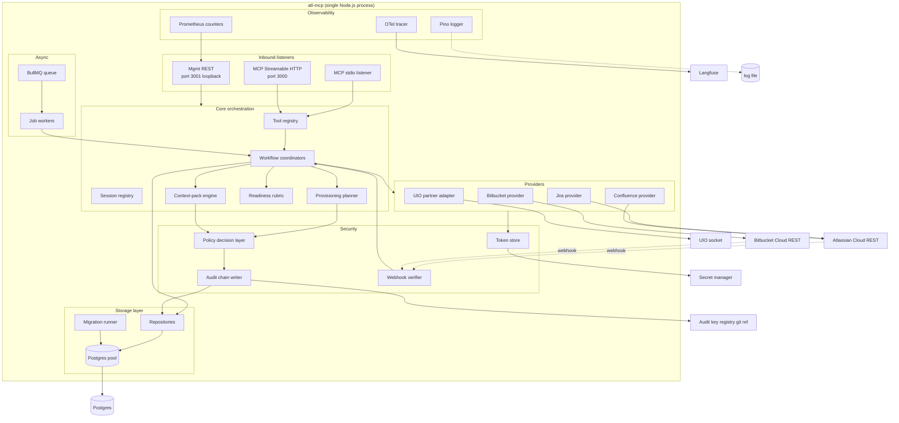

# C4 Level 2 — Containers

> **TL;DR:** atl-mcp is a single Node.js process listening on two ports plus an outbound Postgres connection plus optional MCP-partner adapters. The "containers" in C4 sense are: the MCP transport listener, the mgmt REST listener, the worker pool, the storage layer, the audit chain, and the provider mux. Single deployable; logical separation.

L1 (system context) is in [`README.md`](README.md). L3 (per-module design) is in [`../04-design/module-*.md`](../04-design/).

---

## Container diagram

## Containers

### MCP transport (stdio + Streamable HTTP)

- **Code:** `src/mcp/`.
- **Inbound:** stdio (when started with stdin/stdout) AND HTTP on port 3000.
- **What it does:** terminates MCP, performs capability negotiation, dispatches tool calls to the tool registry.
- **Owns:** session state per session.
- **Spec:** v6 §22 (transport).

### Mgmt REST (port 3001, loopback)

- **Code:** `src/server/mgmtApi/`.
- **Inbound:** HTTP on port 3001 (loopback by default).
- **What it does:** health checks, metrics, operator-control endpoints.
- **Owns:** nothing persistent; just exposes state.

### Tool registry + dispatcher

- **Code:** `src/mcp/toolRegistry.ts`, `src/mcp/registerTools.ts`, `src/mcp/tools/`.
- **What it does:** registers MCP tools (gated by feature flags), dispatches calls to handlers.
- **Owns:** tool metadata, dispatch table.

### Session registry

- **Code:** `src/mcp/sessionCapabilities.ts` (and a session-store).
- **What it does:** tracks active MCP sessions, their TTLs, their declared capabilities.
- **Owns:** session table (in-memory + DB-mirrored for HTTP transport).

### Workflow coordinators

- **Code:** `src/workflows/`.
- **What it does:** orchestrates multi-step operations (intake → blueprint, plan → execute, etc.). Calls into providers, storage, audit chain.
- **Owns:** workflow state machines (PHASE-STATE.json per v6 §6.1).

### Provisioning planner

- **Code:** `src/planning/`.
- **What it does:** turns a blueprint into an idempotent action list against live state.
- **Owns:** `ArtifactPlan` schema and rendering.

### Context-pack engine

- **Code:** `src/context/`.
- **What it does:** generates token-budgeted, classification-aware context packs for build agents.
- **Owns:** packs in `contextPacks` table.

### Readiness rubric

- **Code:** `src/validation/` + `src/workflows/`.
- **What it does:** computes the deterministic 6-category score + invokes the LLM-judged 4-tier verdict.
- **Owns:** `readinessReports` table.

### Storage layer

- **Code:** `src/storage/`.
- **What it does:** schema, migrations (with rehearsal), repositories with tenant-scope enforcement.
- **Owns:** the Postgres connection pool.

### Security: policy, audit, tokens, webhooks

- **Code:** `src/security/`.
- **What it does:** policy decisions, audit-chain writes, token sealing/opening, webhook signature verification.
- **Owns:** the audit chain integrity. Reads/writes the audit key registry (git ref) at signing time.

### Providers (Atlassian, VCS, UIO)

- **Code:** `src/providers/`.
- **What it does:** abstracts external systems behind a uniform interface. Handles auth, retry, pagination, ADF/storage rendering, etc.
- **Owns:** outbound HTTP clients.

### Async (BullMQ queue + workers)

- **Code:** `src/queue/`.
- **What it does:** background processing for long-running provisioning jobs (M6+).
- **Owns:** the job queue (Redis-backed when configured).

### Observability

- **Code:** `src/observability/`.
- **What it does:** pino logger (file destination), Prometheus counters (exposed at `/metrics`), OpenTelemetry tracer (Langfuse export).
- **Owns:** the log file path; counter registrations; tracer config.

## Why one process

Single-tenant v1 doesn't justify multi-process orchestration. Pros:

- Simpler ops.
- No inter-process communication overhead.
- Lower ops complexity.
- Easier reasoning about race conditions.

Cons (accepted):

- No process-level isolation between containers.
- A single OOM takes down everything.
- Vertical scale only.

When v2 / multi-tenant lands, some of these containers may split out (the queue worker as a separate process is the obvious candidate).

## Inter-container communication

Inside the process: direct function calls. No internal RPC; no message bus. Everything is in-process TypeScript.

This means:

- Shared mutable state is in JavaScript memory; concurrency is via the event loop, not preemptive threading.
- Errors propagate through normal Node async/await semantics.
- Trace context is propagated via async-local-storage (when implemented in M11).

## What's NOT a container (in C4 sense)

- Logging file path (it's a sink, not a container).
- Audit key registry (external git ref; out of process).
- Atlassian / Bitbucket / UIO (external systems).
- Postgres (external system, even though tightly coupled).

## Linked artifacts

- **Parent (L1):** [`README.md`](README.md)
- **Per-module (L3):** [`../04-design/module-*.md`](../04-design/)
- **Sequence diagrams:** [`../04-design/sequence-diagrams.md`](../04-design/sequence-diagrams.md)
- **Spec:** v6 §7, §8 (repo structure), §22 (transport)
- **Code root:** [`../../../src/`](../../../src/)

---

*Last reviewed: 2026-04-25 by Chris.*
