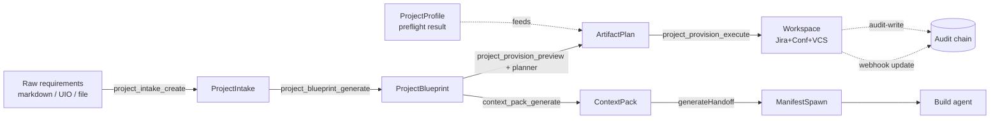

# Data Flow — End to End

> **TL;DR:** Requirement → preflight → blueprint → plan → execute → audit → context → handoff. Each step has a typed output that becomes the next step's input. Audit entries fire at every state-changing transition. Webhooks loop back to update graph state in real time. The flow is captured here at L2 (data-shape) granularity; per-flow sequence diagrams in [`../04-design/sequence-diagrams.md`](../04-design/sequence-diagrams.md).

This doc is the "what data shape moves where" view.

---

## End-to-end pipeline

Domain types as transitions:

| From | Tool | To |
|---|---|---|
| `string` (raw markdown) | `project_intake_create` | `ProjectIntake` (sourcePins[]) |
| `ProjectIntake` | `project_blueprint_generate` (sampling) | `ProjectBlueprint` |
| (target Jira/Confluence/VCS) | `project_preflight_check` | `ProjectProfile` |
| `ProjectBlueprint` + `ProjectProfile` | `project_provision_preview` | `ArtifactPlan` |
| `ArtifactPlan` (approved) | `project_provision_execute` | `(provisionJobId, async outcome)` |
| `ProjectBlueprint` (+ context settings) | `context_pack_generate` | `ContextPack` |
| Ready project | `readiness_validate` | `ReadinessReport` |
| Ready project | `generateHandoff` | `ManifestSpawn` |
| Atlassian/Bitbucket event | `ingestWebhook` | `GraphChangeEvent` |

## Stage-by-stage

### Stage 1: Intake

**Input:** raw content (markdown / UIO file / pasted text). Includes `name`, `key`, `source`.
**Output:** `ProjectIntake` row in `projects` table; `sourcePins[]` recorded so future references can trace back.
**Side effects:** new project state machine started; `ProjectState = INTAKE_RECEIVED`. Audit entry `"project.intake.create"`.

### Stage 2: Preflight (parallel to intake)

**Input:** target Jira project key, target Confluence space key, optional Bitbucket workspace + repo.
**Output:** `ProjectProfile` row in `projectProfiles` (with TTL).
**Side effects:** none in target systems (read-only). Audit entry `"project.preflight.run"`.

Preflight can run before, during, or after intake. The blueprint workflow + planner consume both.

### Stage 3: Blueprint

**Input:** `ProjectIntake` (latest).
**Tool:** `project_blueprint_generate` (with `useSampling: true` invokes the LLM sampling provider chain).
**Output:** `ProjectBlueprint` (composed of intake, requirements[], features[], epics[], blueprintExtras: {architecture, security/privacy, testing, release}).
**Validation:** adversarial verification triplet (v6 §18.1) before persisting.
**Side effects:** `ProjectState = BLUEPRINT_DRAFTED` → `BLUEPRINT_VALIDATED`. Audit entry per draft + per validation outcome.

### Stage 4: Plan

**Input:** `ProjectBlueprint` + `ProjectProfile`.
**Tool:** `project_provision_preview`.
**Output:** `ArtifactPlan` — ordered list of operations against Jira / Confluence / VCS, marked with idempotency keys + dependency relationships.
**Side effects:** `ProjectState = PROVISIONING_PLANNED` → `PROVISIONING_PREVIEWED`. No external writes. Audit entries.

### Stage 5: Execute

**Input:** `ArtifactPlan` (with `approved: true` and `approvalEvidence`).
**Tool:** `project_provision_execute`.
**Output:** asynchronous; returns `provisionJobId` + a polling URI.
**Side effects:** Jira issues / Confluence pages / Bitbucket branches actually written. Each write generates an audit entry. `ProjectState = PROVISIONING_EXECUTED`.

The execute step is the only stage that writes to external systems.

### Stage 6: Context pack (post-provision)

**Input:** `ProjectBlueprint` (+ optional `issueKey` for issue-specific context).
**Tool:** `context_pack_generate`.
**Output:** `ContextPack` — bounded, redacted, model-targeted.
**Validation:** classification + token budget enforced.
**Side effects:** row in `contextPacks` keyed by `regenerationKey`.

Re-fetching a previously-generated pack: `context_get(regenerationKey)`. Idempotent.

### Stage 7: Readiness validation

**Input:** project state (post-provision).
**Tool:** `readiness_validate`.
**Output:** `ReadinessReport` with deterministic 6-category score + LLM-judged 4-tier verdict.
**Side effects:** `ProjectState = READINESS_CHECKED`. Audit entry.

### Stage 8: Handoff

**Input:** project + a specific issue + objective + acceptance criteria.
**Tool:** `generateHandoff`.
**Output:** `ManifestSpawn` for an MCP-host build agent.
**Side effects:** `ProjectState = READY_FOR_BUILD`. Audit entry.

### Stage 9: Build (external)

The build agent now runs against the workspace. Build agent's actions land in Jira / Confluence / Bitbucket via normal workflows. Webhooks loop those changes back.

### Stage 10: Webhook ingestion (continuous)

**Input:** signed webhook delivery from Atlassian / Bitbucket.
**Tool:** internal `ingestWebhook`.
**Output:** `GraphChangeEvent`; possibly state-machine transition (e.g., `DRIFT_DETECTED` if external state diverges from blueprint).
**Side effects:** dedup row; audit entry; resource subscription notifications.

---

## Trust boundary crossings (data-flow view)

| Stage | Crosses boundary | Auth |
|---|---|---|
| Stage 1 (intake) | external→server | session capability |
| Stage 2 (preflight) | server→Atlassian/VCS | API token / OAuth / app password |
| Stage 3 (blueprint) | server→sampling provider (external LLM) | provider auth |
| Stage 4 (plan) | server→Atlassian/VCS (read-only) | same as 2 |
| Stage 5 (execute) | server→Atlassian/VCS (writes!) | same as 2 |
| Stage 6 (context pack) | internal | n/a |
| Stage 7 (readiness) | internal + sampling | provider auth |
| Stage 8 (handoff) | internal | n/a |
| Stage 9 (build) | external→external | not our concern |
| Stage 10 (webhook) | external→server | HMAC signature |

Every stage that crosses a boundary outward emits an audit entry. Every stage that crosses inward verifies auth.

## Failure paths

| Stage | Failure mode | Result |
|---|---|---|
| Intake | Validation failure | `INTAKE_RECEIVED` → `VALIDATION_FAILED` |
| Preflight | Auth / network | warnings array; can retry |
| Blueprint | Adversarial validation fails | `BLUEPRINT_DRAFTED` → `VALIDATION_FAILED` |
| Plan | Diff conflicts | warnings; preview shows expected diffs |
| Execute | Mid-execution failure | partial; idempotent re-run completes the rest |
| Webhook | Signature invalid | rejected with audit entry |

## Linked artifacts

- **Spec:** v6 §5 (core user flow), §6 (state machine), §10 (domain model)
- **Per-flow sequence:** [`../04-design/sequence-diagrams.md`](../04-design/sequence-diagrams.md)
- **Sibling architecture:** [`README.md`](README.md), [`containers.md`](containers.md), [`trust-boundaries.md`](trust-boundaries.md)
- **Module designs:** [`../04-design/module-workflows.md`](../04-design/module-workflows.md)
- **Domain types:** [`../05-data/domain-model.md`](../05-data/domain-model.md)

---

*Last reviewed: 2026-04-25 by Chris.*
