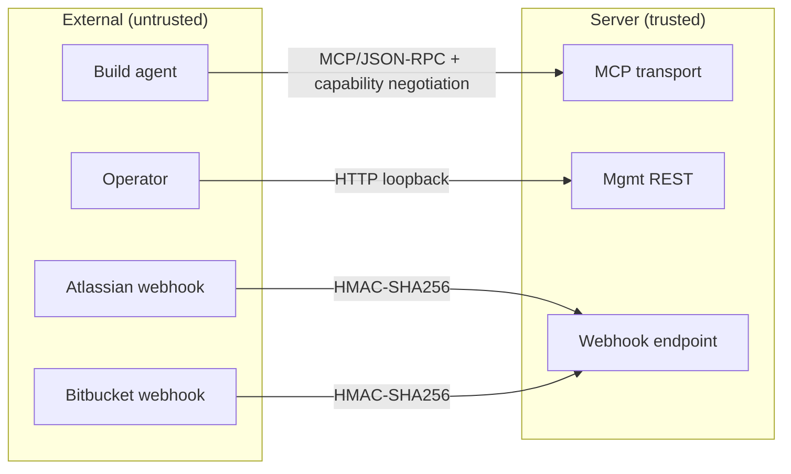
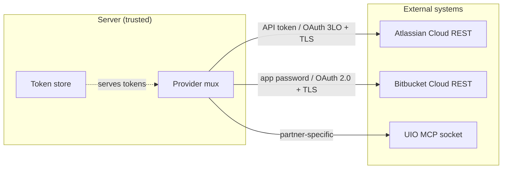
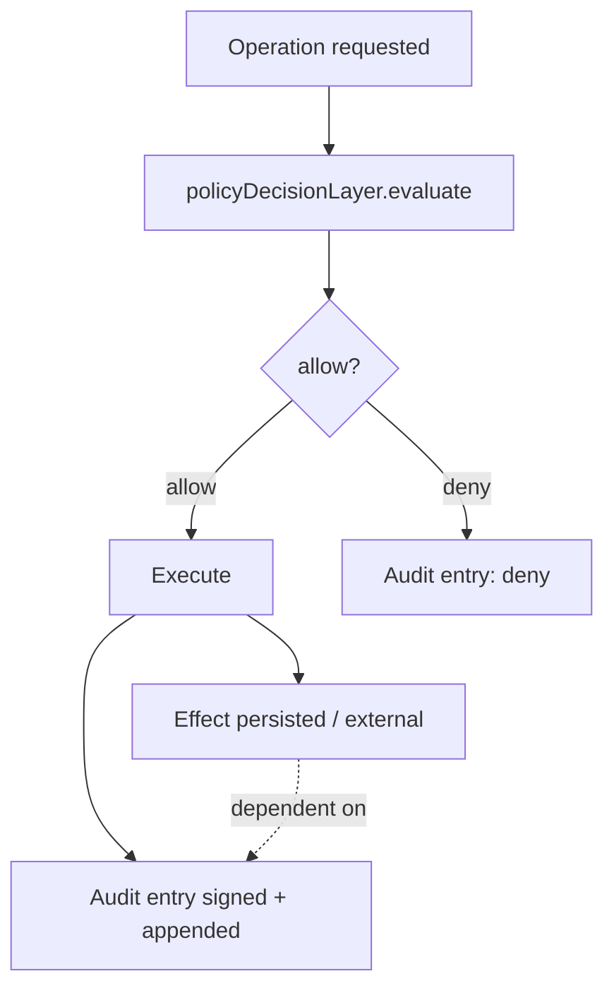

# Trust Boundaries

> **TL;DR:** Three boundaries. (1) External callers → server: auth at session start; webhooks signed. (2) Server → external systems: tokens encrypted; outbound TLS; provider-specific auth. (3) Audit boundary (cross-cutting): every state change generates a signed entry; failures fail closed. Per-boundary auth + audit obligations are non-negotiable. The threat model in [`../06-security/threat-model.md`](../06-security/threat-model.md) operationalizes these.

The trust-boundary discipline: anywhere data crosses one of these lines, the responsible code is named, the auth method is named, and the audit obligation is named.

---

## Boundary 1: External callers → server

### Boundary 1 — Build agent → MCP transport

- **Auth:** capability negotiation per v6 §2.2; session-bound credentials.
- **Code:** [`src/mcp/sessionCapabilities.ts`](../../../src/mcp/sessionCapabilities.ts).
- **Audit obligation:** session-open and session-close events recorded; per-tool-call audit entries.
- **Threat:** T-1101 (spoofing), T-1102 (replay), T-1107 (payload injection). [`../06-security/threat-model.md`](../06-security/threat-model.md).

### Boundary 1 — Operator → mgmt REST

- **Auth:** loopback by default (`MGMT_API_HOST=127.0.0.1`); auth headers required if non-loopback. Loopback warns at startup if non-loopback in non-dev tier.
- **Code:** [`src/server/mgmtApi/`](../../../src/) (mgmt API handlers).
- **Audit obligation:** every operator-initiated state change is audited.
- **Threat:** T-1106 (DoS), T-1108 (privilege escalation).

### Boundary 1 — Webhook ingress

- **Auth:** HMAC-SHA256 signature verified before body parsing. Per-source shared secret in `encryptedTokens`. See [`../06-security/webhook-verification.md`](../06-security/webhook-verification.md).
- **Code:** [`src/security/webhookSignatures.ts`](../../../src/security/webhookSignatures.ts).
- **Audit obligation:** every delivery (valid or invalid signature, duplicate or new) is audited.
- **Threat:** T-1103 (forge), T-1104 (replay).

## Boundary 2: Server → external systems

### Boundary 2 — Atlassian Cloud

- **Auth:** API token (default) or OAuth 3LO (per ADR-0002 / v6 §20).
- **Token storage:** XChaCha20-Poly1305 envelope encryption (ADR-0002).
- **Code:** [`src/providers/atlassian/auth/`](../../../src/providers/atlassian/auth/).
- **Audit obligation:** every state-changing call to Atlassian generates an audit entry.
- **Threat:** T-2201 (token exfil), T-2204 (forge response), T-2205 (rate limit), T-2206 (wrong project).

### Boundary 2 — Bitbucket Cloud

- **Auth:** App password (per ADR-0004) or OAuth 2.0.
- **Code:** [`src/providers/vcs/bitbucket/`](../../../src/providers/vcs/bitbucket/).
- **Audit obligation:** every state-changing call generates an audit entry.

### Boundary 2 — UIO partner (optional)

- **Auth:** UIO MCP socket; partner-specific.
- **Code:** UIO adapter.
- **Audit obligation:** reads recorded if access cache miss; partner contract.

## Boundary 3: Audit boundary (cross-cutting)

This isn't a boundary in the network sense — it's the policy layer that gates every state change. Every operation that crosses Boundary 1 or 2 inward (state-changing direction) also crosses the audit boundary.

### Boundary 3 — Policy decision layer

- **Code:** [`src/security/policyDecisionLayer.ts`](../../../src/security/policyDecisionLayer.ts).
- **What:** every state-changing operation passes through `evaluate()`. Returns `effect` + obligations + confidence.
- **Adapter:** v1 has the code-policy adapter; future adapters (OPA, Cedar) plug in behind the same interface.
- **Threat:** T-PDL-* in [`../06-security/policy-decision-layer.md`](../06-security/policy-decision-layer.md).

### Boundary 3 — Audit chain writer

- **Code:** [`src/storage/schema/auditEntries.ts`](../../../src/storage/schema/auditEntries.ts) + repositories.
- **What:** hash-linked, ed25519-signed log entry per state change. Genesis block special-case. Failure to write is fail-closed (operation aborts).
- **Threat:** T-3302 (forge), T-3303 (key compromise), T-3304 (registry compromise), T-3305 (silent fail).

## What the boundaries protect

Each boundary protects different invariants:

- **B1:** Identity / authenticity of the caller. Are you who you say you are? Did your message arrive intact?
- **B2:** Confidentiality of credentials. The server has tokens; nothing outside the server's encrypted memory should see them in plaintext.
- **B3:** Integrity of operations. Every state change is policy-gated and audit-recorded; nothing happens silently.

A failure at any boundary is a security incident. The threat model categorizes failures by boundary.

## Where the boundaries are NOT

It's worth being explicit about what's NOT a trust boundary, to avoid over-protecting:

- **Inside the server, between modules.** All in-process TypeScript; no internal RPC; no per-module auth. Modules trust each other (defense in depth is at the storage + audit layer, not inter-module).
- **Inside the audit chain entries' payload.** Once signed, the entry is trusted — no further signing of sub-fields.
- **Inside the database.** Postgres rows are trusted by the application (the application owns the schema). Tampering at the DB level is its own threat (T-3302, captured in the audit chain).

These non-boundaries are deliberate — adding them would inflate complexity without proportional benefit.

## Boundary changes over time

When does a boundary move? When a new caller is admitted (new MCP host, new partner integration), or when a new outbound system is added.

- New inbound caller: re-evaluate B1 — does the new caller's auth method satisfy the model?
- New outbound system: re-evaluate B2 — does the new system's auth, token storage, and TLS posture satisfy?

Document any change as an ADR (`docs/adr/NNNN-...md`).

## Linked artifacts

- **Threat model:** [`../06-security/threat-model.md`](../06-security/threat-model.md)
- **Per-boundary docs:** [`../06-security/webhook-verification.md`](../06-security/webhook-verification.md), [`../06-security/token-storage.md`](../06-security/token-storage.md), [`../06-security/policy-decision-layer.md`](../06-security/policy-decision-layer.md), [`../06-security/audit-chain-threat-model.md`](../06-security/audit-chain-threat-model.md)
- **Code:** `src/security/`, `src/mcp/sessionCapabilities.ts`, `src/providers/`, `src/storage/schema/auditEntries.ts`
- **Spec:** v6 §7.2 (policy), §22 (transport), §30 (audit), §38 (lethal trifecta)

---

*Last reviewed: 2026-04-25 by Chris.*
