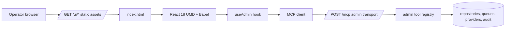

# Operator Control Plane UI Design

> **TL;DR:** The operator control plane is the browser UI for proving that Jira, Confluence, VCS, policy, audit, jobs, role-specific work orchestration, and platform administration are integrated into atl-mcp. It is generated from static React assets under `docs/control-plane/`, served from `/ui/` by the management API, and populated exclusively through loopback `admin.*` MCP tools.

## Purpose

The UI exists to make the orchestrator operator-drivable without requiring direct database access, ad hoc scripts, or raw MCP calls. It supports four operating modes:

| Mode | What the UI proves |
|---|---|
| Intake and portfolio visibility | Projects from Jira or local seed data are visible as lifecycle objects with state, blueprint, jobs, and audit context. |
| Provisioning execution | A selected project can be walked through Jira, Confluence, VCS, and handoff stages from the project detail page. |
| Operations control | Jobs, policy approvals, audit integrity, provider health, secrets, migrations, and sessions have visible operator workflows. |
| Role-specific workflow assistance | Product owners can initiate projects from descriptions and briefs; developers can classify work, assign agents, and score source content quality. |
| Enterprise governance evidence | Data provenance, data-limited gaps, and audited writes are explicit enough for review and demonstrations. |

## Boundary

The UI is intentionally not a separate SPA product. It is a management surface shipped with the orchestrator:

- Static assets live in [`docs/control-plane/`](../../../control-plane/).
- The management API mounts those assets at `/ui/` through [`src/server/uiAssets.ts`](../../../../src/server/uiAssets.ts).
- The same loopback origin exposes `/mcp` for the admin MCP transport.
- Pages call `admin.*` tools using [`docs/control-plane/mcp-client.js`](../../../control-plane/mcp-client.js) and [`docs/control-plane/use-admin.jsx`](../../../control-plane/use-admin.jsx).
- Mutating actions are routed through existing audited admin tools, not browser-local state.
- The top-navigation role lens is a frontend presentation preference only. It changes copy, ordering, and emphasis; it is not authorization and is not a data-hiding mechanism.

## Route Inventory

| Screen | Route | Component | Source file | Canonical doc |
|---|---|---|---|---|
| S0 Screen index | `#/index` | `IndexPage` | `page-index.jsx` | [`pages-core.md`](pages-core.md) |
| S1 Dashboard | `#/` and `#/dashboard` | `DashboardPage` | `page-dashboard.jsx` | [`pages-core.md`](pages-core.md) |
| S2 Project list | `#/projects` | `ProjectListPage` | `page-projects.jsx` | [`pages-core.md`](pages-core.md) |
| S3 Project detail | `#/projects/<key>` | `ProjectDetailPage` | `page-projects.jsx` | [`pages-core.md`](pages-core.md) |
| S4 Jobs | `#/jobs` | `JobsPage` | `page-jobs-policy.jsx` | [`pages-operations.md`](pages-operations.md) |
| S5 Audit | `#/audit` | `AuditPage` | `page-audit.jsx` | [`pages-operations.md`](pages-operations.md) |
| S6 Policy | `#/policy` | `PolicyPage` | `page-jobs-policy.jsx` | [`pages-operations.md`](pages-operations.md) |
| S7 Providers | `#/providers` | `ProvidersPage` | `page-tier23.jsx` | [`pages-platform-admin.md`](pages-platform-admin.md) |
| S8 Sessions / Agents | `#/sessions` | `SessionsPage` | `page-tier23.jsx` | [`pages-platform-admin.md`](pages-platform-admin.md) |
| S9 Alerts | `#/alerts` | `AlertsPage` | `page-tier23.jsx` | [`pages-platform-admin.md`](pages-platform-admin.md) |
| S10 Migrations | `#/migrations` | `MigrationsPage` | `page-tier23.jsx` | [`pages-platform-admin.md`](pages-platform-admin.md) |
| S11 Secrets | `#/secrets` | `SecretsPage` | `page-tier23.jsx` | [`pages-platform-admin.md`](pages-platform-admin.md) |
| S12 SLO | `#/slo` | `SloPage` | `page-tier23.jsx` | [`pages-platform-admin.md`](pages-platform-admin.md) |
| S13 Capacity | `#/capacity` | `CapacityPage` | `page-tier23.jsx` | [`pages-platform-admin.md`](pages-platform-admin.md) |
| S14 DR | `#/dr` | `DrPage` | `page-tier23.jsx` | [`pages-platform-admin.md`](pages-platform-admin.md) |
| S15 Settings | `#/settings` | `SettingsPage` | `page-tier23.jsx` | [`pages-platform-admin.md`](pages-platform-admin.md) |
| S16 Requirements Assist | `#/requirements-assist` | `RequirementsAssistPage` | `page-role-workflows.jsx` | [`role-workflows.md`](role-workflows.md) |
| S17 Agent Assignment | `#/agent-assignment` | `AgentAssignmentPage` | `page-role-workflows.jsx` | [`role-workflows.md`](role-workflows.md) |

Unknown routes render `NotFoundPage` from `index.html` and offer a return path to the screen index.

## Implementation Topology

The browser never reads the database directly. Every value shown in the UI comes from an admin tool response or from static UI configuration such as route labels and component layout.

## File Ownership

| File | Responsibility |
|---|---|
| `index.html` | Runtime composition, dependency loading, hash router, top-level app shell. |
| `base-styles.css` | Shared paper-warm visual tokens inherited from the visualization site. |
| `app.css` | Control-plane-specific layout, tables, cards, tabs, drawers, and responsive behavior. |
| `mcp-client.js` | MCP initialize, session reuse, JSON-RPC tool calls, SSE-framed response parsing, retry on lost session. |
| `use-admin.jsx` | React read hook, polling, pause/resume behavior, structuredContent extraction, data-limited extraction. |
| `components.jsx` | Shared UI primitives: navigation, page head, status dots, pills, modal, drawer, JSON view. |
| `data-limited.jsx` | Explicit rendering for real-but-incomplete backend data. |
| `app-tweaks.jsx`, `tweaks-panel.jsx` | Operator/demo controls for environment badge, polling cadence, and visual stress states. |
| `control-surface-model.js` | Shared role lens copy, focus cards, portfolio metrics, and agent role catalog. |
| `page-role-workflows.jsx` | Requirements Assist and Agent Assignment route-level workflows. |
| `page-*.jsx` | Page-level composition and direct admin tool wiring. |

## Data Classification

| Data class | Examples in UI | Display rule |
|---|---|---|
| Public/internal operational data | project key, state, job status, provider id, feature flag key | Display normally, prefer monospace for IDs. |
| Private business context | blueprint summaries, Jira project names, Confluence space ids, repository URLs | Display only in authenticated loopback management context; avoid copying into unaudited browser storage. |
| Secret or credential material | provider tokens, master keys, audit signing keys | Never display raw values; only logical keys, rotation status, checklist state, or signing key id. |
| Audit integrity material | audit head, previous hash, signature key id, verification result | Display with high density and monospace to support inspection and evidence capture. |

## Design Principles

- Pages must show real source-of-truth data or explicitly declare `dataLimited`.
- Every write must require an operator badge and reason when the underlying tool requires a reason.
- Dense operational views favor tables, narrow cards, and drawers over landing-page composition.
- The project detail page is the main "Jira projects are integrated" proof point: it ties a lifecycle project to blueprint, audit, jobs, transitions, and provisioning actions.
- Role-specific pages and panels must remain presentation lenses over the same admin tools, not separate privilege paths.
- Uneven card-heavy workflow panels should use packed responsive layouts so two-column rows do not add unnecessary vertical whitespace.
- The UI should be credible in a screen share without implying unimplemented backend capability.

## Linked Artifacts

- [`docs/control-plane/index.html`](../../../control-plane/index.html)
- [`docs/control-plane/STYLE-NOTES.md`](../../../control-plane/STYLE-NOTES.md)
- [`src/server/uiAssets.ts`](../../../../src/server/uiAssets.ts)
- [`src/server/mgmtApi.ts`](../../../../src/server/mgmtApi.ts)
- [`src/mcp/admin/registry.ts`](../../../../src/mcp/admin/registry.ts)
- [`docs/sdlc/04-design/control-plane-ui/role-workflows.md`](role-workflows.md)
- [`tests/integration/admin/transportAndUi.test.ts`](../../../../tests/integration/admin/transportAndUi.test.ts)
- [`tests/integration/admin/roleWorkflowTools.test.ts`](../../../../tests/integration/admin/roleWorkflowTools.test.ts)

---

*Last reviewed: 2026-04-27 by Chris.*
