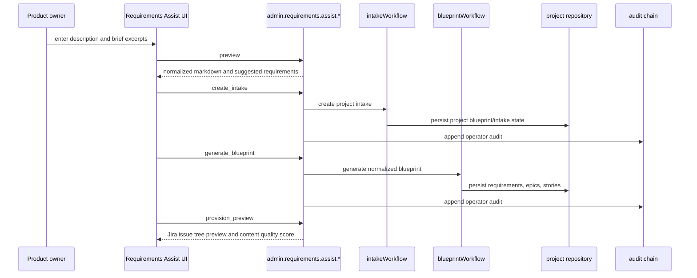

# Role Workflows

> **TL;DR:** The control plane now supports role-specific presentation lenses plus three role workflow surfaces: Requirements Assist for product owners, agent work assignment for developers, and content quality scoring for Jira/Confluence/project artifacts. The lens changes copy, ordering, and emphasis only. It is not authorization and it does not hide data as a security boundary.

## Scope

This document covers UI and admin-tool behavior added for role-aware control-plane operation:

- A persisted frontend `roleLens` preference with six internal roles.
- Requirements Assist intake, brief parsing, blueprint generation, and Jira preview surfaces.
- Agent work classification, recommendation, assignment, and assignment history surfaces.
- Content quality and trustworthiness scoring for project artifacts.
- An agent role catalog on the Agents/Sessions page, sourced from analyzed code-engine and ops-engine agent definitions.

These workflows use existing project, blueprint, provider, session, audit, and repository infrastructure. No backend authorization role model is introduced by this feature.

## Role Lens Boundary

| Role id | Label | Primary presentation emphasis |
|---|---|---|
| `customer` | Customer | Delivery status, outcomes, readiness, blockers, recent progress, Jira and Confluence links. |
| `product` | Product Owner | Requirements, Jira cards, Confluence pages, trace matrix, scope gaps, readiness gates, next planning action. |
| `scrum` | Scrum Master | Phase flow, blocked lanes, approvals, queue pressure, failed jobs, handoff readiness, aging work. |
| `developer` | Developer | Repository, checkout command, branch, context pack, handoff URI, failed logs, trace-to-file mapping, verification command. |
| `devops` | DevOps Engineer | Provider health, queue runway, agents, webhooks, transport, audit chain, retry/probe actions, runtime readiness. |
| `operator` | Operator | Broad control-plane health, queue, approvals, audit, provider, lifecycle controls. |

The first-time default is `developer`, stored through `CPTweaksProvider` in browser local tweak storage. The role lens:

- May change page titles, section labels, focus cards, metric ordering, table emphasis, and first-screen panels.
- May move operational panels lower or higher on a page.
- Must continue to call the same `admin.*` tools and preserve all existing operational detail.
- Must not be used as an access-control decision, a data redaction rule, or a backend schema discriminator.

## Requirements Assist

Requirements Assist supports the product owner workflow for turning a project description plus uploaded or pasted briefs into an orchestrator project.

| Surface | Route or panel | Purpose |
|---|---|---|
| Requirements Assist page | `#/requirements-assist` | Dedicated workflow for project initiation. |
| Project list panel | `ProjectAssistPanel` on `#/projects` | Portfolio-level entry point for creating an intake without leaving Projects. |
| Project detail Assist tab | `#/projects/<key>` tab `assist` | Project-scoped assist workflow and Jira preview context. |

### Data Path

### Admin Tools

| Tool | Read/write | Notes |
|---|---|---|
| `admin.requirements.assist.preview` | Read-only | Normalizes description and brief excerpts into markdown, suggested requirements, source count, and UIO reference count. |
| `admin.requirements.assist.create_intake` | Write | Creates a project intake from assisted text and appends audit evidence. |
| `admin.requirements.assist.generate_blueprint` | Write | Generates a normalized blueprint from the intake and appends audit evidence. |
| `admin.requirements.assist.provision_preview` | Read-only | Returns planned Jira epic/story nodes plus deterministic quality score. |

Brief text is treated as project requirements content. It inherits PRIVATE classification unless a stricter source policy applies.

## Developer Agent Assignment

Developer-facing assignment lets a human classify a story/task and choose an agent with matching specialization.

| Surface | Route or panel | Purpose |
|---|---|---|
| Agent Assignment page | `#/agent-assignment` | Work classifier, recommendation list, assignment action, and quality score shortcut. |
| Project detail Assignments tab | `#/projects/<key>` tab `assignments` | Project-scoped recommendations and persisted assignment history. |
| Project list panel | `AgentAssignmentPanel` | Portfolio-level assignment signal for selected projects. |

### Classification Model

The classifier maps story/task/Jira text to:

- `workType`: `frontend`, `backend`, `integration`, `test`, `docs`, `infra`, `security`, `data`, or `unknown`.
- `skillTags`: normalized tags used to match agent capabilities.
- `riskLevel`: `low`, `medium`, or `high`.
- `confidence`: deterministic confidence score.
- `explanation`: matched terms or fallback explanation.

Recommendations combine the classification with live MCP sessions and persisted MCP session profiles. The recommendation score favors matching tags, declared work type affinity, live sessions, enabled feature count, and worker-like agent modes.

### Admin Tools

| Tool | Read/write | Notes |
|---|---|---|
| `admin.agent.work.classify` | Read-only | Resolves a blueprint story/task or Jira issue and returns classification. |
| `admin.agent.work.recommend` | Read-only | Classifies work and ranks matching live or persisted agents. |
| `admin.agent.work.assign` | Write | Persists the selected agent assignment and appends audit evidence. |
| `admin.agent.work.list` | Read-only | Lists persisted work assignments for a project. |

Assignments are not task execution. They are a control-plane record of human assignment intent for downstream build-agent orchestration.

## Content Quality Scoring

Content quality scoring gives product, developer, and operator users a visible trust signal for project knowledge before it drives work.

| Surface | Route or panel | Purpose |
|---|---|---|
| Agent Assignment page | `#/agent-assignment` | Project quality score shortcut next to assignment workflow. |
| Project detail Quality tab | `#/projects/<key>` tab `quality` | Full project quality report list and findings. |
| Project list panel | `ContentQualityPanel` | Portfolio-level quality state for selected projects. |
| Requirements Assist Jira preview | `admin.requirements.assist.provision_preview` output | Quality score shown before Jira work is created. |

The deterministic scorer evaluates:

- Completeness
- Traceability
- Source grounding
- Freshness
- Consistency
- Actionability

Grades are `A`, `B`, `C`, or `D`. `llmCritique.status` is currently `unavailable` unless a future critique provider is explicitly configured.

### Admin Tools

| Tool | Read/write | Notes |
|---|---|---|
| `admin.quality.score.project` | Write | Scores project content and persists a `content_quality_reports` row. |
| `admin.quality.score.artifact` | Write | Scores a named artifact reference and persists a report. |
| `admin.quality.reports.list` | Read-only | Lists persisted reports for a project. |

Quality reports are advisory evidence. They do not automatically block provisioning or assignment unless a future policy gate is added.

## Agent Role Catalog

The Agents/Sessions page includes `AgentRoleCatalogPanel` so developers can understand which analyzed agent roles exist before assigning work. The catalog is sourced from `agentRoleCatalog()` in `control-surface-model.js` and describes code-engine and ops-engine agent roles, their recommended use cases, and work classes.

The catalog is static UI metadata, not a source of live agent availability. Live availability still comes from `admin.sessions.list` and persisted session profiles used by `admin.agent.work.recommend`.

## Persistence

| Data | Storage location | Notes |
|---|---|---|
| Role lens | Browser tweak storage via `app-tweaks.jsx` | Local presentation preference only. |
| Requirements intake and blueprint | `projects.blueprint` JSONB and project state | Created through existing intake and blueprint workflows. |
| Work assignments | `work_assignments` | Tenant/project scoped assignment records with classification and recommendation payload. |
| Content quality reports | `content_quality_reports` | Tenant/project/artifact scoped report payloads and generated timestamps. |
| Agent catalog | Static UI model | Derived from analyzed agent definitions; not persisted in the database. |

## UX Rules

- Role-specific panels should be prominent for their target role, but full operational detail remains reachable.
- Customer and product views should avoid raw provider/session internals on the first screen unless they explain delivery status or blockers.
- Developer views should surface repo, context, handoff, failed logs, trace, assignment, and verification controls early.
- DevOps and operator views keep provider health, queue, audit, jobs, and lifecycle controls primary.
- Uneven role workflow cards should use packed column or masonry-style CSS where supported to avoid excessive whitespace from mismatched card heights.

## Linked Artifacts

- [`docs/control-plane/control-surface-model.js`](../../../control-plane/control-surface-model.js)
- [`docs/control-plane/components.jsx`](../../../control-plane/components.jsx)
- [`docs/control-plane/page-role-workflows.jsx`](../../../control-plane/page-role-workflows.jsx)
- [`docs/control-plane/page-projects.jsx`](../../../control-plane/page-projects.jsx)
- [`docs/control-plane/page-tier23.jsx`](../../../control-plane/page-tier23.jsx)
- [`src/mcp/admin/tools/requirementsAssist.ts`](../../../../src/mcp/admin/tools/requirementsAssist.ts)
- [`src/mcp/admin/tools/agentWork.ts`](../../../../src/mcp/admin/tools/agentWork.ts)
- [`src/mcp/admin/tools/quality.ts`](../../../../src/mcp/admin/tools/quality.ts)
- [`src/workflows/workClassification.ts`](../../../../src/workflows/workClassification.ts)
- [`src/workflows/contentQualityScorer.ts`](../../../../src/workflows/contentQualityScorer.ts)
- [`src/storage/migrations/0005_role_workflows.sql`](../../../../src/storage/migrations/0005_role_workflows.sql)
- [`tests/integration/admin/roleWorkflowTools.test.ts`](../../../../tests/integration/admin/roleWorkflowTools.test.ts)
- [`tests/unit/controlSurfaceModel.test.ts`](../../../../tests/unit/controlSurfaceModel.test.ts)
- [`tests/unit/controlPlaneProvisionUi.test.ts`](../../../../tests/unit/controlPlaneProvisionUi.test.ts)

---

*Last reviewed: 2026-04-27 by Chris.*
