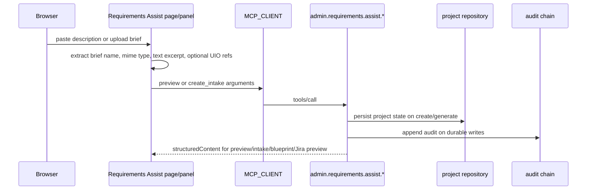
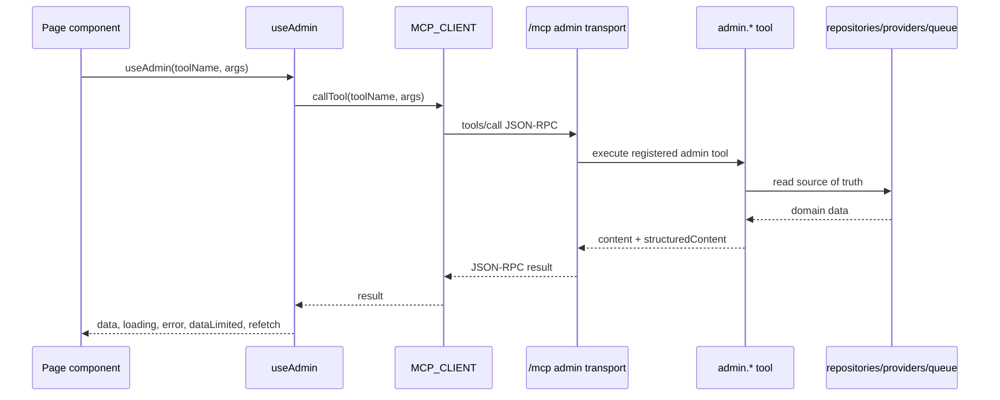
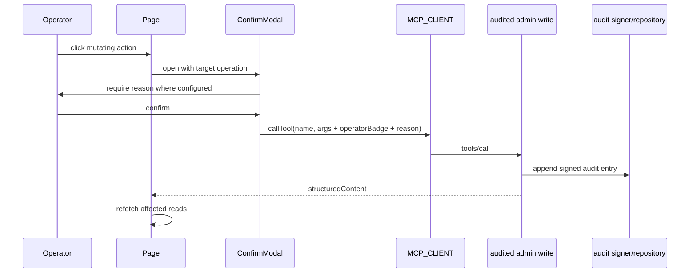

# Runtime and Data Flow

> **TL;DR:** The UI is generated in the browser from static JSX files, local presentation preferences, and live `admin.*` MCP tool responses. Static assets define layout and role-lens behavior; admin tool `structuredContent` supplies operational data; audited writes produce signed audit entries.

## Static Asset Serving

The management API mounts the UI through [`src/server/uiAssets.ts`](../../../../src/server/uiAssets.ts):

| Path | Behavior |
|---|---|
| `/ui` | Redirects to `/ui/`. |
| `/ui/` | Serves `docs/control-plane/index.html`. |
| `/ui/<asset>` | Serves static CSS, JS, JSX, JSON, Markdown, SVG, PNG, or ICO assets from `docs/control-plane/`. |

The asset server protects the file boundary by rejecting null bytes, path traversal (`..`), and backslash traversal attempts before resolving a path under the control-plane directory. Production builds rely on `scripts/copy-runtime-assets.mjs` to mirror `docs/control-plane/` into the runtime `dist/docs/control-plane/` tree.

## Browser Generation Model

`index.html` loads:

1. CSS tokens and control-plane styles.
2. React 18 UMD, ReactDOM UMD, and Babel standalone.
3. `mcp-client.js`.
4. Shared JSX helpers and page JSX files.
5. An inline `App` component that resolves `window.location.hash` to a page component.

There is no bundler step for the control plane. The browser transpiles JSX through Babel at runtime. This keeps the control plane inspectable and aligned with the documentation-first prototype model, at the cost of production SPA optimizations.

## Local Role Lens State

The active role lens is stored as `roleLens` in `CPTweaksProvider` and defaults to `developer`. The selected value is validated against the supported role ids before it is used by pages. It participates only in presentation decisions:

- `TopNav` renders `RoleSelect` and writes the selected lens through `setTweak("roleLens", value)`.
- Pages read `useCPTweaks().t.roleLens` and pass it to `roleCopy`, `roleProjectFocus`, and `rolePortfolioFocus`.
- Role helpers return deterministic copy, focus cards, and ordering instructions from `control-surface-model.js`.
- Admin tool arguments, storage scope, and authorization behavior do not depend on `roleLens`.

Because the role lens is browser-local, reload persistence is a convenience feature, not a durable business record.

## Hash Routing

Route state is stored in the hash fragment. `useHashRoute` in `components.jsx` listens for `hashchange` and `index.html` maps the current path to a page component. This avoids server-side route rewrites and keeps every page reachable through `/ui/#/<route>` while all static assets continue to be served from `/ui/*`.

## MCP Client Session

[`mcp-client.js`](../../../control-plane/mcp-client.js) is a minimal MCP-over-HTTP JSON-RPC client:

| Step | Behavior |
|---|---|
| Lazy initialize | The first `callTool` sends `initialize` to `/mcp`. |
| Session capture | The client stores the `mcp-session-id` response header. |
| Initialized notification | The client sends `notifications/initialized` before tool calls. |
| Tool call | Calls `tools/call` with `{ name, arguments }`. |
| Response parsing | Accepts raw JSON or SSE-framed JSON by reading the `data:` line. |
| Session recovery | On session-not-found/404, resets the session, reinitializes once, and retries. |

The UI reuses one MCP session per browser tab. It does not persist session ids to local storage.

## Requirements Assist Brief Flow

Requirements Assist accepts a typed project description plus brief excerpts supplied by text area, file upload parsing in the browser, or UIO references carried in the brief metadata. The UI sends text excerpts and optional `uioSourceId` or `garageKey` fields to the admin tool. Binary file content is not stored in local tweak storage.

The preview tool is read-only. `create_intake` and `generate_blueprint` are audited writes. `provision_preview` returns planned Jira nodes and a quality score without writing to Jira.

## Read Path

`useAdmin` prefers `result.structuredContent` and falls back to `result.content`. Pages do not parse `content` strings when `structuredContent` is present.

## Polling and Staleness

Reads are eager and polled by default:

| Setting | Source | Default |
|---|---|---|
| Polling enabled | `CPTweaksProvider` | `true` |
| Poll interval | `CPTweaksProvider` | `30s` |
| Per-hook override | `useAdmin(..., opts.intervalSec)` | optional |
| Manual refresh | returned `refetch` function | always available |

The top navigation displays the polling mode and freshness age so an operator can distinguish live-ish data from a paused view. When polling is paused, pages still fetch once on mount and on manual `refetch`.

## Write Path

Writes do not update browser state as the source of truth. A successful write is followed by refetching the relevant read tool where the page supports it.

Role workflow writes follow the same pattern:

| Write | Durable effect | Refetch target |
|---|---|---|
| `admin.requirements.assist.create_intake` | Project intake and project row. | `admin.projects.list` or `admin.projects.get`. |
| `admin.requirements.assist.generate_blueprint` | Updated blueprint/version/state. | `admin.projects.get`. |
| `admin.agent.work.assign` | `work_assignments` row status and assigned agent. | `admin.agent.work.list`. |
| `admin.quality.score.project` / `score.artifact` | `content_quality_reports` row. | `admin.quality.reports.list`. |

## Data-Limited Contract

Some admin tools are intentionally real but incomplete while backend layers are deferred. These tools return a `dataLimited` object with a reason string. The UI must render that reason through `DataLimited` or `DataLimitedBanner`; it must not invent placeholder values that look live.

Examples:

| Area | Current backend state | UI behavior |
|---|---|---|
| Alerts | Alerting backend deferred | Empty or limited list plus explicit banner. |
| SLO | Targets available, live measurements unavailable | Show targets and null current/state values with data-limited banner. |
| Capacity | Sessions and queue visible, cost model unavailable | Show available capacity counters, mark cost/model gaps. |
| DR | Drill schedule backend deferred | Show no fabricated schedule; record scheduling intent if tool is called. |
| Provider rate limit headroom | Health probes available, rate limit telemetry deferred | Show provider status, mark headroom as limited. |

## Error Flow

Tool failures are page-local and rendered through `ErrorBlock`. The UI keeps the page shell mounted so operators retain context and can retry once the underlying tool or provider recovers.

## Linked Artifacts

- [`docs/control-plane/mcp-client.js`](../../../control-plane/mcp-client.js)
- [`docs/control-plane/use-admin.jsx`](../../../control-plane/use-admin.jsx)
- [`docs/control-plane/app-tweaks.jsx`](../../../control-plane/app-tweaks.jsx)
- [`docs/control-plane/page-role-workflows.jsx`](../../../control-plane/page-role-workflows.jsx)
- [`docs/control-plane/data-limited.jsx`](../../../control-plane/data-limited.jsx)
- [`src/server/uiAssets.ts`](../../../../src/server/uiAssets.ts)
- [`src/mcp/admin/auditedWrite.ts`](../../../../src/mcp/admin/auditedWrite.ts)
- [`src/mcp/admin/tools/requirementsAssist.ts`](../../../../src/mcp/admin/tools/requirementsAssist.ts)
- [`src/mcp/admin/tools/agentWork.ts`](../../../../src/mcp/admin/tools/agentWork.ts)
- [`src/mcp/admin/tools/quality.ts`](../../../../src/mcp/admin/tools/quality.ts)
- [`src/mcp/admin/tools/dataLimited.ts`](../../../../src/mcp/admin/tools/dataLimited.ts)
- [`tests/integration/admin/transportAndUi.test.ts`](../../../../tests/integration/admin/transportAndUi.test.ts)

---

*Last reviewed: 2026-04-27 by Chris.*
