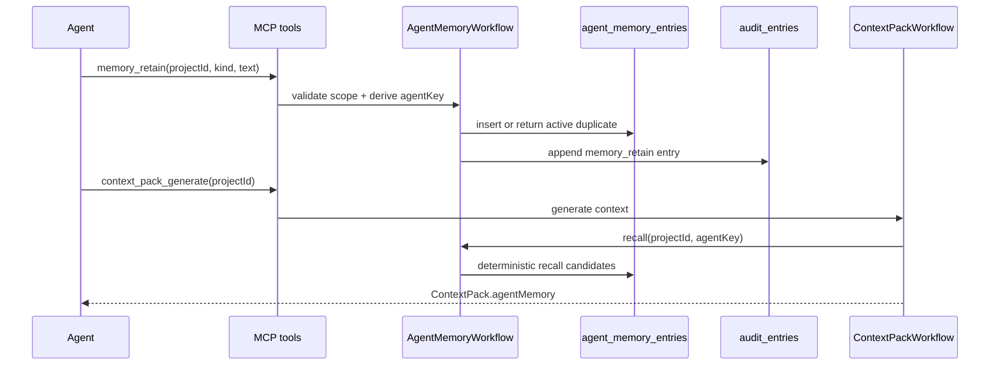

# Module Design — Agent Memory

Persistent agent memory lets a build agent retain project-specific facts, decisions, preferences, warnings, and reflections across MCP sessions. It is deliberately scoped to `(tenant, project, agent)` so reconnecting agents recover useful project state without creating a global personal memory system.

## Responsibilities

- Persist memory entries through `agent_memory_entries`.
- Expose explicit MCP tools: `memory_retain`, `memory_recall`, `memory_reflect`, and `memory_forget`.
- Inject a bounded memory section into `context_pack_generate` output when memory exists for the current project and agent.
- Append audit entries for every mutating memory tool.
- Provide deterministic recall in all deployments and optional vector recall when the runtime has a vector index.

## Data Flow

## Tool Semantics

| Tool | Write? | Purpose |
|---|---:|---|
| `memory_retain` | Yes | Store a project-scoped memory entry; active duplicates return the existing entry. |
| `memory_recall` | No | Retrieve matching memory by project, agent, optional issue, kind, tags, query, and limit. |
| `memory_reflect` | Yes | Store an agent-authored reflection linked to existing memory ids. |
| `memory_forget` | Yes | Soft-delete a memory entry so future recalls omit it. |

`agentKey` defaults to MCP `clientInfo.name@version`; callers may supply it explicitly when a host wants stable identity across client version changes.

## Recall Model

Deterministic recall ranks active entries by keyword hits, tag hits, vector score if present, and recency. Deterministic recall is always available. Vector recall is additive: if `AGENT_MEMORY_VECTOR_ENABLED=true` but the vector index is unavailable, responses set `vectorAttempted=true` and `vectorAvailable=false` while still returning deterministic matches.

The concrete vector implementation uses a dedicated Qdrant collection configured by `AGENT_MEMORY_QDRANT_URL`, optional `AGENT_MEMORY_QDRANT_API_KEY`, and `AGENT_MEMORY_QDRANT_COLLECTION` (default `atl_mcp_agent_memory`). It writes only to that collection and does not write to UIO-owned Qdrant collections.

Context packs call recall with the project name, goals, and requirement titles as the query. At most 10 memory snippets are injected. When memory is included, the regeneration key carries a memory fingerprint so the same key still represents byte-identical inputs.

## UX and Operational Decisions

- Agents opt in through explicit tools; the orchestrator does not silently infer memories from chat transcripts.
- The context-pack memory section is bounded and structured so frontends can render it as supporting context instead of mixing it into the summary.
- Forget is soft-delete, not hard-delete, because auditability matters more than physical purge for normal correction workflows.
- Memory is classified as project data. Secrets are redacted before persistence by the same redaction utility used by context packs.

## Failure Modes

| Failure | Behavior |
|---|---|
| Project id is unknown | Tool fails before writing memory. |
| Duplicate active memory | Existing entry is returned and the retain intent is audited. |
| Vector search unavailable | Deterministic recall continues; response reports vector unavailable. |
| Source reflection ids are invalid | `memory_reflect` fails and writes no reflection. |
| Forget target is missing | Tool returns `forgotten=false` and audits the failed deletion intent. |
