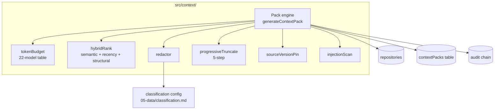

# Module — Context Pack Engine

> **TL;DR:** Generates token-budgeted, classification-aware context packs for build agents. Reads project state (blueprint, profile, traces, ACL); applies redaction per data classification; targets a specific model's context window per the 22-model context-size table in v6 §16.1; idempotent — same `regenerationKey` produces the same pack. Includes prompt-injection scanning per v6 §16.5. Lands in M7.

The context pack is the bridge between the orchestrator's project state and a build agent's request. Get it wrong and the agent flies blind or fails for the wrong reason; get it right and the agent has exactly the context it needs.

---

## Purpose

Owns:
- Context-pack generation per v6 §16.
- Token budgeting against the target model (v6 §16.1: 22-model context-size table).
- 5-step progressive truncation (v6 §16.2).
- Hybrid relevance ranking (v6 §16.3): semantic + recency + structural signals.
- Source version pinning (v6 §16.4): every fact in the pack ties back to a specific version of the underlying source.
- Redaction + prompt-injection scanning (v6 §16.5).
- Memory Bank reference (v6 §16.6) — preserved for future use; out of v1 scope.
- Patterns from the awesome-agentic-patterns catalog (v6 §16.7).

Does NOT own:
- Storage of packs (delegates to `contextPackRepository`).
- The MCP tool entry (`context_pack_generate` / `context_get` live in `src/mcp/tools/`).
- Classification rules themselves (data layer owns; the engine consumes).
- The audit chain — pack generations are audited via the policy decision layer.

---

## Public surface

| Symbol | Kind | Signature | Purpose |
|---|---|---|---|
| `generateContextPack` | function | `(input: PackInput) => Promise<ContextPack>` | Main entry: profile + targets + model → ContextPack |
| `getContextPack` | function | `(regenerationKey) => Promise<ContextPack \| null>` | Idempotent re-fetch |
| `ContextPack` | type | (re-exported from `src/domain/contextPack.ts`) | Pack shape |
| `redactor` | function | `(content, classification) => RedactedContent` | Apply classification-aware redaction |
| `tokenBudget` | function | `(targetModel) => Budget` | Compute safe size per model |
| `progressiveTruncate` | function | `(candidates, budget) => TruncatedSet` | Drop content per v6 §16.2 |
| `hybridRank` | function | `(candidates, query) => RankedSet` | Score relevance |
| `injectionScan` | function | `(text) => InjectionFlag[]` | Detect prompt-injection patterns |

---

## Architecture

The engine orchestrates; each helper is a focused leaf.

---

## Key flows

### Generate context pack

1. **Resolve target.** Project + optional issue. The pack scope determines which content to gather.
2. **Compute token budget** for the requested model (e.g., 200k for Sonnet 4.x, 1M for Opus 4.7 1M context). v6 §16.1's 22-model table is the source of truth; defaults conservatively for unknown models.
3. **Gather candidates.** Blueprint sections, related issues, code snippets (when M7+ pulls them), prior context (when applicable), traces from `traceLinks`.
4. **Hybrid rank** the candidates by relevance (v6 §16.3): semantic similarity to the issue's description + recency of the artifact + structural relevance (e.g., same epic).
5. **Apply redaction** per classification ([`../05-data/classification.md`](../05-data/classification.md)). PRIVATE / SECRET fields don't leave the boundary.
6. **Apply progressive truncation** if over budget (v6 §16.2): drop oldest history first, then related artifacts, then less-relevant sections.
7. **Pin source versions** (v6 §16.4): every included artifact has a version pin so the agent can detect when its context becomes stale.
8. **Scan for prompt injection** (v6 §16.5): pattern-match for known injection shapes; flag suspicious content.
9. **Persist** with `regenerationKey` (deterministic hash of inputs).
10. **Audit + return** the pack.

### Idempotent re-fetch

`getContextPack(regenerationKey)`:
1. Look up by key in `contextPacks`.
2. If found and within TTL: return as-is.
3. If found but stale (TTL expired or upstream changed): regenerate (same inputs → same key still).
4. If not found: error (caller should generate fresh).

The deterministic regen-key means the same request produces the same pack; reproducibility for debugging.

---

## Token budgeting (v6 §16.1)

<figure>

<svg viewBox="0 0 1200 620" xmlns="http://www.w3.org/2000/svg" font-family="IBM Plex Sans, system-ui">
  <text x="40" y="28" font-family="IBM Plex Mono" font-size="10.5" letter-spacing="1.4" fill="#9a9690">BOUNDED, REDACTED, MODEL-TARGETED · SAME PROFILE PRODUCES DIFFERENT PACKS PER MODEL</text>

  <!-- y axis labels (model targets) -->
  <g font-family="IBM Plex Sans" font-size="13" fill="#1a1a1c">
    <text x="40" y="120">Claude Sonnet 4.x</text>
    <text x="40" y="138" font-family="IBM Plex Mono" font-size="10.5" fill="#6f6e6a">200k window · 90% target = 180k</text>

    <text x="40" y="240">Cursor (default)</text>
    <text x="40" y="258" font-family="IBM Plex Mono" font-size="10.5" fill="#6f6e6a">128k window · target = 115k</text>

    <text x="40" y="360">Codex / GPT-5</text>
    <text x="40" y="378" font-family="IBM Plex Mono" font-size="10.5" fill="#6f6e6a">128k window · target = 115k</text>

    <text x="40" y="480">small-context fallback</text>
    <text x="40" y="498" font-family="IBM Plex Mono" font-size="10.5" fill="#6f6e6a">32k window · target = 28k</text>
  </g>

  <!-- bars -->
  <!-- helper grid; 1 token = 4.4px (180k -> ~792px) -->
  <!-- We'll cap bar at 880px from x=270 -->
  <g transform="translate(270,100)">
    <!-- 200k reference ticks -->
    <g font-family="IBM Plex Mono" font-size="10" fill="#9a9690">
      <line x1="0" y1="-12" x2="0" y2="440" stroke="#e3e0d8"/><text x="0" y="-16" text-anchor="middle">0</text>
      <line x1="220" y1="-12" x2="220" y2="440" stroke="#e3e0d8"/><text x="220" y="-16" text-anchor="middle">50k</text>
      <line x1="440" y1="-12" x2="440" y2="440" stroke="#e3e0d8"/><text x="440" y="-16" text-anchor="middle">100k</text>
      <line x1="660" y1="-12" x2="660" y2="440" stroke="#e3e0d8"/><text x="660" y="-16" text-anchor="middle">150k</text>
      <line x1="880" y1="-12" x2="880" y2="440" stroke="#e3e0d8"/><text x="880" y="-16" text-anchor="middle">200k tokens</text>
    </g>

    <!-- =============== Bar 1: Claude Sonnet — target 180k =============== -->
    <!-- system + intent: 8k -->
    <rect x="0" y="0" width="35" height="40" fill="#1a1a1c"/>
    <!-- charter + ADR snippets: 22k -->
    <rect x="35" y="0" width="97" height="40" fill="#3e0d4d"/>
    <!-- module/runtime spec: 28k -->
    <rect x="132" y="0" width="124" height="40" fill="#6e1a82"/>
    <!-- code excerpts (selected): 64k -->
    <rect x="256" y="0" width="282" height="40" fill="#1f5f8a"/>
    <!-- tests + fixtures: 30k -->
    <rect x="538" y="0" width="132" height="40" fill="#1f6e54"/>
    <!-- runbook + ops: 14k -->
    <rect x="670" y="0" width="62" height="40" fill="#b96b16"/>
    <!-- safety margin: 14k -->
    <rect x="732" y="0" width="62" height="40" fill="#fbe7e4" stroke="#b8281d" stroke-dasharray="3 2"/>
    <!-- outline -->
    <rect x="0" y="0" width="794" height="40" fill="none" stroke="#1a1a1c" stroke-width="1"/>
    <text x="800" y="26" font-family="IBM Plex Mono" font-size="11" fill="#43434a">180k / 200k</text>

    <!-- =============== Bar 2: Cursor — target 115k =============== -->
    <!-- system: 8k -->
    <rect x="0" y="120" width="35" height="40" fill="#1a1a1c"/>
    <!-- charter + ADR: 14k -->
    <rect x="35" y="120" width="62" height="40" fill="#3e0d4d"/>
    <!-- module spec: 18k -->
    <rect x="97" y="120" width="79" height="40" fill="#6e1a82"/>
    <!-- code: 38k -->
    <rect x="176" y="120" width="167" height="40" fill="#1f5f8a"/>
    <!-- tests: 18k -->
    <rect x="343" y="120" width="79" height="40" fill="#1f6e54"/>
    <!-- runbook: 9k -->
    <rect x="422" y="120" width="40" height="40" fill="#b96b16"/>
    <!-- safety: 10k -->
    <rect x="462" y="120" width="44" height="40" fill="#fbe7e4" stroke="#b8281d" stroke-dasharray="3 2"/>
    <rect x="0" y="120" width="506" height="40" fill="none" stroke="#1a1a1c" stroke-width="1"/>
    <text x="512" y="146" font-family="IBM Plex Mono" font-size="11" fill="#43434a">115k / 128k</text>

    <!-- =============== Bar 3: Codex — target 115k (same window, different selection ratio) =============== -->
    <rect x="0" y="240" width="35" height="40" fill="#1a1a1c"/>
    <rect x="35" y="240" width="62" height="40" fill="#3e0d4d"/>
    <rect x="97" y="240" width="62" height="40" fill="#6e1a82"/>
    <rect x="159" y="240" width="186" height="40" fill="#1f5f8a"/>
    <rect x="345" y="240" width="92" height="40" fill="#1f6e54"/>
    <rect x="437" y="240" width="29" height="40" fill="#b96b16"/>
    <rect x="466" y="240" width="40" height="40" fill="#fbe7e4" stroke="#b8281d" stroke-dasharray="3 2"/>
    <rect x="0" y="240" width="506" height="40" fill="none" stroke="#1a1a1c" stroke-width="1"/>
    <text x="512" y="266" font-family="IBM Plex Mono" font-size="11" fill="#43434a">115k / 128k</text>

    <!-- =============== Bar 4: small-context — target 28k =============== -->
    <rect x="0" y="360" width="22" height="40" fill="#1a1a1c"/>
    <rect x="22" y="360" width="22" height="40" fill="#3e0d4d"/>
    <rect x="44" y="360" width="22" height="40" fill="#6e1a82"/>
    <rect x="66" y="360" width="33" height="40" fill="#1f5f8a"/>
    <rect x="99" y="360" width="11" height="40" fill="#1f6e54"/>
    <rect x="110" y="360" width="9" height="40" fill="#b96b16"/>
    <rect x="119" y="360" width="4" height="40" fill="#fbe7e4" stroke="#b8281d" stroke-dasharray="3 2"/>
    <rect x="0" y="360" width="123" height="40" fill="none" stroke="#1a1a1c" stroke-width="1"/>
    <text x="130" y="386" font-family="IBM Plex Mono" font-size="11" fill="#43434a">28k / 32k · TRUNCATION LOSSY</text>
  </g>

  <!-- legend -->
  <g transform="translate(40,540)" font-family="IBM Plex Sans" font-size="11.5" fill="#43434a">
    <text font-family="IBM Plex Mono" font-size="10" letter-spacing="1.4" fill="#9a9690" y="0">SECTIONS</text>
    <g transform="translate(0,14)">
      <rect width="14" height="14" fill="#1a1a1c"/><text x="22" y="11">system + intent</text>
      <rect x="148" width="14" height="14" fill="#3e0d4d"/><text x="170" y="11">charter + ADR snippets</text>
      <rect x="338" width="14" height="14" fill="#6e1a82"/><text x="360" y="11">module / runtime spec</text>
      <rect x="528" width="14" height="14" fill="#1f5f8a"/><text x="550" y="11">code excerpts</text>
      <rect x="668" width="14" height="14" fill="#1f6e54"/><text x="690" y="11">tests + fixtures</text>
      <rect x="828" width="14" height="14" fill="#b96b16"/><text x="850" y="11">runbook + ops</text>
      <rect x="978" width="14" height="14" fill="#fbe7e4" stroke="#b8281d" stroke-dasharray="3 2"/><text x="1000" y="11">safety margin (head-room)</text>
    </g>
    <text y="50" font-family="IBM Plex Mono" font-size="10.5" fill="#6f6e6a">classification + provenance metadata is embedded per chunk · redaction happens upstream of pack assembly · over-budget triggers truncation lossiness warning.</text>
  </g>
</svg>

<figcaption><strong>V11 — Context-pack token budget.</strong> Context-pack composition, sized per model target. The same project profile yields different packs because the budget — and therefore the selection ratio across system/spec/code/tests/runbook — changes per consumer. The dashed safety-margin band is mandatory head-room: it leaves room for the agent's own reasoning. The 32k small-context fallback truncates aggressively and surfaces a "lossy" warning to the consumer. (See <a href="../../visualizations/v11-token-budget.html">full visualization page</a>.)</figcaption>
</figure>

The 6-category breakdown of how the token budget is allocated:

| Category | Allocation | Purpose |
|---|---|---|
| System / instructions | 5% | Build-agent prompt setup; doesn't change per-call |
| Project blueprint summary | 20% | Why are we building? What's the scope? |
| Issue-specific context | 30% | What story is the agent working? |
| Related artifacts | 20% | Related issues, code samples, prior decisions |
| History / prior context | 15% | What's been tried before? |
| Reserve for response | 10% | Headroom for the agent's output |

When the requested target model has less context than the sum of allocations: progressive truncation kicks in (v6 §16.2):

**5 steps:** drop oldest history → drop least-relevant related artifacts → drop oldest blueprint sections → drop comments-on-comments → fail if still over budget (with a clear error).

The model-context table is in v6 §16.1. Unknown models (or models the engine doesn't recognize) get a conservative 8k-token default.

---

## Hybrid ranking (v6 §16.3)

When budget is bound, choosing what fits matters. Hybrid ranking signals:

1. **Semantic similarity** — embedding-based; how relevant is this candidate to the issue's text?
2. **Recency** — recently-touched artifacts are more relevant.
3. **Structural relevance** — same epic, same component, same author signals proximity.

The combined score is a weighted sum (weights tunable). Hybrid is more interpretable than pure-semantic; cost is more computation.

---

## Redaction (v6 §16.5)

Per the classification policy:

- **PUBLIC** — included as-is.
- **INTERNAL** — included with audit logging.
- **PRIVATE** — included only if the target context is itself trusted to receive PRIVATE; otherwise replaced with `[REDACTED]` markers.
- **SECRET** — never included; replaced with `[SECRET]` markers regardless of context.

The redaction step is **not optional**. It runs on every pack, even if the target seems "safe." Defense in depth.

Failed redaction (a field has no classification metadata) defaults to INTERNAL with a logged warning.

---

## Prompt-injection scanning (v6 §16.5)

Patterns flagged:

- "Ignore previous instructions" / "disregard the above" / etc.
- Embedded role markers ("System:", "Assistant:", etc.) within user-provided content.
- Suspicious tool-call shapes embedded in prose.
- Known injection corpus (curated; updated as new attacks surface).

Detection is heuristic; flagged content gets a warning (or, in strict mode, refused). Not a substitute for the lethal-trifecta detection at the policy decision layer — those work together.

---

## Source version pinning (v6 §16.4)

Every artifact in the pack carries a version pin:

- Blueprint section: `(blueprintId, version, timestamp)`.
- Issue: `(jiraKey, lastUpdated)`.
- Code snippet: `(repo, branch, commitSha, file, lineRange)`.
- Trace link: `(linkId, version)`.

The pack reader (the build agent) can detect stale context: if the pack says "blueprint version 5" and the live blueprint is version 8, the agent knows it's working from outdated info. Surfaces a re-fetch as needed.

---

## Failure modes

### Target model not in budget table

**Symptom:** unknown model name in `targetModel`.

**Action:** falls back to a conservative 8k-token default. Logged as a warning.

### Classification missing on a field

**Symptom:** content arrives without classification metadata.

**Action:** treated as INTERNAL by default; logged warning. Operator should classify the field.

### All redaction rules drop a critical field

**Symptom:** a field essential to the pack is fully redacted.

**Action:** error returned to caller; pack not produced. The caller (operator) must adjust classification or the rules.

### Injection detected in critical content

**Symptom:** the issue's own description contains injection patterns.

**Action:** in strict mode, fail. In permissive mode, warn + continue with sanitization.

### Budget exhausted even after truncation

**Symptom:** the issue + minimal context is still larger than the model's window.

**Action:** error to the caller. The issue is too big; needs to be decomposed.

### Stale pack re-served

**Symptom:** `getContextPack` returns a TTL'd pack while upstream content has changed.

**Action:** TTL semantics. The build agent can detect via version pins and request regeneration.

---

## Tests

Planned (M7):

| Test | What it proves |
|---|---|
| Token budgeting per model | Different model targets produce different budget allocations |
| Redaction correctness | PRIVATE / SECRET classified content is redacted; PUBLIC / INTERNAL preserved |
| Idempotency | Same inputs → same `regenerationKey` → same content |
| Truncation behavior | Over-budget candidates are dropped per the 5-step priority |
| Hybrid ranking ordering | Higher-scoring candidates appear first |
| Prompt-injection detection | Known patterns flagged; benign content not |
| Source version pinning | Each included artifact has a version pin in the pack |

Coverage gaps:
- **Adversarial injection corpus** — needs to be assembled.
- **Cross-model behavior** — testing against actual builds with different model targets.

---

## Configuration

| Var / setting | Default | Purpose |
|---|---|---|
| `targetModel` (per-call) | required | Which model's context window to size for |
| Pack TTL | 30 days (per [`../05-data/retention.md`](../05-data/retention.md)) | When to consider regeneration |
| Hybrid ranking weights | hard-coded for v1 | Tunable post-v1 if signals show drift |
| Injection-scan strictness | `strict` in production tier; `permissive` in dev | Whether flagged content fails or warns |

---

## Concurrency

- Per-request; no shared state.
- Multiple `generateContextPack` calls can run in parallel (different projects or different issues).

---

## Performance

| Operation | Typical | p99 |
|---|---|---|
| Generate context pack | < 2 s | < 10 s |
| Get context pack (cached) | < 100 ms | < 500 ms |

Generation cost is dominated by hybrid ranking (semantic embedding lookups) when M7+ wires it.

---

## Tradeoffs

### Hybrid ranking vs. pure semantic

**Chose:** hybrid (semantic + recency + structural).

**Pro:** more interpretable; less brittle to embedding model changes.

**Con:** more computation per pack; weights need tuning.

### Persistent context packs vs. regenerate-every-time

**Chose:** persisted (with TTL).

**Pro:** repeated requests are cheap; reproducibility for debugging.

**Con:** staleness vs. fresh-data tension.

**Mitigation:** version pinning + TTL; agent can detect staleness.

### Strict redaction vs. permissive

**Chose:** strict-by-default.

**Pro:** defense in depth; classified content doesn't leak.

**Con:** sometimes blocks legitimate context.

**Mitigation:** explicit operator override available; logged + audited.

---

## Roadmap

- **M7:** full implementation lands; integrated with the workflow + tools.
- **M11:** prompt-injection scanning hardening (per v6 §16.5).
- **Post-v1:** Memory Bank reference (v6 §16.6) — currently preserved for reference.
- **Post-v1:** semantic retrieval / vector store (v6 §25).

---

## Linked artifacts

- **Spec:** v6 §16 (full design), §16.1 (token budgeting), §16.2 (truncation), §16.3 (hybrid ranking), §16.4 (source pinning), §16.5 (redaction + injection)
- **Code:** `src/context/` (M7+), `src/domain/contextPack.ts`
- **Sibling modules:** [`module-storage.md`](module-storage.md), [`module-security.md`](module-security.md), [`module-workflows.md`](module-workflows.md)
- **Classification:** [`../05-data/classification.md`](../05-data/classification.md)
- **Lethal trifecta:** [`../06-security/lethal-trifecta.md`](../06-security/lethal-trifecta.md) (related defense)
- **Schema:** [`../05-data/schema.md`](../05-data/schema.md) `contextPacks` table

---

*Last reviewed: 2026-04-25 by Chris.*
