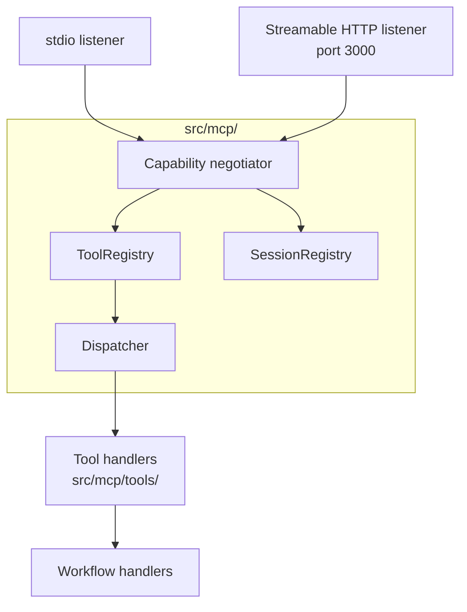

# Module — MCP Runtime

> **TL;DR:** The MCP transport layer. Implements stdio + Streamable HTTP transports, capability negotiation, the tool registry, the dispatcher, and the session registry. Owns nothing persistent except session state. v6 §22 specifies the transport; v6 §14 specifies the surface.

Module-level design, following the [`module-design-template.md`](../templates/module-design-template.md) shape.

---

## Purpose

The MCP runtime is the inbound surface for build-agent traffic. It owns:

- The two transports (stdio, Streamable HTTP).
- Capability negotiation per v6 §2.2.
- Tool registration (gated by feature flags).
- The dispatcher that routes tool calls to handlers.
- Session-state tracking with TTL eviction.

It does NOT own:

- The handlers themselves (those live in workflows / providers).
- The schema for tool inputs/outputs (those are domain types).
- Authorization logic (that's the policy decision layer).

## Public surface

| Symbol | Kind | Signature | Purpose |
|---|---|---|---|
| `buildServer` | function | `(opts) => MCPServer` | Constructs a configured MCP server with tools registered |
| `registerTools` | function | `(server, deps, flags) => void` | Registers all milestone-gated tools |
| `SessionRegistry` | class | TTL-evicting map | Tracks active MCP sessions |
| `ToolRegistry` | class | Map of tool name → handler | Dispatch table |
| `MCPSessionProfile` | type | `{ sessionId, capabilities, tokenBudget, ... }` | Session metadata |

For the full registered tool catalog, see [`api-mcp-tools.md`](api-mcp-tools.md).

## Architecture

## Key flows

### Session establishment (stdio + HTTP)

See [`sequence-diagrams.md` § "MCP session establishment"](sequence-diagrams.md). Briefly:

1. Client connects (stdio: stdin/stdout pipe; HTTP: POST `/mcp` with capability advertisement).
2. Capability negotiator inspects client's declared capabilities and the server's advertised set.
3. Negotiated capability set is computed (intersection of supported, with version pinning per v6 §22).
4. SessionRegistry registers the session with TTL.
5. Server returns its capability response.

### Tool dispatch

1. Client sends `tools/call` with tool name + args.
2. Dispatcher looks up the name in ToolRegistry.
3. If found and the milestone gate is on: invoke the handler.
4. Handler validates args against Zod schema; validation failure returns a structured error.
5. Handler invokes downstream workflow/provider/storage.
6. Result returned via JSON-RPC.

## Data model

The runtime persists session state in `mcpSessionProfiles` (per v6 §10 domain model). Session lifecycle:

- Created on capability negotiation.
- TTL-evicted on idle timeout (`MCP_HTTP_SESSION_TTL_SECONDS`, default 3600).
- Capped by `MCP_HTTP_MAX_CONCURRENT_SESSIONS` (default 1000).

## Configuration

| Var | Required | Default | Purpose |
|---|---|---|---|
| `MCP_TRANSPORT` | No | `both` | Which transport(s) to enable |
| `MCP_HTTP_PORT` | No | `3000` | HTTP MCP listener port |
| `MCP_HTTP_HOST` | No | `0.0.0.0` | Bind address |
| `MCP_HTTP_SESSION_TTL_SECONDS` | No | `3600` | Session idle timeout |
| `MCP_HTTP_SSE_KEEP_ALIVE_MS` | No | `25000` | SSE keep-alive interval |
| `MCP_HTTP_MAX_CONCURRENT_SESSIONS` | No | `1000` | Concurrent cap |

## Failure modes

- **Stdout corruption** — see Incident A in [`../08-operations/runbook.md`](../08-operations/runbook.md). The stdio MCP transport requires stdout JSON-RPC purity. Any code that writes to stdout from `src/` corrupts the protocol stream.
- **Capability negotiation mismatch** — older / newer client speaks a different MCP version. Negotiation produces a downgraded surface.
- **Session cap reached** — new sessions get a clear error rather than queuing.
- **Tool not registered** — feature flag off; tool returns `tool_not_found`.

## Test surface

| Test | Path | What it proves |
|---|---|---|
| Server build | `tests/unit/buildServer.test.ts` | `buildServer` returns a configured server |
| Capability negotiation | `tests/unit/sessionCapabilities.test.ts` | Negotiation produces correct intersection |
| No-stdout enforcement | `tests/lint/no-stdout.test.ts` | Lint catches forbidden patterns |
| Tool registration (gating) | `tests/unit/mcp/projectIntakeTools.test.ts` | M4-gated tool only registers with flag on |
| Sampling adapter | `tests/unit/mcp/sampling.test.ts` | Sampling provider chain works |

## Concurrency

- Single event loop; all handlers are async.
- SessionRegistry is in-process (single replica in v1).
- Concurrent tool calls are serialized only where downstream demands (e.g., per-project state machine).

## Performance

- Capability negotiation: < 50 ms p99.
- Dispatcher overhead: < 1 ms.
- Tool latency: dominated by the tool's own work (provider calls, sampling).

## Tradeoffs

- **Tool-collapse pattern** vs. many narrow tools: chose tool-collapse where the operations form a natural family (per v6 §14). Cost: fatter schemas with action-enum routing.
- **Stdio + HTTP both supported** vs. one: chose dual to support embedded use (stdio for local Claude Code) and managed deployments (HTTP for a server). Cost: two transport code paths.
- **Session-bound capabilities** vs. always-current: capabilities pinned at session start. Cost: client must reconnect to pick up server-side capability changes (acceptable; capability changes are rare).

## Roadmap

- M11: capability negotiation per v6 §2.2 fully wired (all advertised capabilities present).
- M11: image scan + dependency audit in CI.
- Post-v1: re-evaluate session cap when multi-tenant lands.

## Linked artifacts

- **Spec:** v6 §22 (transport), §14 (MCP surface), §2.2 (capability negotiation)
- **API:** [`api-mcp-tools.md`](api-mcp-tools.md), [`api-mgmt-rest.md`](api-mgmt-rest.md)
- **Code:** `src/mcp/`, `src/mcp/sessionCapabilities.ts`, `src/mcp/toolRegistry.ts`, `src/mcp/registerTools.ts`, `src/mcp/tools/`
- **Tests:** `tests/unit/buildServer.test.ts`, `tests/unit/sessionCapabilities.test.ts`, `tests/unit/mcp/`
- **Anti-stdout discipline:** [`../13-quality/anti-slop.md`](../13-quality/anti-slop.md)

---

*Last reviewed: 2026-04-25 by Chris.*
