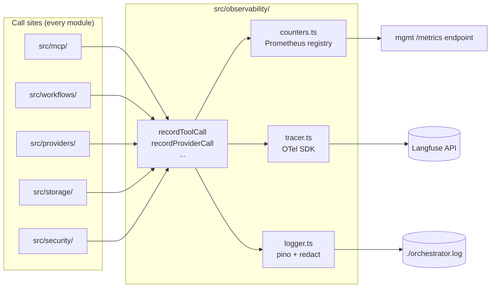

# Module — Observability

> **TL;DR:** Three-pillar observability — pino logger (file destination, NEVER stdout per CLAUDE.md), Prometheus counters at mgmt `/metrics`, OpenTelemetry tracer to Langfuse (when configured). Plus the audit trace JSONL stream from v6 §27.4. Six counter classes per v6 §27.5. The module is a thin wrapper around well-known libraries; the discipline is what matters: the file-only logger preserves the MCP stdio protocol invariant, redaction protects secrets, and structured fields enable post-hoc forensics.

This module is small in code but load-bearing in operations. Every other module emits through it. Misconfigured observability = invisible incidents.

---

## Purpose

Owns:
- The pino logger configuration (`createLogger`).
- The redaction config that protects secrets in log output.
- The OpenTelemetry tracer setup (when Langfuse is configured).
- The Prometheus counter / histogram registration.
- The trace-context propagation pattern (async-local-storage based).

Does NOT own:
- Counter / span emission at call sites — those are inline at the point of action in their respective modules.
- The audit trace JSONL stream — that lives alongside the audit chain in `src/storage/`.
- The mgmt REST `/metrics` endpoint — `src/server/mgmtApi/` exposes the registry; this module populates it.

---

## Public surface

| Symbol | Kind | Signature | Purpose |
|---|---|---|---|
| `createLogger` | factory | `(opts) => pino.Logger` | Returns a configured pino instance with redaction + base fields |
| `getMeter` | function | `(name) => Meter` | Get a Prometheus meter for a counter family |
| `getTracer` | function | `(name) => Tracer` | Get an OpenTelemetry tracer |
| `withTraceContext` | wrapper | `<T>(fn) => T` | Propagate trace context via async-local-storage |
| `recordToolCall` | helper | `(tool, outcome, durationMs) => void` | Convenience: increments + observes the standard MCP tool counters |
| `recordProviderCall` | helper | `(provider, method, outcome, durationMs) => void` | Same for provider HTTP |

The helpers ensure consistent label usage (no typos in `outcome` strings, etc.).

---

## Architecture

Every module that emits observability does so through this module's helpers (or the raw logger / tracer). The module is the convergence point.

---

## The four streams

### 1. Logs (Pino, file-only)

- **Library:** [pino](https://github.com/pinojs/pino) — fast structured logging.
- **Destination:** file (`LOG_FILE_PATH`, default `./orchestrator.log`).
- **Why file, not stdout:** the stdio MCP transport carries JSON-RPC frames over stdout. A log line on stdout corrupts the protocol stream. v6 §22 + CLAUDE.md operating rule. Enforced by `lint:no-stdout` (PCO-12 documents an alias-form gap).
- **Format:** newline-delimited JSON.
- **Common fields:** `time`, `level`, `service`, `version`, `tier` (deployment tier), `pid`, `traceId`, `spanId`, `tenantId`, `projectId`, `operation`, `outcome`.
- **Redaction:** `src/observability/logger.ts` configures pino redact on known secret paths. See [`../06-security/secrets-mgmt.md`](../06-security/secrets-mgmt.md) "Pino redaction config."
- **Levels:** `info` is production default. `debug` for investigation (off in prod). `trace` is off in non-dev (volume).
- **Rotation:** size-based; planned for M11. Currently the deploy platform handles log files (volume mounts + log shippers).

### 2. Metrics (Prometheus counters + histograms)

- **Library:** `prom-client` (or equivalent).
- **Endpoint:** `GET http://127.0.0.1:3001/metrics` (loopback by default).
- **Format:** Prometheus text format.
- **Counter taxonomy:** v6 §27.5 specifies six categories. See [`../08-operations/monitoring.md`](../08-operations/monitoring.md) for the full inventory.
- **Why Prometheus:** standard, easy to scrape, well-supported by every observability stack (Grafana, Datadog, NewRelic, etc.).

Counter families used:
- `mcp_*` — session init, tool calls, blocked calls.
- `provider_*` — outbound REST, retries, latency.
- `db_*` — query outcomes + latency.
- `provision_*` — queue depth, lag, job outcomes.
- `audit_*` — chain growth.
- `mgmt_*` — mgmt REST request shapes.

### 3. Traces (OpenTelemetry → Langfuse)

- **Library:** OpenTelemetry instrumentation; export to Langfuse when `LANGFUSE_*` env vars are set.
- **Spans emitted for:**
  - MCP sampling calls (full prompt, model, token count, latency, outcome).
  - Blueprint workflow spans (intake → blueprint pipeline).
  - Provisioning spans (plan → execute path).
  - Provider HTTP calls (with retry context).
- **Why Langfuse:** purpose-built for LLM-app observability. Spans include prompt/response (with redaction); retains for analysis. Falls back to no-op exporter if not configured.
- **Trace propagation:** W3C `traceparent` headers on outbound REST calls so distributed traces with Atlassian / Bitbucket can be assembled (when those vendors expose tracing).

### 4. Audit trace JSONL (v6 §27.4)

A unique-to-atl-mcp stream: every consequential operation also emits a structured event into a JSONL file (or DB-backed row in `auditEntries`).

- **Why a separate stream:** the audit chain is a *security* artifact (signed, tamper-evident). The audit trace is an *observability* artifact (queryable, sortable, fast to scan). Both reference the same underlying events.
- **Spec:** v6 §27.4.
- **Schema:** `(timestamp, actor, operation, outcome, traceId, projectId, ...)`.
- **Where it's owned:** the audit chain module emits it; observability module references it.

---

## Configuration

Per [`../09-deployment/secrets-provisioning.md`](../09-deployment/secrets-provisioning.md):

| Var | Required | Default | Purpose |
|---|---|---|---|
| `LOG_LEVEL` | No | `info` (`debug` in dev) | pino verbosity |
| `LOG_FILE_PATH` | No | `./orchestrator.log` | pino destination |
| `LANGFUSE_PUBLIC_KEY` | Optional | — | Langfuse export (only when set) |
| `LANGFUSE_SECRET_KEY` | Optional | — | Langfuse auth |
| `LANGFUSE_HOST` | Optional | — | Langfuse endpoint |

When Langfuse vars are unset: tracer uses a no-op exporter; spans created but not exported. Functional impact: zero. Cost impact: zero.

---

## How streams interact

A single MCP tool call produces:

- **1+ log lines** (info-level entry/exit; warn/error if anything went wrong).
- **N counter increments** (`mcp_tool_calls_total`, `mcp_tool_call_duration_seconds`, plus per-trust-boundary counters as relevant).
- **1 span** in OpenTelemetry, propagated to all internal sub-spans.
- **1 audit entry** (signed) AND **1 audit-trace row** (denormalized) for state-changing calls.

Each stream has different ergonomics:

- **Logs** — human-readable post-hoc; grep / jq.
- **Metrics** — aggregate trends; alerting input.
- **Traces** — per-request investigation; latency attribution.
- **Audit** — tamper-evident security forensics + structured queryability.

---

## Adding observability to a new operation

When a new operation, error class, or trust-boundary crossing warrants observability:

1. **Log line** at the right level (`info` for normal flow, `warn` for degraded, `error` for handled failures, `fatal` for unrecoverable). Include structured fields (`operation`, `outcome`, `projectId`, etc.).
2. **Counter or histogram** in `src/observability/counters.ts` — increment / observe at the right moment.
3. **Span** if the operation is a transaction worth attributing latency to.
4. **Audit entry** if the operation crosses a trust boundary or changes state.
5. **Alert** if the metric should page someone — see [`../08-operations/alerting.md`](../08-operations/alerting.md).
6. **Runbook entry** if the alert can fire — see [`../08-operations/runbook.md`](../08-operations/runbook.md).
7. **Threat coverage** if the new operation introduces a new threat — see [`../06-security/threat-model.md`](../06-security/threat-model.md).

The discipline is: observability isn't an afterthought; it lands in the same PR as the new functionality.

---

## Failure modes

### Log file unwritable

**Symptom:** disk full, permission error, or path doesn't exist.

**Action:** pino falls back to stderr (NOT stdout — that's protocol-pure). Process continues but with reduced operability.

**Audit:** depends on whether the audit chain is also affected. If they share storage: full incident.

### Prometheus scrape fails

**Symptom:** Prometheus can't reach `/metrics`.

**Action:** counter values still in memory; next successful scrape recovers. No data loss within the last 15 min (typical scrape interval).

**Audit:** the scrape failure is itself a Prometheus-side concern, not application-side.

### Langfuse unreachable

**Symptom:** trace export fails.

**Action:** spans go to no-op exporter; no functional impact. Trace history for the affected window is lost.

**Audit:** the export failure is logged; not auditable as a state change.

### Counter cardinality explosion

**Symptom:** a label gets a high-cardinality value (e.g., a full UUID), blowing up the time-series count.

**Action:** review label set; restrict labels to bounded enums. Example: `outcome` should be `success | failure | blocked`, not the full error message.

**Mitigation:** code review catches at the helper level (the helpers enforce label sets).

---

## Test surface

| Test | Path | What it proves |
|---|---|---|
| No-stdout protocol invariant | `tests/lint/no-stdout.test.ts` | Lint catches forbidden patterns |
| Logger redaction | (manual / planned) | Known secret-bearing paths are redacted |
| Counter registration | (manual via `/metrics` curl) | Counters appear with expected labels |
| Trace propagation | (planned, M11) | TraceID propagates through nested async calls |

Coverage gaps:
- **Programmatic redaction tests** (planned): verify a sample of structured logs that include known-secret-shaped fields produce `[REDACTED]` in output.
- **Counter-cardinality tests** (planned): smoke-check that a load test doesn't produce > N unique time-series.

---

## Concurrency

- Pino is async-safe; multiple writers fine.
- Prometheus counters are thread-safe (Node single-threaded; counters are simple atomic increments anyway).
- OpenTelemetry trace context: AsyncLocalStorage-based; preserves across async boundaries.

---

## Performance characteristics

- **Log line emit:** < 50 µs typical. Pino is famously fast.
- **Counter increment:** < 1 µs.
- **Histogram observe:** < 5 µs.
- **Span creation:** ~10 µs of overhead.
- **Span export to Langfuse:** async; no on-path cost.

At v1 scale, observability overhead is < 1% of request time.

---

## Tradeoffs

### File logger only vs. console / multi-destination

**Chose:** file only.

**Pro:** preserves the MCP stdio protocol invariant. Simpler config.

**Con:** deploy platform must capture / ship the log file. No "tail in terminal" during dev (workaround: `tail -f ./orchestrator.log` in a second window).

**Mitigation:** dev workflow uses `tail -f` or pino-pretty.

### Pino over winston / bunyan

**Chose:** pino.

**Pro:** ~10x faster than winston for typical workloads. Native redaction. Smaller dependency footprint.

**Con:** more opinionated about format (newline-delimited JSON only).

### Prometheus pull over StatsD push

**Chose:** Prometheus.

**Pro:** widely supported; easy to deploy; pull model means no reverse network connection.

**Con:** scrape interval is the resolution limit; histogram bucket choice matters.

### Langfuse over Datadog APM

**Chose:** Langfuse (when used at all).

**Pro:** purpose-built for LLM-app observability. Captures prompts + responses.

**Con:** less general-purpose than Datadog. Not as integrated with non-LLM tracing.

**Mitigation:** OpenTelemetry SDK is provider-agnostic; if Langfuse doesn't fit, swap exporter.

---

## Roadmap

- **M11:** full counter set wired (a subset is implemented now).
- **M11:** log rotation built into the logger config (currently relies on deploy platform).
- **M11:** Langfuse trace integration end-to-end exercised.
- **M11:** programmatic redaction tests.
- **Post-v1:** profiling + APM dashboard standardization (Grafana per category).

---

## Linked artifacts

- **Spec:** v6 §27 (full observability stack), §27.4 (Agent Trace JSONL spec), §27.5 (counter taxonomy)
- **Code:** `src/observability/logger.ts`, plus future `counters.ts` + `tracer.ts`
- **Sibling SDLC docs:** [`../08-operations/monitoring.md`](../08-operations/monitoring.md), [`../08-operations/observability-stack.md`](../08-operations/observability-stack.md), [`../08-operations/alerting.md`](../08-operations/alerting.md)
- **Lint:** [`../13-quality/anti-slop.md`](../13-quality/anti-slop.md), `scripts/lint-no-stdout.mjs`, `tests/lint/no-stdout.test.ts`
- **Audit trail data:** [`../05-data/audit-trail.md`](../05-data/audit-trail.md)
- **Secrets / redaction:** [`../06-security/secrets-mgmt.md`](../06-security/secrets-mgmt.md)
- **Tracking:** PCO-12 (alias-form lint gap)

---

*Last reviewed: 2026-04-25 by Chris.*
