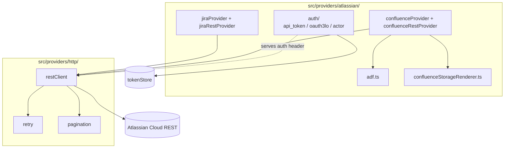

# Module — Atlassian Providers (Jira + Confluence)

> **TL;DR:** Jira REST v3 + Confluence REST v2 clients. API token / OAuth 3LO auth. Capability discovery (preflight). ADF + storage format dual-renderer for Confluence (ADR-0003). Pagination + retry + rate-limit handling. Every state-changing call generates an audit entry.

## Purpose

Owns:
- Auth flows for Atlassian Cloud (API token + OAuth 3LO).
- Jira REST v3 client.
- Confluence REST v2 client.
- ADF and storage-format rendering (ADR-0003).
- Capability discovery (used in preflight).
- Actor attribution metadata.

Does NOT own:
- Provisioning logic (that's workflows + planner).
- Token storage (that's `src/security/tokenStore.ts`).
- The MCP tool that invokes preflight (that's `src/mcp/tools/projectPreflight.ts`).

## Public surface

| Symbol | Kind | Purpose |
|---|---|---|
| `JiraProvider` | interface | Abstract Jira contract |
| `ConfluenceProvider` | interface | Abstract Confluence contract |
| `jiraRestProvider` | factory | REST-backed Jira impl |
| `confluenceRestProvider` | factory | REST-backed Confluence impl |
| `apiTokenAuth` | function | API token Authorization header |
| `oauth3loAuth` | function | OAuth 3LO Bearer flow |
| `actorAttribution` | function | Adds `X-User-Account` headers for impersonation |
| `adfRenderer` | function | Build/parse Atlassian Document Format trees |
| `confluenceStorageRenderer` | function | Build/parse Confluence storage format |

## Architecture

## Key flows

### Capability discovery (Jira)

See [`sequence-diagrams.md`](sequence-diagrams.md) — "Preflight against Jira".

1. Resolve credentials from token store.
2. GET `/rest/api/3/myself` to verify auth.
3. GET `/rest/api/3/project/<key>?expand=...` for project capabilities.
4. GET `/rest/api/3/issuetype/project/{projectId}` for issue types.
5. GET `/rest/api/3/workflowscheme/project?projectId=...` for workflow.
6. Compose `ProjectProfile` JSON.

Pagination + retry handled by `src/providers/http/`.

### Confluence body write (M6b)

1. Render the page body to either ADF or storage format (per ADR-0003 + per-page flag).
2. POST to `/wiki/api/v2/pages` (v2; if response shows representation bug observed in audit findings F-13, fall back to v1).
3. Audit entry recorded.

## Authentication

| Mode | Source | When used |
|---|---|---|
| API token | Operator-provided via secret manager | Default |
| OAuth 3LO | OAuth flow + refresh | When `ATLASSIAN_AUTH_MODE=oauth3lo` |
| Service account | Site-admin-issued | Future / per-customer-need |

Token storage: encrypted at rest (ADR-0002) via `tokenStore`. Plaintext only in memory during request signing.

## Failure modes

- **401** — token expired / revoked. Operator rotates.
- **429** — rate limit. Retry layer handles up to 3 attempts with backoff.
- **OAuth 3LO refresh race** — PCO-59. Workaround: fall back to API token.
- **ADF round-trip lossiness** — PCO-58 (nested table cells). Documented limitation.
- **Confluence v2 representation bug** — F-13 in audit findings; fall back to v1.

## Test surface

| Test | Path |
|---|---|
| ADF renderer | `tests/unit/providers/atlassian/adf.test.ts` |
| Storage renderer | `tests/unit/providers/atlassian/confluenceStorageRenderer.test.ts` |
| Auth (API token + OAuth) | `tests/unit/providers/atlassian/auth.test.ts` |
| Confluence REST live | `tests/integration/providers/confluenceRestProvider.test.ts` (gated by `RUN_LIVE_TESTS=1`) |
| Retry behavior | `tests/unit/providers/http/retry.test.ts` |

## Concurrency

- HTTP calls are independent; concurrency bounded by the calling workflow.
- Token store is single-readers; no contention expected at v1 scale.

## Performance

- Capability discovery: < 5 s p99 against typical Jira project.
- Single REST call: < 500 ms p50; < 2 s p99 (network-bound).
- ADF render: < 10 ms for typical page.

## Tradeoffs

- **REST v2 default for Confluence + v1 fallback** vs. v1 only / v2 only: v2 is the future, v1 is the workaround for the representation bug. ADR-worthy if it persists.
- **App-password / API token vs. SAML / SSO**: only org admins can configure SAML; API token is universal.

## Roadmap

- M2 closes when capability discovery is end-to-end with preflight profile emitter.
- PCO-58, PCO-59 are open bugs.
- v2 representation bug acknowledgment: revisit when v2 fixes; remove fallback.

## Linked artifacts

- **Spec:** v6 §19, §20 (auth modes), §21 (rate limits), §28 M2
- **ADR:** [ADR-0003](../../adr/0003-confluence-storage-default-adf-flagged.md)
- **Code:** `src/providers/atlassian/`, `src/providers/http/`
- **Sibling:** [`module-providers-vcs.md`](module-providers-vcs.md), [`module-preflight.md`](module-preflight.md)
- **Tracking:** PCO-58, PCO-59

---

*Last reviewed: 2026-04-25 by Chris.*
