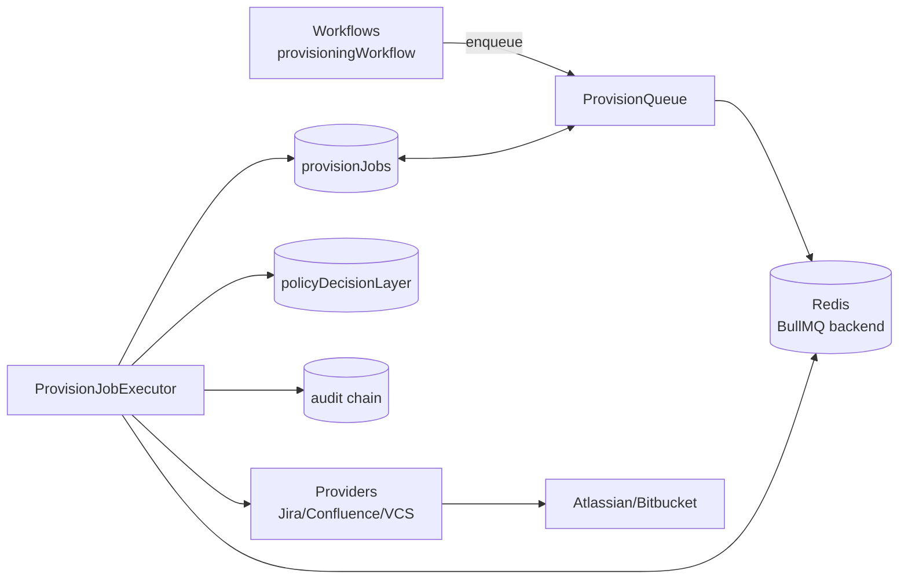
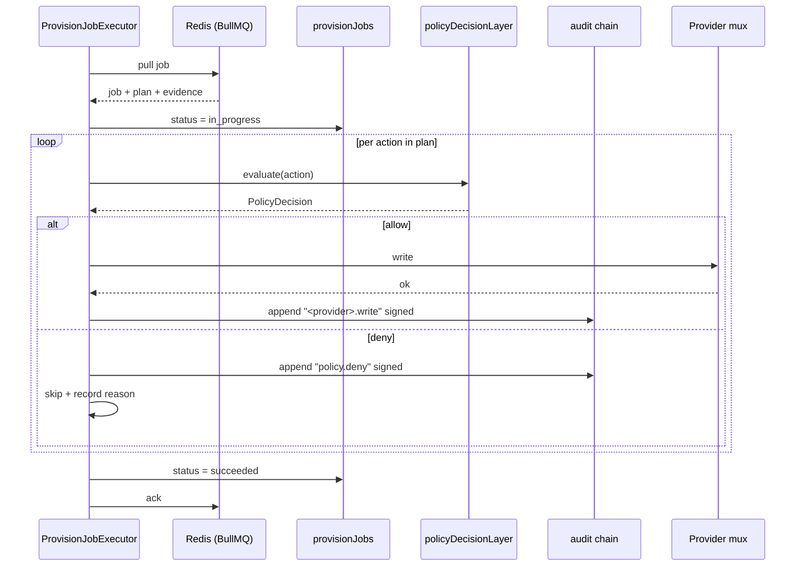
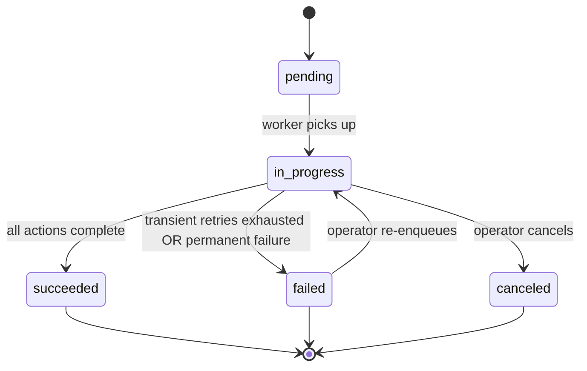

# Module — Queue (BullMQ)

> **TL;DR:** Async job queue for long-running provisioning. BullMQ-backed (Redis). Each job is idempotent — re-running with the same `jobId` + approval evidence produces no extra writes. Job state persisted in `provisionJobs`. Workers pull jobs; per-action policy decision + audit emission. Provisioning queue is M6+; webhook async processing is M10+. v6 §24.

The queue exists because some operations are too long for a synchronous MCP tool call. Provisioning a 50-issue Jira plan takes minutes; the operator can't wait on a single `tools/call` response. The queue absorbs the long tail; jobs return their handle synchronously.

---

## Purpose

Owns:
- The provisioning queue (`ProvisionQueue`).
- Job workers (`ProvisionJobExecutor`) that process jobs.
- Job lifecycle: `pending` → `in_progress` → `succeeded` / `failed` / `canceled`.
- Retry semantics with exponential backoff for transient failures.
- Job-level audit trail integration.
- Idempotency across re-runs.

Does NOT own:
- The provisioning logic itself (workflows + executors own; the queue just runs them).
- The `provisionJobs` schema (storage owns the table; this module operates on it).
- Worker scaling decisions (operational concern).

---

## Public surface

| Symbol | Kind | Signature | Purpose |
|---|---|---|---|
| `ProvisionQueue` | class | various | Enqueue / dequeue / inspect |
| `ProvisionJobExecutor` | class | (worker process / instance) | Pulls + processes |
| `enqueueProvisioning` | function | `(plan, approvalEvidence) => Promise<{jobId, jobResourceUri}>` | Helper used by workflows |
| `getJobStatus` | function | `(jobId) => Promise<JobStatus>` | For mgmt UI / polling |
| `cancelJob` | function | `(jobId, reason) => Promise<void>` | Operator-initiated cancel (M11) |

---

## Architecture

The queue holds the job manifest; workers consume and execute. Each per-action operation flows through the policy + audit layers as if it were inline.

---

## Key flows

### Enqueue

1. Workflow calls `enqueueProvisioning(plan, approvalEvidence)`.
2. Job inserted into `provisionJobs` table (status: `pending`).
3. Job pushed onto BullMQ queue.
4. Returns `{ jobId, jobResourceUri }` synchronously.

The `jobResourceUri` is an MCP resource URI the build agent can subscribe to (M10+) for status updates.

### Process

Each per-action loop is independent; partial completion is the normal recovery path.

### Idempotency

Plans carry idempotency keys per action. Re-running a job with the same plan + approval evidence:

- Skips writes that already succeeded (verified via provider read — does the issue / page / branch already exist?).
- Resumes from the first not-yet-completed action.
- No extra audit entries for skipped actions (skip is itself an audit-logged outcome).

The idempotency key is typically a deterministic hash of the action's intent + parameters; same intent → same key → same downstream artifact.

### Retry on transient failure

For 429s, 5xx, network errors:
- BullMQ retries with exponential backoff (configured per job).
- Default: 3 attempts with backoff 5s, 30s, 2 min.
- After max attempts: status = `failed`; preserves diagnostics for operator review.

For permanent failures (4xx other than 429):
- No retry. Status = `failed` immediately.
- Operator inspects + decides whether to re-enqueue manually after fixing.

### Cancel (M11)

Operator-initiated cancellation:
- `POST /admin/jobs/<id>/cancel` with reason.
- Worker observes the cancel signal at the next safe boundary (between actions).
- In-flight action completes; subsequent actions are skipped.
- Status = `canceled`; reason recorded; audit entry written.

Mid-action cancel is not supported (would require interrupting provider HTTP calls; messy).

---

## Job state model

Failed jobs can be re-enqueued; idempotency handles the re-run.

---

## Failure modes

### Redis unreachable

**Symptom:** workflows can't enqueue.

**Action:** v1 acceptable: workflows fall back to inline execution (synchronous in mgmt REST request) if `PROVISION_QUEUE_REDIS_URL` is empty. M11 hardens with circuit breaker: if Redis was up and is now down, queue stops accepting; existing in-flight jobs continue.

**Audit:** Redis outage is logged + alert.

### Worker crash mid-job

**Symptom:** worker process dies during job execution.

**Action:** BullMQ re-delivers the job to another worker (after a stall timeout). The new worker picks up; idempotency means re-execution doesn't duplicate writes.

**Audit:** the crash is logged; the re-pickup is logged; the audit chain captures both attempts.

### Permanent failure on a job

**Symptom:** all retries exhausted; status = `failed`.

**Action:** alert operator. Operator inspects `provisionJobs` row for diagnostics. Decides whether to fix root cause + re-enqueue, OR accept the partial outcome.

**Audit:** the failure is captured.

### Job timeout

**Symptom:** `PROVISION_JOB_TIMEOUT_MS` (default 5 min) exceeded.

**Action:** worker abandons the job; status = `failed` with reason "timeout."

**Mitigation:** for legitimate long jobs, increase the timeout OR split the plan into smaller plans.

### Duplicate enqueue

**Symptom:** same `jobId` enqueued twice (e.g., from a retry of the workflow).

**Action:** BullMQ recognizes the dedup key; no duplicate work.

---

## Configuration

| Var | Required | Default | Purpose |
|---|---|---|---|
| `PROVISION_QUEUE_REDIS_URL` | Conditional (M6+) | (empty = inline mode) | Redis DSN |
| `PROVISION_JOB_TIMEOUT_MS` | No | 300,000 (5 min) | Per-job timeout |
| `PROVISION_WORKER_CONCURRENCY` | No | 1 | Jobs per worker |
| `PROVISION_RETRY_ATTEMPTS` | No | 3 | Max retry attempts |

When Redis is unset: inline mode. Suitable for v1 small workloads; trade-off is the workflow blocks until completion.

---

## Tests

Planned (M6+):

| Test | What it proves |
|---|---|
| Job lifecycle | `pending → in_progress → succeeded` |
| Retry on transient failure | 429 → backoff → eventual success |
| Idempotency on re-run | Same plan re-runs without duplicates |
| Timeout handling | Long job aborts at the configured timeout |
| Worker crash + recovery | New worker picks up; no duplicate writes |
| Cancel (M11) | Mid-job cancel respects safe boundaries |

Coverage gaps:
- **Concurrent worker race** — when multiple workers compete for the same job (BullMQ handles; verify in integration).
- **Redis failover** — partial network partition behavior.

---

## Concurrency

- BullMQ handles worker concurrency (`PROVISION_WORKER_CONCURRENCY`).
- v1 single-replica: 1 worker process; configurable concurrency per worker.
- Multi-replica (post-v1): horizontal worker scaling. Workers don't share in-memory state; concurrency is queue-mediated.

Per-job concurrency: a single job processes its actions sequentially (or with controlled parallelism within a job). This avoids races within a project's plan.

---

## Performance characteristics

| Operation | Typical | p99 |
|---|---|---|
| Enqueue | < 50 ms | < 200 ms |
| Pickup latency | depends on worker load; aim for < 5 s typical, < 30 s p99 | per SLO |
| Job duration (50-issue Jira plan) | 30–60 s | < 2 min |
| Retry overhead per attempt | 5 s, 30 s, 2 min (backoff) | — |

Performance is dominated by provider call latency, not queue overhead.

---

## Tradeoffs

### BullMQ + Redis vs. Postgres-backed queue

**Chose:** BullMQ.

**Pro:** purpose-built for retry + scheduling + observability. Mature library.

**Con:** additional infrastructure dependency (Redis).

**Mitigation:** inline-mode fallback for small workloads.

### Async by default vs. sync where possible

**Chose:** async for provisioning (long); sync for read-only / fast operations.

**Pro:** large plans don't block the MCP transport.

**Con:** complexity in the queue layer; jobIDs to track.

**Mitigation:** subset of jobs can use inline mode; the threshold is operator-configurable.

### Per-job concurrency 1 vs. per-action parallelism

**Chose:** sequential per-job in v1.

**Pro:** simpler; race-free; easier to reason about.

**Con:** large jobs are slower than they could be.

**Mitigation:** within-job parallelism is post-v1 concern; landed when warranted by data.

---

## Roadmap

- **M6+:** queue wired with executors (Jira / Confluence / VCS).
- **M11:** observability + cancel + circuit breaker hardening.
- **v6 §24.7:** Hatchet considered as alternative queue; deferred for v1.
- **Post-v1:** within-job parallelism if perf data warrants.
- **Post-v1:** distributed worker scaling with multi-replica.

---

## Linked artifacts

- **Spec:** v6 §24 (job queue), §24.1 (workflow strategies), §24.2 (scheduler strategies), §24.3 (approval-gate callback), §24.5 (per-session VCS worktree), §24.7 (Hatchet deferred)
- **Code:** `src/queue/` (M6+), `src/storage/schema/provisionJobs.ts`
- **Sibling modules:** [`module-workflows.md`](module-workflows.md), [`module-storage.md`](module-storage.md), [`module-providers-atlassian.md`](module-providers-atlassian.md), [`module-providers-vcs.md`](module-providers-vcs.md), [`module-security.md`](module-security.md)
- **Capacity:** [`../15-capacity/current-limits.md`](../15-capacity/current-limits.md) (queue depth limits), [`../15-capacity/capacity-planning.md`](../15-capacity/capacity-planning.md) (worker scaling triggers)
- **Audit:** [`../05-data/audit-trail.md`](../05-data/audit-trail.md) (per-action audit emission)

---

*Last reviewed: 2026-04-25 by Chris.*
