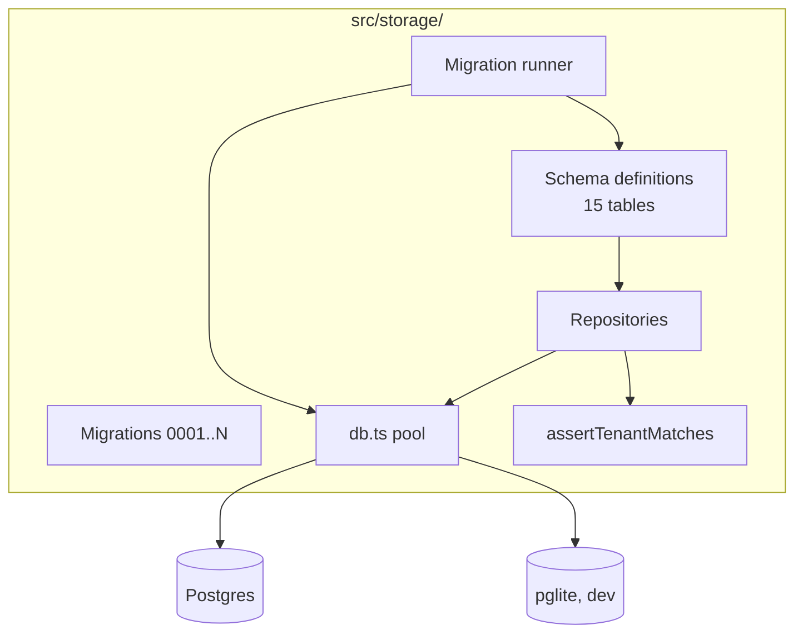
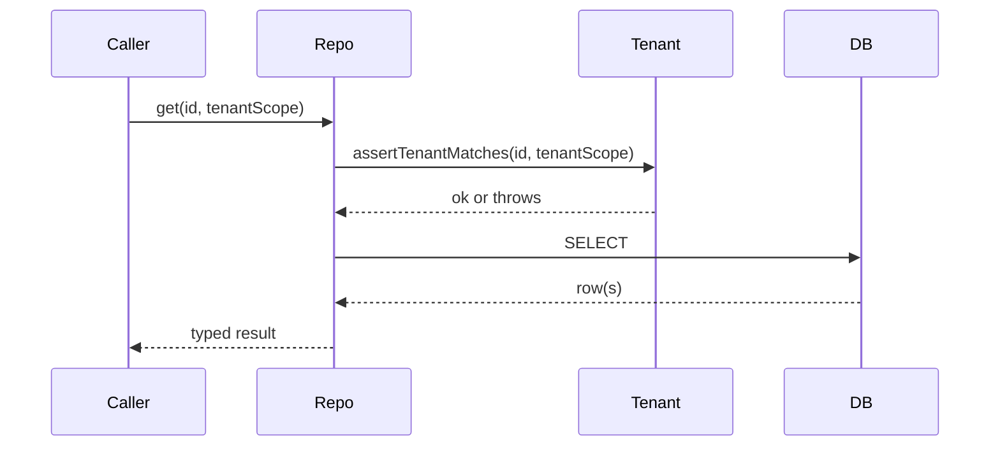

# Module — Storage

> **TL;DR:** Drizzle-typed schema, repositories with tenant-scope enforcement, migration runner with rehearsal mode. Postgres in production, pglite in dev (ADR-0001). All writes go through repositories; no raw SQL outside this module. Idempotency at the schema level (unique constraints) + at the repo level (deterministic upsert).

## Purpose

Owns:
- The schema (15 tables; `src/storage/schema/`).
- The migration runner including rehearsal mode (PCO-13).
- All repositories — every read/write to Postgres goes through them.
- Tenant-scope enforcement at the repo boundary.

Does NOT own:
- Schema changes outside the migration system. (Anything changing the schema is a versioned migration.)
- Cross-table business logic (that lives in workflows).

## Public surface

| Symbol | Kind | Purpose |
|---|---|---|
| `migrationRunner` | function | Apply migrations idempotently; supports rehearsal mode |
| `db` | function | Returns a Drizzle DB instance scoped to a tenant |
| `projectRepository` | factory | CRUD for projects |
| `auditEntriesRepository` | factory | Append-only audit chain writes + reads |
| `policyDecisionRepository` | factory | Policy decision history |
| `mcpSessionProfileRepository` | factory | Session state |
| `tokenStore` | factory | Sealed token CRUD (calls `tokenEncryption`) |
| `aclRepository` | factory | ACL cache reads/writes |
| `traceLinkRepository` | factory | Source-pin traceability |
| `contextPackRepository` | factory | Context pack persistence (M7) |
| `readinessRepository` | factory | Readiness reports |
| `projectProfileRepository` | factory | Preflight profile persistence |
| `workAssignmentRepository` | factory | Developer work assignment persistence |
| `contentQualityReportRepository` | factory | Project/artifact quality report persistence |
| `assertTenantMatches` | guard | Throws on cross-tenant access |

## Architecture

<figure>

<svg viewBox="0 0 1200 480" xmlns="http://www.w3.org/2000/svg" font-family="IBM Plex Sans, system-ui">
  <text x="40" y="28" font-family="IBM Plex Mono" font-size="10.5" letter-spacing="1.4" fill="#9a9690">V15a · STORAGE CONTAINER · C4 LEVEL 3</text>

  <defs>
    <marker id="ar15a" viewBox="0 0 10 10" refX="9" refY="5" markerWidth="7" markerHeight="7" orient="auto-start-reverse">
      <path d="M0,0 L10,5 L0,10 z" fill="#43434a"/>
    </marker>
  </defs>

  <!-- container boundary -->
  <rect x="40" y="56" width="1120" height="400" fill="none" stroke="#1a1a1c" stroke-dasharray="4 3" stroke-width="1.5"/>
  <text x="58" y="76" font-family="IBM Plex Mono" font-size="10.5" letter-spacing="1.2" fill="#1a1a1c">«container» Storage</text>

  <!-- repositories -->
  <g transform="translate(80,110)">
    <rect width="220" height="100" fill="#dde9f2" stroke="#1f5f8a" stroke-width="1.5"/>
    <text x="14" y="22" font-family="IBM Plex Mono" font-size="10" letter-spacing="1.2" fill="#11364f">«component»</text>
    <text x="14" y="44" font-family="IBM Plex Sans" font-size="13" font-weight="600" fill="#11364f">Repositories</text>
    <line x1="14" y1="54" x2="206" y2="54" stroke="#a3c4d8"/>
    <text x="14" y="74" font-family="IBM Plex Sans" font-size="11.5" fill="#11364f">domain queries by aggregate</text>
    <text x="14" y="90" font-family="IBM Plex Mono" font-size="10.5" fill="#1f5f8a">Audit · Token · Job · Schedule</text>
  </g>

  <!-- query builder -->
  <g transform="translate(330,110)">
    <rect width="200" height="100" fill="#faf9f6" stroke="#43434a" stroke-width="1.5"/>
    <text x="14" y="22" font-family="IBM Plex Mono" font-size="10" letter-spacing="1.2" fill="#43434a">«component»</text>
    <text x="14" y="44" font-family="IBM Plex Sans" font-size="13" font-weight="600" fill="#1a1a1c">Kysely query builder</text>
    <line x1="14" y1="54" x2="186" y2="54" stroke="#c8c3b6"/>
    <text x="14" y="74" font-family="IBM Plex Sans" font-size="11.5" fill="#43434a">type-safe SQL · no ORM</text>
    <text x="14" y="90" font-family="IBM Plex Mono" font-size="10.5" fill="#43434a">v6 §11</text>
  </g>

  <!-- driver -->
  <g transform="translate(560,110)">
    <rect width="200" height="100" fill="#faf9f6" stroke="#43434a" stroke-width="1.5"/>
    <text x="14" y="22" font-family="IBM Plex Mono" font-size="10" letter-spacing="1.2" fill="#43434a">«component»</text>
    <text x="14" y="44" font-family="IBM Plex Sans" font-size="13" font-weight="600" fill="#1a1a1c">Driver — pg / pglite</text>
    <line x1="14" y1="54" x2="186" y2="54" stroke="#c8c3b6"/>
    <text x="14" y="74" font-family="IBM Plex Sans" font-size="11.5" fill="#43434a">runtime choice via PGLITE_PATH</text>
    <text x="14" y="90" font-family="IBM Plex Mono" font-size="10.5" fill="#43434a">v6 §11.1</text>
  </g>

  <!-- migrations -->
  <g transform="translate(790,110)">
    <rect width="200" height="100" fill="#fbeed8" stroke="#b96b16" stroke-width="1.5"/>
    <text x="14" y="22" font-family="IBM Plex Mono" font-size="10" letter-spacing="1.2" fill="#7a4408">«component»</text>
    <text x="14" y="44" font-family="IBM Plex Sans" font-size="13" font-weight="600" fill="#7a4408">Migrator</text>
    <line x1="14" y1="54" x2="186" y2="54" stroke="#e3c486"/>
    <text x="14" y="74" font-family="IBM Plex Sans" font-size="11.5" fill="#7a4408">forward-only · schema_migrations</text>
    <text x="14" y="90" font-family="IBM Plex Mono" font-size="10.5" fill="#7a4408">runs on boot</text>
  </g>

  <!-- audit writer -->
  <g transform="translate(80,250)">
    <rect width="220" height="120" fill="#fbe7e4" stroke="#b8281d" stroke-width="1.5"/>
    <text x="14" y="22" font-family="IBM Plex Mono" font-size="10" letter-spacing="1.2" fill="#7a1d14">«component»</text>
    <text x="14" y="44" font-family="IBM Plex Sans" font-size="13" font-weight="600" fill="#7a1d14">AuditWriter</text>
    <line x1="14" y1="54" x2="206" y2="54" stroke="#e3a39a"/>
    <text x="14" y="74" font-family="IBM Plex Sans" font-size="11.5" fill="#7a1d14">single writer · serial commits</text>
    <text x="14" y="90" font-family="IBM Plex Sans" font-size="11.5" fill="#7a1d14">canonical JSON · Ed25519 sign</text>
    <text x="14" y="108" font-family="IBM Plex Mono" font-size="10.5" fill="#b8281d">v6 §10 · V1 detail</text>
  </g>

  <!-- audit verifier -->
  <g transform="translate(330,250)">
    <rect width="200" height="120" fill="#fbe7e4" stroke="#b8281d" stroke-width="1.5"/>
    <text x="14" y="22" font-family="IBM Plex Mono" font-size="10" letter-spacing="1.2" fill="#7a1d14">«component»</text>
    <text x="14" y="44" font-family="IBM Plex Sans" font-size="13" font-weight="600" fill="#7a1d14">AuditVerifier</text>
    <line x1="14" y1="54" x2="186" y2="54" stroke="#e3a39a"/>
    <text x="14" y="74" font-family="IBM Plex Sans" font-size="11.5" fill="#7a1d14">re-derive hash · check sig</text>
    <text x="14" y="90" font-family="IBM Plex Sans" font-size="11.5" fill="#7a1d14">offline-runnable utility</text>
    <text x="14" y="108" font-family="IBM Plex Mono" font-size="10.5" fill="#b8281d">scripts/verify-audit.ts</text>
  </g>

  <!-- token store -->
  <g transform="translate(560,250)">
    <rect width="200" height="120" fill="#ece1f3" stroke="#6e1a82" stroke-width="1.5"/>
    <text x="14" y="22" font-family="IBM Plex Mono" font-size="10" letter-spacing="1.2" fill="#3e0d4d">«component»</text>
    <text x="14" y="44" font-family="IBM Plex Sans" font-size="13" font-weight="600" fill="#3e0d4d">TokenStore</text>
    <line x1="14" y1="54" x2="186" y2="54" stroke="#c39bd1"/>
    <text x="14" y="74" font-family="IBM Plex Sans" font-size="11.5" fill="#3e0d4d">at-rest envelope encryption</text>
    <text x="14" y="90" font-family="IBM Plex Sans" font-size="11.5" fill="#3e0d4d">decrypts only into memory</text>
    <text x="14" y="108" font-family="IBM Plex Mono" font-size="10.5" fill="#6e1a82">v6 §9 · V5 detail</text>
  </g>

  <!-- pg singleton -->
  <g transform="translate(790,250)">
    <rect width="200" height="120" fill="#1a1a1c" stroke="#1a1a1c"/>
    <text x="14" y="22" font-family="IBM Plex Mono" font-size="10" letter-spacing="1.2" fill="#9a9690">«database»</text>
    <text x="14" y="44" font-family="IBM Plex Sans" font-size="13" font-weight="600" fill="#fff">Postgres 17</text>
    <line x1="14" y1="54" x2="186" y2="54" stroke="#43434a"/>
    <text x="14" y="74" font-family="IBM Plex Sans" font-size="11.5" fill="#c8c3b6">single-tenant instance</text>
    <text x="14" y="90" font-family="IBM Plex Sans" font-size="11.5" fill="#c8c3b6">audit_log · tokens · jobs · ...</text>
    <text x="14" y="108" font-family="IBM Plex Mono" font-size="10.5" fill="#9a9690">PITR · daily logical backup</text>
  </g>

  <!-- arrows: repos -> kysely -> driver -> pg -->
  <line x1="300" y1="160" x2="330" y2="160" stroke="#43434a" marker-end="url(#ar15a)"/>
  <line x1="530" y1="160" x2="560" y2="160" stroke="#43434a" marker-end="url(#ar15a)"/>
  <line x1="660" y1="210" x2="890" y2="250" stroke="#43434a" marker-end="url(#ar15a)"/>
  <text x="700" y="232" font-family="IBM Plex Mono" font-size="10" fill="#6f6e6a">SQL</text>

  <!-- migrator -> pg -->
  <line x1="890" y1="210" x2="890" y2="250" stroke="#43434a" marker-end="url(#ar15a)"/>

  <!-- audit writer -> repo -->
  <line x1="190" y1="250" x2="190" y2="210" stroke="#43434a" marker-end="url(#ar15a)"/>
  <text x="200" y="232" font-family="IBM Plex Mono" font-size="10" fill="#6f6e6a">via AuditRepo</text>

  <!-- token store -> repo -->
  <line x1="660" y1="250" x2="220" y2="210" stroke="#43434a" marker-end="url(#ar15a)"/>

  <!-- verifier reads pg directly -->
  <path d="M530,310 Q700,400 890,370" stroke="#43434a" fill="none" stroke-dasharray="3 3" marker-end="url(#ar15a)"/>
  <text x="650" y="395" font-family="IBM Plex Mono" font-size="10" fill="#6f6e6a">read-only</text>

  <!-- KMS callout -->
  <g transform="translate(1010,250)">
    <rect width="130" height="120" fill="#faf9f6" stroke="#1a1a1c" stroke-dasharray="3 3"/>
    <text x="10" y="22" font-family="IBM Plex Mono" font-size="9.5" letter-spacing="1.2" fill="#43434a">«external»</text>
    <text x="10" y="42" font-family="IBM Plex Sans" font-size="12" font-weight="600" fill="#1a1a1c">KMS / KEK</text>
    <text x="10" y="62" font-family="IBM Plex Sans" font-size="11" fill="#43434a">unwraps DEK on</text>
    <text x="10" y="76" font-family="IBM Plex Sans" font-size="11" fill="#43434a">demand</text>
    <text x="10" y="100" font-family="IBM Plex Mono" font-size="10" fill="#43434a">audit-logged</text>
  </g>
  <line x1="760" y1="290" x2="1010" y2="290" stroke="#43434a" marker-end="url(#ar15a)"/>
</svg>

<figcaption><strong>V15a — C4-L3 Storage.</strong> The two C4-L3 component diagrams that anchor the architecture chapter. **Storage (V15a)** shows the read/write paths: AuditWriter is single-writer; tokens go through envelope encryption; Postgres is single-tenant. **Security (V15b)** shows the request pipeline every entry point shares: authn → authz → confirmation → redaction → rate limit → prompt-injection guard, with every decision audit-hooked. There is no bypass path — that's the point. (See <a href="../../visualizations/v15-c4-l3.html">full visualization page</a>.)</figcaption>
</figure>

## Key flows

### Migration with rehearsal

See [`sequence-diagrams.md`](sequence-diagrams.md). Runner steps:

1. Acquire advisory lock (single-runner).
2. Read `_migrations` to determine pending migrations.
3. For each pending migration in order:
   - If rehearsal mode: spin up a temp DB, apply prior migrations, apply pending, run post-conditions; tear down.
   - Apply to target.
   - Record in `_migrations` metadata.
4. Release lock.

Rehearsal failure: stops the runner; the migration is NOT applied to target. Operator must investigate.

### Repository read

Tenant-scope check is mandatory; bypassing it is a defect.

## Data model

15 tables; full ER diagram in [`../05-data/schema.md`](../05-data/schema.md).

Highlights:
- `projects` — root aggregate; blueprint stored as JSONB.
- `auditEntries` — append-only, hash-chained, signed (ADR-0005).
- `encryptedTokens` — sealed via XChaCha20-Poly1305 (ADR-0002).
- `policyDecisions` — structurally redundant with audit entries; queryable via SQL.
- `workAssignments` — role workflow assignment intent with classification and recommendations.
- `contentQualityReports` — deterministic content quality/trustworthiness reports.
- `_migrations` — runner metadata; the table that tracks "what's been applied."

## Failure modes

- **Migration mid-flight crash** — Incident B class. Recovery via [`../08-operations/runbook.md`](../08-operations/runbook.md) "Migration runner stuck."
- **Connection pool exhaustion** — alert via `db_query_failure_rate`. Increase pool size or investigate long-running queries.
- **Tenant-scope violation** — defect; should never happen. The thrown error is captured in audit logs.
- **Audit-write fails** — fail closed. Documented in [`../06-security/audit-chain-threat-model.md`](../06-security/audit-chain-threat-model.md).

## Test surface

| Test | Path |
|---|---|
| Repository contract | `tests/integration/storage/repositories.test.ts` |
| Audit chain integrity | `tests/integration/storage/auditRepository.test.ts` |
| Token store seal/open | `tests/integration/storage/tokenStore.test.ts` |
| Migration rehearsal | `tests/integration/storage/migrationRehearsal.test.ts` |
| Tenant scope | `tests/unit/domain/tenantScope.test.ts` |
| Role workflow repositories | `tests/integration/storage/repositories.test.ts` |

## Concurrency

- Connection pool serves concurrent reads.
- Writes serialized at the row level by Postgres (default).
- Migration runner uses advisory locks for single-runner.
- Audit chain writes serialize the chain (each entry depends on the previous; the runner's locking ensures no parallel chain heads).

## Performance

- Reads: < 5 ms p99 for indexed lookups.
- Writes: < 20 ms p99 for typical inserts.
- Migration apply: depends on migration; rehearsal adds ~1s overhead per migration.

## Tradeoffs

- **Drizzle ORM** vs. raw SQL: chose Drizzle for type-safe queries. Cost: another abstraction layer.
- **JSONB blueprints** vs. fully normalized: blueprints have heterogeneous shapes; JSONB is the ergonomic choice. Cost: harder to query individual fields without GIN indexes.
- **Migration runner replaces Drizzle's built-in runner** vs. accepting Drizzle's: rehearsal is novel, not in Drizzle. Cost: maintain a custom runner.

## Roadmap

- M11: pruning cron jobs for retention.
- Post-v1: per-tenant DB sharding (multi-tenant prerequisite).

## Linked artifacts

- **Spec:** v6 §10 (domain), §28 M1, §6.1 (PHASE-STATE)
- **ADR:** [ADR-0001](../../adr/0001-pglite-for-dev.md)
- **Code:** `src/storage/`
- **Schema doc:** [`../05-data/schema.md`](../05-data/schema.md)
- **Migrations doc:** [`../05-data/migrations.md`](../05-data/migrations.md)
- **Tests:** see test surface
- **Tracking:** PCO-13 (rehearsal), PCO-56 (vacuumed-row gap)

---

*Last reviewed: 2026-04-27 by Chris.*
