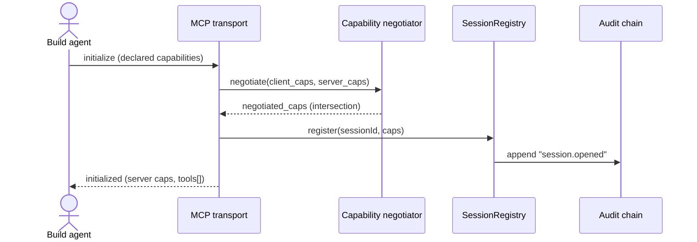
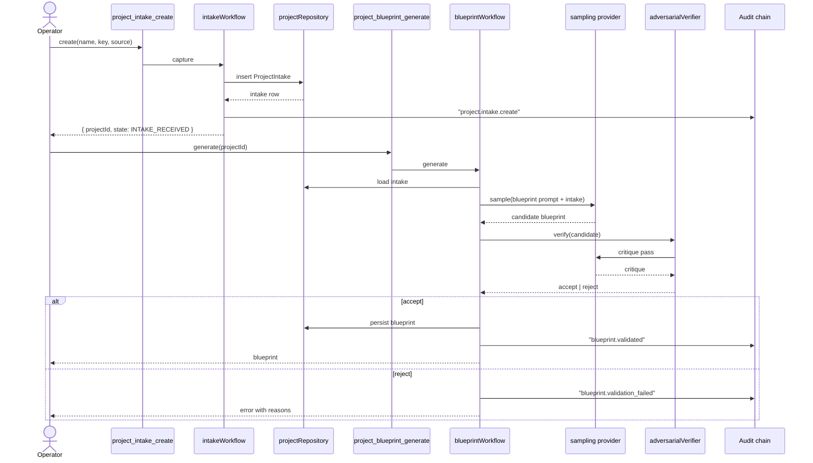
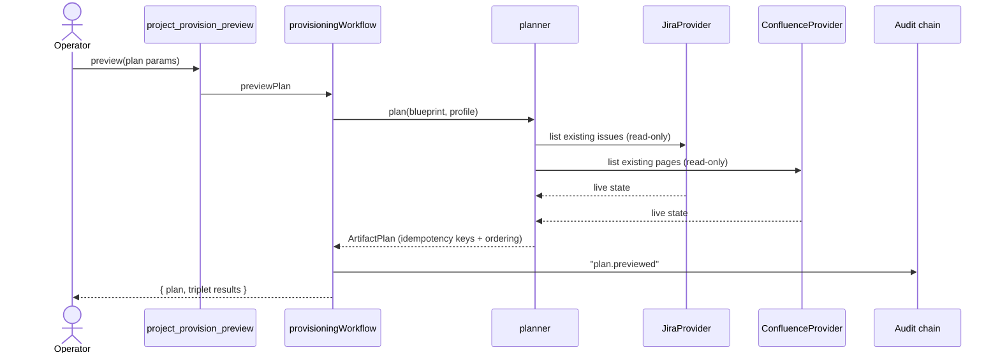
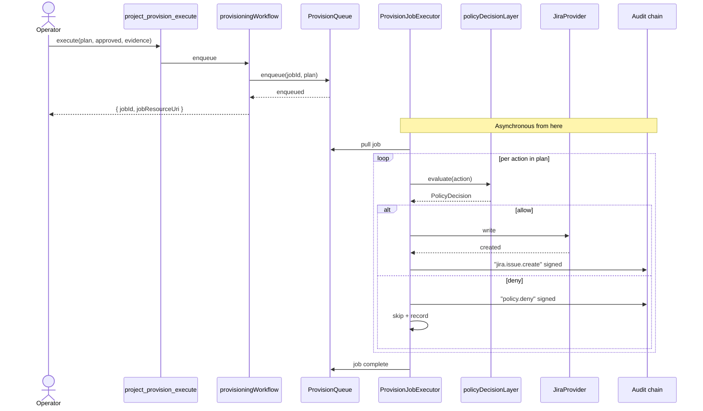
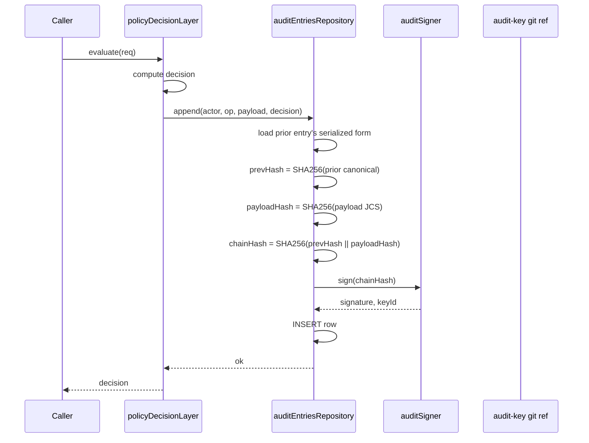
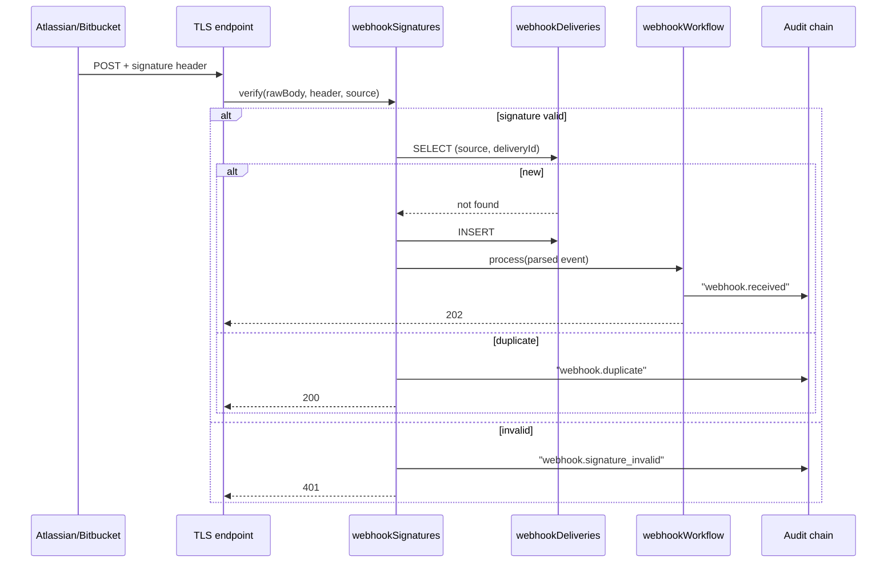
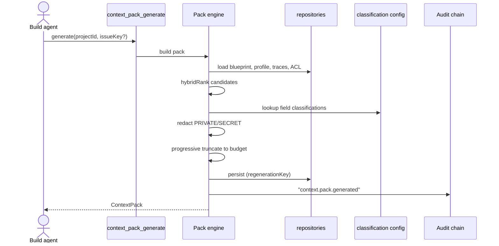
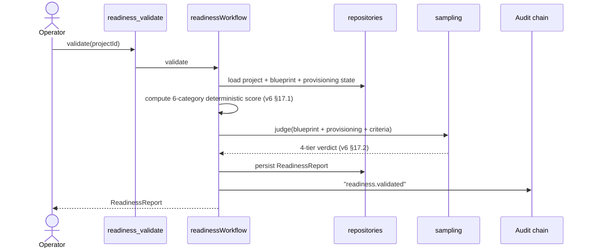

# Sequence Diagrams

> **TL;DR:** Eight key flows: MCP session establishment, intake → blueprint, blueprint → plan, plan → execute, audit chain write, audit chain rotation, webhook ingestion, context-pack generation, readiness validation. Each is a separate section with a mermaid sequence diagram, narrative, failure-mode notes, and trust-boundary callouts. Per the [`../templates/sequence-diagram-template.md`](../templates/sequence-diagram-template.md) shape.

---

## 1. MCP session establishment

**Pre-conditions:** server running; client speaks MCP.



**Boundaries crossed:** Boundary 1 (external → server).
**Failure modes:** stdout corruption (Incident A); capability mismatch (negotiation produces downgraded surface).
**Post-conditions:** session live; client can issue tool calls.

## 2. Intake → blueprint

**Pre-conditions:** project exists; intake tool flag enabled.



**Boundaries crossed:** Boundary 1 (operator), Boundary 2 (sampling provider).
**Failure modes:** sampling unavailable (degraded); triplet rejects (state VALIDATION_FAILED).

## 3. Blueprint → plan

**Pre-conditions:** validated blueprint + ProjectProfile exist.



**Boundaries crossed:** Boundary 1, Boundary 2 (read-only against Atlassian).
**Failure modes:** discovery fails; planner produces partial plan with warnings.

## 4. Plan → execute (Jira)

**Pre-conditions:** plan exists, approval received.



**Boundaries crossed:** Boundary 1, Boundary 2 (writes!), Boundary 3 (audit on every step).
**Failure modes:** mid-execute crash → job re-pickup, idempotent re-run; policy denial → audit + skip.

## 5. Audit chain write

**Pre-conditions:** an operation needs to be audited.



**Boundaries crossed:** Boundary 3.
**Failure modes:** signing key unreachable → fail closed; DB insert fails → fail closed; registry unreachable for new key resolution → fail (use cached active key).

## 6. Audit chain key rotation

**Pre-conditions:** operator decides to rotate (compromise or scheduled).

```mermaid
sequenceDiagram
    actor Op as Operator
    participant Cli as audit-keys-init
    participant Reg as audit-key git ref
    participant Server as orchestrator process
    participant Audit as audit chain

    Op->>Cli: generate new keypair
    Cli-->>Op: new keypair (private + public)
    Op->>Reg: push public-half (new keyId)
    Op->>Server: update AUDIT_KEYPAIR_PATH; restart
    Server->>Server: load new private key
    Server->>Audit: append "audit.key.rotated" with new key
    Note over Server,Audit: First entry signed with new key references the rotation event
    Op->>Cli: archive old private key (retention period)
```

**Boundaries crossed:** Boundary 3.
**Failure modes:** registry push fails → no rotation; restart fails → roll back to old key path.

## 7. Webhook ingestion

**Pre-conditions:** webhook source has shared secret registered.



**Boundaries crossed:** Boundary 1 (external → server).
**Failure modes:** signature failure → 401; dedup table unreachable → reject (fail closed).

## 8. Context pack generation + readiness validation





**Failure modes:** missing classification (default INTERNAL); LLM judge unavailable (degraded — score-only); pack over budget (truncation lossiness).

---

## Diagram conventions

- Activations only on non-trivial work.
- `alt` blocks for branches; `opt` for optional; `par` for parallel.
- Audit interactions shown as solid arrows (they're synchronous and load-bearing).
- Lifelines named by role, not by class file.

## Linked artifacts

- **Spec:** v6 §5 (core flow), §6 (state machine), §7 (architecture), §16 (context), §17 (readiness), §18 (write safety), §22 (transport), §26 (webhook), §30 (audit)
- **Sibling docs:** [`module-*.md`](.) (per-module designs), [`../02-architecture/data-flow.md`](../02-architecture/data-flow.md)
- **Template:** [`../templates/sequence-diagram-template.md`](../templates/sequence-diagram-template.md)

---

*Last reviewed: 2026-04-25 by Chris.*
