# Data Schema

> **TL;DR:** 15 tables in Postgres (or pglite in dev). Drizzle-typed schema. Versioned migrations in `src/storage/migrations/`. ER diagram below; per-table fields documented inline. Audit chain (`auditEntries`) is append-only; everything else is normal CRUD with tenant scoping.

This is the data architecture view. The migration policy is in [`migrations.md`](migrations.md). The classification policy is in [`classification.md`](classification.md). The retention policy is in [`retention.md`](retention.md).

---

## ER diagram

```mermaid
erDiagram
    projects ||--o{ projectProfiles : "has many"
    projects ||--o{ traceLinks : "has many"
    projects ||--o{ contextPacks : "has many"
    projects ||--o{ agentMemoryEntries : "has many"
    projects ||--o{ workAssignments : "has many"
    projects ||--o{ contentQualityReports : "has many"
    projects ||--o{ aclEntries : "has many"
    projects ||--o{ readinessReports : "has many"
    projects ||--o{ provisionJobs : "has many"
    auditEntries }o--|| auditEntries : "prev_hash chains"
    policyDecisions }|--|| auditEntries : "1:1 mirror"
    encryptedTokens ||--o{ webhookDeliveries : "secret per source"
    mcpSessionProfiles ||--o{ traceLinks : "actor in"

    projects {
        text id PK
        text tenant_id
        text key
        text name
        jsonb blueprint
        text state
        timestamp created_at
        timestamp updated_at
    }

    projectProfiles {
        text id PK
        text project_id FK
        text tenant_id
        jsonb capabilities
        timestamp expires_at
        timestamp created_at
    }

    traceLinks {
        text tenant_id PK
        text project_id PK
        text source_ref PK
        text target_ref PK
        jsonb metadata
    }

    contextPacks {
        text id PK
        text regeneration_key UK
        text project_id FK
        jsonb content
        text target_model
        int token_count
        timestamp created_at
    }

    agentMemoryEntries {
        text id PK
        text tenant_id
        text project_id
        text agent_key
        text issue_key
        text kind
        text text
        jsonb tags
        jsonb source_refs
        text content_hash
        timestamp created_at
        timestamp updated_at
        timestamp deleted_at
    }

    workAssignments {
        text id PK
        text tenant_id
        text project_id FK
        text work_kind
        text work_id
        text status
        text assigned_agent_id
        text assigned_by
        jsonb payload
        timestamp created_at
        timestamp updated_at
    }

    contentQualityReports {
        text id PK
        text tenant_id
        text project_id FK
        text artifact_kind
        text artifact_id
        int score
        text grade
        jsonb payload
        timestamp generated_at
    }

    aclEntries {
        text project_id PK
        text artifact_ref PK
        text principal_id PK
        text decision
        timestamp expires_at
    }

    mcpSessionProfiles {
        text session_id PK
        jsonb capabilities
        jsonb token_budget
        timestamp expires_at
    }

    policyDecisions {
        text id PK
        text check_id
        text effect
        jsonb obligations
        jsonb confidence
        text[] reasons
        timestamp created_at
    }

    auditEntries {
        text id PK
        text tenant_id
        text actor
        text operation
        jsonb payload
        bytea prev_hash
        bytea payload_hash
        bytea chain_hash
        bytea signature
        text key_id
        timestamp ts
    }

    readinessReports {
        text id PK
        text project_id FK
        text grade
        jsonb score_breakdown
        text verdict
        timestamp created_at
    }

    encryptedTokens {
        text id PK
        text kind
        text subject
        bytea nonce
        bytea ciphertext
        text rotated_from_id
        timestamp created_at
    }

    provisionJobs {
        text job_id PK
        text project_id FK
        text status
        jsonb plan
        jsonb result
        jsonb approval_evidence
        timestamp created_at
        timestamp updated_at
    }

    webhookDeliveries {
        text id PK
        text source
        text delivery_id
        text outcome
        timestamp received_at
    }
```

## Per-table notes

### `projects`
Root aggregate. Blueprint is JSONB so it can carry the heterogeneous shapes from v6 §10. State is one of the 13 ProjectState values.

### `projectProfiles`
Output of preflight. Multiple profiles per project (over time); `expires_at` for TTL.

### `traceLinks`
Source-pin traceability: maps requirements back to intake markdown chunks.

### `contextPacks`
M7+. Context-pack persistence keyed by `regenerationKey` (deterministic hash of inputs).

### `agentMemoryEntries`
Project-scoped persistent agent memory keyed by tenant, project, and agent. Active duplicates are deduped by content hash; `deleted_at` soft-deletes entries from recall.

### `workAssignments`
Developer work assignment intent keyed by tenant/project/work reference. The row stores normalized work kind/id fields for lookup plus the full `WorkAssignmentRecord` payload with classification, recommendation, and assignment metadata.

### `contentQualityReports`
Persisted project or artifact trustworthiness reports. The row stores score/grade/artifact lookup fields plus the full `ContentQualityReport` payload.

### `aclEntries`
Cache of ACL decisions from Jira/Confluence/VCS. TTL refresh on permission webhook.

### `mcpSessionProfiles`
Per-MCP-session metadata. Ephemeral (HTTP session TTL).

### `policyDecisions`
SQL-queryable redundant copy of audit chain entries that are policy decisions.

### `auditEntries`
**Append-only.** The audit chain. See [`audit-trail.md`](audit-trail.md) for the construction; [`../06-security/audit-chain-threat-model.md`](../06-security/audit-chain-threat-model.md) for the threat model.

### `readinessReports`
M8+. The deterministic + LLM-judged readiness output.

### `encryptedTokens`
Sealed credentials. See [`../06-security/token-storage.md`](../06-security/token-storage.md).

### `provisionJobs`
M6+. Async job state for the queue.

### `webhookDeliveries`
M10+. Delivery dedup table.

## Indexes

Indexed columns (beyond primary keys):

- `projects.tenant_id` — tenant filter.
- `projectProfiles.project_id` — lookup recent profiles.
- `traceLinks.tenant_id, project_id` — lookup all links.
- `contextPacks.regeneration_key` — UNIQUE, fast idempotent re-fetch.
- `agentMemoryEntries.tenant_id, project_id, agent_key` — recall scope.
- `agentMemoryEntries.tenant_id, project_id, content_hash` — active dedupe with agent key.
- `workAssignments.tenant_id, project_id` — project assignment list.
- `workAssignments.tenant_id, project_id, work_kind, work_id` — lookup assignment for a specific story/task/Jira issue.
- `workAssignments.tenant_id, status` — operational review by assignment state.
- `contentQualityReports.tenant_id, project_id` — project quality report list.
- `contentQualityReports.tenant_id, artifact_kind, artifact_id` — latest report for a specific artifact.
- `contentQualityReports.tenant_id, project_id, generated_at` — chronological project quality history.
- `aclEntries.expires_at` — for TTL pruning.
- `auditEntries.tenant_id, ts` — chronological queries.
- `auditEntries.actor, ts` — actor history.
- `policyDecisions.check_id` — UNIQUE; fast check.
- `provisionJobs.project_id, status` — operator inspection.
- `webhookDeliveries.source, delivery_id` — UNIQUE; dedup check.

Indexes are defined in the schema files.

## Constraints

- `auditEntries` has a UNIQUE constraint on `(tenant_id, prev_hash)` (excluding NULL prev_hash for genesis) to prevent forking the chain.
- `encryptedTokens.kind` enum-bound.
- Foreign keys with `ON DELETE` policies appropriate to the relationship.

## What's deliberately NOT in the schema

- **No "audit-chain head" pointer.** The head is the row with the largest `ts` (or sequence). Adding a separate pointer creates consistency questions.
- **No materialized views.** Analytics on audit entries is via SQL; if scale demands materialized views, M11+.
- **No audit-trace JSONL persisted in the DB.** That stream lives as files, complementary to the in-DB chain.

## Linked artifacts

- **Spec:** v6 §10 (domain model)
- **Code:** `src/storage/schema/`
- **Migrations:** [`migrations.md`](migrations.md), `src/storage/migrations/`
- **Role workflow migration:** `src/storage/migrations/0005_role_workflows.sql`
- **Domain types:** [`domain-model.md`](domain-model.md)
- **Audit trail:** [`audit-trail.md`](audit-trail.md)
- **Classification:** [`classification.md`](classification.md)
- **Retention:** [`retention.md`](retention.md)
- **Module:** [`../04-design/module-storage.md`](../04-design/module-storage.md)

---

*Last reviewed: 2026-04-27 by Chris.*
