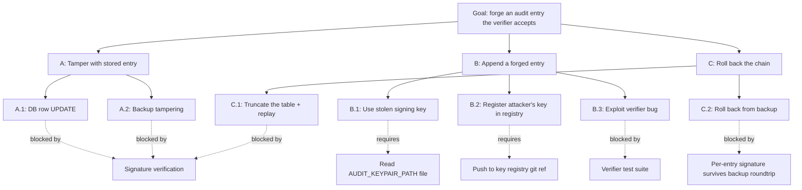

# Audit Chain Threat Model

> **TL;DR:** The audit chain is hash-linked + ed25519-signed + key-registry in a git ref. An adversary needs DB write access AND signing-key access AND key-registry-push access to forge an entry undetected. This doc walks the attack tree per defense layer, documents the genesis case, and specifies the rotation procedure.

Component-level threat model. Parent: [`threat-model.md`](threat-model.md). Decision rationale: [ADR-0005](../../adr/0005-audit-signing-pipeline.md).

---

## Component scope

- **What it is:** append-only log of every state change in atl-mcp; tamper-evident.
- **Code:** `src/storage/schema/auditEntries.ts`, plus repositories in `src/storage/repositories/`.
- **Persistence:** Postgres `auditEntries` table (rehearsed via pglite in dev).
- **Verifier:** offline CLI tool (planned per ADR-0005).
- **Spec:** v6 §30.1.

## Entry shape (recap)

<figure>

<svg viewBox="0 0 1100 640" xmlns="http://www.w3.org/2000/svg" font-family="IBM Plex Sans, system-ui" font-size="12">
    <defs>
      <marker id="arr" viewBox="0 0 10 10" refX="9" refY="5" markerWidth="7" markerHeight="7" orient="auto-start-reverse">
        <path d="M0,0 L10,5 L0,10 z" fill="#43434a"/>
      </marker>
      <marker id="arr-dim" viewBox="0 0 10 10" refX="9" refY="5" markerWidth="7" markerHeight="7" orient="auto-start-reverse">
        <path d="M0,0 L10,5 L0,10 z" fill="#9a9690"/>
      </marker>
      <pattern id="dotgrid" x="0" y="0" width="6" height="6" patternUnits="userSpaceOnUse">
        <circle cx="1" cy="1" r="0.5" fill="#e3e0d8"/>
      </pattern>
    </defs>

    <!-- title strip -->
    <text x="40" y="28" font-family="IBM Plex Mono" font-size="10.5" letter-spacing="1.2" fill="#9a9690">ENTRY N-1 · STORED</text>
    <text x="430" y="28" font-family="IBM Plex Mono" font-size="10.5" letter-spacing="1.2" fill="#9a9690">ENTRY N · CONSTRUCTION</text>
    <text x="900" y="28" font-family="IBM Plex Mono" font-size="10.5" letter-spacing="1.2" fill="#9a9690">REGISTRY</text>

    <!-- column dividers -->
    <line x1="380" y1="44" x2="380" y2="600" stroke="#e3e0d8" stroke-dasharray="2 4"/>
    <line x1="850" y1="44" x2="850" y2="600" stroke="#e3e0d8" stroke-dasharray="2 4"/>

    <!-- ============ ENTRY N-1 (stored row, cylinder-ish rect) ============ -->
    <g transform="translate(40,68)">
      <rect width="320" height="172" rx="3" fill="#faf9f6" stroke="#c8c3b6"/>
      <text x="16" y="22" font-family="IBM Plex Mono" font-size="10" fill="#9a9690">stored row · auditEntries[N-1]</text>
      <g font-family="IBM Plex Mono" font-size="11.5" fill="#43434a">
        <text x="16" y="46">id              018f...c2a1</text>
        <text x="16" y="64">prev_hash       3a91…</text>
        <text x="16" y="82">payload_hash    7e0c…</text>
        <text x="16" y="100">chain_hash      bb52…</text>
        <text x="16" y="118">signature       ed25519:84ff…</text>
        <text x="16" y="136">key_id          key-A</text>
        <text x="16" y="154">ts              2026-04-25T…</text>
      </g>
    </g>

    <!-- canonical serialize -->
    <g transform="translate(40,260)">
      <rect width="320" height="46" rx="3" fill="#fff" stroke="#c8c3b6"/>
      <text x="16" y="20" font-family="IBM Plex Mono" font-size="11" fill="#1a1a1c">canonicalize (RFC 8785 JCS)</text>
      <text x="16" y="36" font-family="IBM Plex Mono" font-size="10.5" fill="#6f6e6a">incl. signature → bytes</text>
    </g>
    <line x1="200" y1="240" x2="200" y2="260" stroke="#43434a" marker-end="url(#arr)"/>

    <!-- SHA-256 -->
    <g transform="translate(80,326)">
      <rect width="240" height="38" rx="19" fill="#1a1a1c"/>
      <text x="120" y="24" text-anchor="middle" font-family="IBM Plex Mono" font-size="11.5" fill="#fff">SHA-256</text>
    </g>
    <line x1="200" y1="306" x2="200" y2="326" stroke="#43434a" marker-end="url(#arr)"/>

    <!-- prev_hash output -->
    <g transform="translate(80,388)">
      <rect width="240" height="48" rx="3" fill="#dde9f2" stroke="#1f5f8a"/>
      <text x="120" y="20" text-anchor="middle" font-family="IBM Plex Mono" font-size="10" fill="#1f5f8a">prev_hash</text>
      <text x="120" y="38" text-anchor="middle" font-family="IBM Plex Mono" font-size="11.5" fill="#1a1a1c">bb52f0c1…</text>
    </g>
    <line x1="200" y1="364" x2="200" y2="388" stroke="#43434a" marker-end="url(#arr)"/>

    <!-- genesis note -->
    <g transform="translate(40,464)">
      <rect width="320" height="58" rx="3" fill="url(#dotgrid)" stroke="#c8c3b6" stroke-dasharray="3 3"/>
      <text x="16" y="22" font-family="IBM Plex Mono" font-size="10" fill="#9a9690">genesis case</text>
      <text x="16" y="40" font-size="11.5" fill="#43434a">prev_hash = NULL</text>
      <text x="16" y="56" font-size="11" fill="#6f6e6a">chain_hash = SHA-256(payload_hash) only</text>
    </g>

    <!-- ============ ENTRY N construction (middle column) ============ -->
    <!-- payload (cylinder = external input) -->
    <g transform="translate(420,68)">
      <ellipse cx="160" cy="14" rx="160" ry="10" fill="#fbeed8" stroke="#b96b16"/>
      <rect x="0" y="14" width="320" height="50" fill="#fbeed8" stroke="#b96b16"/>
      <ellipse cx="160" cy="64" rx="160" ry="10" fill="#fbeed8" stroke="#b96b16"/>
      <text x="160" y="40" text-anchor="middle" font-family="IBM Plex Mono" font-size="11" fill="#7a4408">payload (canonical JSON · JCS)</text>
      <text x="160" y="58" text-anchor="middle" font-family="IBM Plex Mono" font-size="10.5" fill="#7a4408">{ actor, operation, inputs, outputs }</text>
    </g>

    <!-- payload SHA -->
    <g transform="translate(460,170)">
      <rect width="240" height="38" rx="19" fill="#1a1a1c"/>
      <text x="120" y="24" text-anchor="middle" font-family="IBM Plex Mono" font-size="11.5" fill="#fff">SHA-256</text>
    </g>
    <line x1="580" y1="146" x2="580" y2="170" stroke="#43434a" marker-end="url(#arr)"/>

    <!-- payload_hash -->
    <g transform="translate(460,228)">
      <rect width="240" height="48" rx="3" fill="#dde9f2" stroke="#1f5f8a"/>
      <text x="120" y="20" text-anchor="middle" font-family="IBM Plex Mono" font-size="10" fill="#1f5f8a">payload_hash</text>
      <text x="120" y="38" text-anchor="middle" font-family="IBM Plex Mono" font-size="11.5" fill="#1a1a1c">7e0c83a4…</text>
    </g>
    <line x1="580" y1="208" x2="580" y2="228" stroke="#43434a" marker-end="url(#arr)"/>

    <!-- concat -->
    <g transform="translate(460,300)">
      <rect width="240" height="36" rx="3" fill="#fff" stroke="#c8c3b6"/>
      <text x="120" y="22" text-anchor="middle" font-family="IBM Plex Mono" font-size="11" fill="#1a1a1c">prev_hash ‖ payload_hash</text>
    </g>
    <!-- arrow from prev_hash on left -->
    <path d="M320,412 C 360,412 380,318 460,318" fill="none" stroke="#43434a" marker-end="url(#arr)"/>
    <!-- arrow down from payload_hash -->
    <line x1="580" y1="276" x2="580" y2="300" stroke="#43434a" marker-end="url(#arr)"/>

    <!-- chain SHA -->
    <g transform="translate(460,358)">
      <rect width="240" height="38" rx="19" fill="#1a1a1c"/>
      <text x="120" y="24" text-anchor="middle" font-family="IBM Plex Mono" font-size="11.5" fill="#fff">SHA-256</text>
    </g>
    <line x1="580" y1="336" x2="580" y2="358" stroke="#43434a" marker-end="url(#arr)"/>

    <!-- chain_hash -->
    <g transform="translate(460,418)">
      <rect width="240" height="48" rx="3" fill="#dde9f2" stroke="#1f5f8a"/>
      <text x="120" y="20" text-anchor="middle" font-family="IBM Plex Mono" font-size="10" fill="#1f5f8a">chain_hash</text>
      <text x="120" y="38" text-anchor="middle" font-family="IBM Plex Mono" font-size="11.5" fill="#1a1a1c">e44a91d2…</text>
    </g>
    <line x1="580" y1="396" x2="580" y2="418" stroke="#43434a" marker-end="url(#arr)"/>

    <!-- ed25519 sign -->
    <g transform="translate(460,490)">
      <rect width="240" height="40" rx="20" fill="#6e1a82"/>
      <text x="120" y="25" text-anchor="middle" font-family="IBM Plex Mono" font-size="11.5" fill="#fff">ed25519 sign(chain_hash)</text>
    </g>
    <line x1="580" y1="466" x2="580" y2="490" stroke="#43434a" marker-end="url(#arr)"/>

    <!-- signature -->
    <g transform="translate(460,552)">
      <rect width="240" height="48" rx="3" fill="#ece1f3" stroke="#6e1a82"/>
      <text x="120" y="20" text-anchor="middle" font-family="IBM Plex Mono" font-size="10" fill="#6e1a82">signature</text>
      <text x="120" y="38" text-anchor="middle" font-family="IBM Plex Mono" font-size="11.5" fill="#1a1a1c">ed25519:9c14ab…</text>
    </g>
    <line x1="580" y1="530" x2="580" y2="552" stroke="#43434a" marker-end="url(#arr)"/>

    <!-- ============ REGISTRY (right column) ============ -->
    <g transform="translate(880,68)">
      <rect width="200" height="180" rx="3" fill="#faf9f6" stroke="#c8c3b6" stroke-dasharray="3 3"/>
      <text x="14" y="20" font-family="IBM Plex Mono" font-size="10" fill="#9a9690">key registry · git ref</text>
      <g font-family="IBM Plex Mono" font-size="11" fill="#43434a">
        <text x="14" y="44">key-A  ── retired</text>
        <text x="14" y="62">key-B  ── active   ●</text>
        <text x="14" y="80">key-C  ── staged</text>
      </g>
      <text x="14" y="116" font-size="11" fill="#6f6e6a">commit log = rotation</text>
      <text x="14" y="132" font-size="11" fill="#6f6e6a">history; verifier walks</text>
      <text x="14" y="148" font-size="11" fill="#6f6e6a">to resolve key_id at</text>
      <text x="14" y="164" font-size="11" fill="#6f6e6a">entry's timestamp.</text>
    </g>

    <!-- registry → sign annotation -->
    <path d="M880,510 C 820,510 800,510 700,510" fill="none" stroke="#9a9690" stroke-dasharray="4 3" marker-end="url(#arr-dim)"/>
    <text x="780" y="500" font-family="IBM Plex Mono" font-size="10" fill="#6f6e6a" text-anchor="middle">resolves key_id → priv key</text>

    <!-- final stored row -->
    <g transform="translate(420,612)">
      <text x="160" y="14" text-anchor="middle" font-family="IBM Plex Mono" font-size="10" fill="#9a9690">→ persisted as auditEntries[N]</text>
    </g>

  </svg>

<figcaption><strong>V1 — Audit chain entry construction.</strong> Each audit entry chains to the previous via `prev_hash` (SHA-256 of the prior entry's canonical serialization, signature included). The current entry's `payload_hash` and `prev_hash` combine to produce `chain_hash`, which is signed with the active ed25519 key (referenced by `key_id` resolved through the git-ref registry). Tampering with any prior entry breaks `prev_hash` for the next; tampering with the current payload breaks `payload_hash` — either way the verifier surfaces the failing entry. (See <a href="../../visualizations/v01-audit-chain-construction.html">full visualization page</a>.)</figcaption>
</figure>

| Column | Purpose |
|---|---|
| `id` | UUIDv7 (sortable) |
| `actor` | session or operator that initiated |
| `operation` | verb + object (e.g. `jira.issue.create`) |
| `payload` | canonical JSON (RFC 8785 JCS) of inputs + outputs |
| `prev_hash` | SHA-256 of previous entry's full canonical serialization (incl. its signature). NULL for genesis. |
| `payload_hash` | SHA-256(`payload`) |
| `chain_hash` | SHA-256(`prev_hash` ‖ `payload_hash`) |
| `signature` | ed25519 over `chain_hash` |
| `key_id` | identifier resolved through the key registry |
| `ts` | server-generated timestamp |

## Trust assumptions

| Assumption | Why we make it | If broken |
|---|---|---|
| The signing key file (mode 0400) is readable only by the server uid | OS-level file permissions | Forgery becomes possible; rotate immediately |
| The key registry git ref is push-protected | Git host security (signed commits, branch protection) | Attacker can register their key as active; chain integrity collapses |
| The Postgres DB is accessed only by the server process | Application-deploy hygiene | DB-write attacker can append junk entries (caught by signature) but not forge valid ones unless they also have the key |
| Server clock is roughly correct (within seconds) | NTP / cloud host clock | Timestamps misorder; chain order survives via prev_hash; verifier flags large skews |
| Git host is uncompromised | Standard git provider security model | Out of scope; if GitHub/Bitbucket/internal git is compromised, the world is on fire |

## Attack tree

The goal: forge an audit entry that the verifier accepts as valid.

### Attack A: tamper with stored entries

Modifying any stored field changes either `prev_hash` (next entry's reference) or `payload_hash` (this entry's). The `chain_hash` recomputes to a different value; the signature no longer verifies.

**Detection:** offline verifier walks the chain in order, recomputes each `chain_hash`, validates each signature. First-tampered entry surfaces with line: "verification failed at entry K: chain_hash mismatch" or "signature invalid".

**Residual risk:** detection is post-hoc. A long-running tamper that's never verified accumulates impact. Mitigation: scheduled verifier run (operationally; not yet automated in v1) and `/admin/health/audit` health endpoint that runs a partial walk on each call.

### Attack B: append a forged entry

The attacker writes a new entry that looks valid.

**B.1 Stolen signing key.** Attacker reads `AUDIT_KEYPAIR_PATH` and signs a forged `chain_hash`. The forged entry verifies. **This is the worst case** because forensics can't distinguish forged from legitimate.

- Mitigation: file permissions (mode 0400, server uid). Rotation procedure (below) limits temporal exposure.
- Detection: the rotation event itself is an audit entry; if rotation happened without operator action, that's the trigger.
- Recovery: rotate. Mark forged entries (no automated way; relies on operator to identify by content + timing).

**B.2 Register attacker's key.** Attacker pushes to the key registry git ref and registers their key as `active`. New entries signed with the attacker key now verify, because the verifier resolves `key_id` through the registry.

- Mitigation: git host's branch protection + signed commits. Operationally separate from the server host.
- Detection: anomalous registry pushes (git history audit). The registry ref's commit log is itself an audit trail.
- Recovery: revert the bad commit; entries signed with the attacker key are flagged by verifier (no longer resolvable to a "trusted" key).

**B.3 Verifier bug.** The verifier itself has a bug that accepts invalid chains.

- Mitigation: verifier test suite covering tamper / forgery / replay scenarios (`tests/integration/storage/auditRepository.test.ts` partial coverage; full verifier CLI is M11 work).
- Detection: cross-verification (two independent verifier implementations would catch this; v1 has only one).

### Attack C: roll back the chain

The attacker truncates entries and "starts over" from a synthetic genesis.

**C.1 Truncate + replay:** unlike a single tamper, this attacks the *length* invariant. The verifier doesn't directly know "what length the chain should be" without an external pin.

- Mitigation: the chain length itself is recorded in the `/admin/health/audit` response, observable externally. Capacity planning records expected chain length growth rate.
- Detection: anomaly in chain length (sudden drop; unexpected genesis timestamp).

**C.2 Roll back from backup:** if a backup is restored that predates an entry, the entry is lost; the chain has fewer entries.

- Mitigation: backup procedure documented in [`../10-dr-bcp/backup-strategy.md`](../10-dr-bcp/backup-strategy.md); restoration is itself an audit-loggable event.
- Detection: same as C.1.

## The genesis block (and why it has no signed predecessor)

The first entry has `prev_hash = NULL`. This is the chicken-and-egg case: there's no prior entry to chain to.

- **Verifier behavior:** treats `prev_hash IS NULL` as a special case for entry 1 only. Reports "chain length 1, genesis only" or "genesis followed by N entries".
- **Why not seed with a synthetic prior?** A synthetic prior would itself need to be signed, requiring a key, which would be the system's first key with no provenance. The NULL is structurally singular: one entry has it, by construction.
- **Defensive check:** verifier asserts that exactly one entry in the chain has `prev_hash = NULL`. Multiple genesis entries means tampering or rollback.
- **Exposure:** the genesis is signed normally — the same signing key is used. `chain_hash` is just `SHA-256(payload_hash)` for the genesis case.

## Key rotation procedure

<figure>

<svg viewBox="0 0 1200 600" xmlns="http://www.w3.org/2000/svg" font-family="IBM Plex Sans, system-ui">
  <text x="40" y="28" font-family="IBM Plex Mono" font-size="10.5" letter-spacing="1.4" fill="#9a9690">CHAIN STAYS UNBROKEN ACROSS KEY ROTATIONS · OLD PUBLIC KEYS REMAIN IN REGISTRY FOREVER FOR VERIFICATION</text>

  <!-- timeline spine -->
  <line x1="80" y1="320" x2="1140" y2="320" stroke="#43434a" stroke-width="2"/>
  <text x="80" y="552" font-family="IBM Plex Mono" font-size="10" fill="#9a9690">T0 · genesis</text>
  <text x="1140" y="552" text-anchor="end" font-family="IBM Plex Mono" font-size="10" fill="#9a9690">→ time</text>

  <!-- key segments (active periods, color-coded) -->
  <!-- k1 -->
  <line x1="80" y1="320" x2="380" y2="320" stroke="#1f6e54" stroke-width="6"/>
  <!-- k2 -->
  <line x1="380" y1="320" x2="720" y2="320" stroke="#b96b16" stroke-width="6"/>
  <!-- k3 (active) -->
  <line x1="720" y1="320" x2="1140" y2="320" stroke="#6e1a82" stroke-width="6"/>

  <!-- rotation events -->
  <g>
    <!-- T0 genesis -->
    <circle cx="80" cy="320" r="9" fill="#1f6e54"/>
    <line x1="80" y1="320" x2="80" y2="120" stroke="#1f6e54" stroke-dasharray="3 3"/>
    <text x="80" y="108" text-anchor="middle" font-family="IBM Plex Mono" font-size="10.5" fill="#1f6e54">v1 — genesis</text>
    <text x="80" y="92" text-anchor="middle" font-family="IBM Plex Mono" font-size="10" fill="#9a9690">T+0</text>

    <!-- rotation 1 -->
    <circle cx="380" cy="320" r="9" fill="#b96b16"/>
    <line x1="380" y1="320" x2="380" y2="120" stroke="#b96b16" stroke-dasharray="3 3"/>
    <text x="380" y="108" text-anchor="middle" font-family="IBM Plex Mono" font-size="10.5" fill="#b96b16">rotation 1 · routine</text>
    <text x="380" y="92" text-anchor="middle" font-family="IBM Plex Mono" font-size="10" fill="#9a9690">T+90d</text>

    <!-- rotation 2 (incident) -->
    <circle cx="720" cy="320" r="11" fill="#b8281d" stroke="#fff" stroke-width="2"/>
    <line x1="720" y1="320" x2="720" y2="120" stroke="#b8281d" stroke-dasharray="3 3"/>
    <text x="720" y="108" text-anchor="middle" font-family="IBM Plex Mono" font-size="10.5" fill="#b8281d">rotation 2 · INCIDENT (key suspected)</text>
    <text x="720" y="92" text-anchor="middle" font-family="IBM Plex Mono" font-size="10" fill="#9a9690">T+180d</text>
  </g>

  <!-- key labels under spine -->
  <g font-family="IBM Plex Mono" font-size="11">
    <text x="230" y="350" text-anchor="middle" fill="#0e3d2f">k1 active · sigs[]</text>
    <text x="230" y="368" text-anchor="middle" fill="#1f6e54" font-size="10">key_id sha256(pubkey1)</text>

    <text x="550" y="350" text-anchor="middle" fill="#7a4408">k2 active · sigs[]</text>
    <text x="550" y="368" text-anchor="middle" fill="#b96b16" font-size="10">key_id sha256(pubkey2)</text>

    <text x="930" y="350" text-anchor="middle" fill="#3e0d4d">k3 active · sigs[]</text>
    <text x="930" y="368" text-anchor="middle" fill="#6e1a82" font-size="10">key_id sha256(pubkey3)</text>
  </g>

  <!-- WRITE PATH (above timeline) -->
  <g transform="translate(0,160)">
    <text x="40" y="0" font-family="IBM Plex Mono" font-size="10.5" letter-spacing="1.4" fill="#9a9690">WRITE PATH · per rotation event</text>
    <g font-family="IBM Plex Sans" font-size="11.5" fill="#43434a">
      <!-- step boxes per event -->
      <g transform="translate(80,12)">
        <rect width="248" height="80" fill="#dceee5" stroke="#1f6e54"/>
        <text x="12" y="20" font-family="IBM Plex Mono" font-size="10" fill="#0e3d2f">1 · GENERATE</text>
        <text x="12" y="38">ed25519 keypair (offline)</text>
        <text x="12" y="54">commit pub → key registry repo</text>
        <text x="12" y="70" font-family="IBM Plex Mono" font-size="10" fill="#0e3d2f">git ref → sha256 of file</text>
      </g>
      <g transform="translate(380,12)">
        <rect width="280" height="80" fill="#fbeed8" stroke="#b96b16"/>
        <text x="12" y="20" font-family="IBM Plex Mono" font-size="10" fill="#7a4408">2 · ROTATE (routine)</text>
        <text x="12" y="38">push new pub → registry</text>
        <text x="12" y="54">restart with new priv path</text>
        <text x="12" y="70" font-family="IBM Plex Mono" font-size="10" fill="#7a4408">old priv: archived offline</text>
      </g>
      <g transform="translate(720,12)">
        <rect width="320" height="80" fill="#fbe7e4" stroke="#b8281d"/>
        <text x="12" y="20" font-family="IBM Plex Mono" font-size="10" fill="#7a1d14">3 · ROTATE (INCIDENT — runbook §C)</text>
        <text x="12" y="38">revoke flag in registry on k2</text>
        <text x="12" y="54">push k3 · restart at k3 path</text>
        <text x="12" y="70" font-family="IBM Plex Mono" font-size="10" fill="#7a1d14">post-window entries from k2 → review</text>
      </g>
    </g>
  </g>

  <!-- VERIFY PATH (below timeline) -->
  <g transform="translate(0,400)">
    <text x="40" y="0" font-family="IBM Plex Mono" font-size="10.5" letter-spacing="1.4" fill="#9a9690">VERIFY PATH · auditor walks the chain</text>

    <g transform="translate(80,12)">
      <rect width="1060" height="100" fill="#faf9f6" stroke="#c8c3b6"/>
      <text x="20" y="22" font-family="IBM Plex Sans" font-size="12" fill="#1a1a1c">For each entry e: <tspan font-family="IBM Plex Mono" fill="#43434a">key_id = e.key_id</tspan> → resolve in registry at <tspan font-family="IBM Plex Mono" fill="#43434a">git_ref</tspan> stamped on entry → fetch public key → <tspan font-family="IBM Plex Mono" fill="#43434a">ed25519.verify(pub, e.payload, e.sig)</tspan> · check <tspan font-family="IBM Plex Mono" fill="#43434a">prev_hash</tspan> matches.</text>

      <!-- mini chain visualization -->
      <g transform="translate(20,42)">
        <!-- e_n-1 (k1) -->
        <rect width="100" height="44" fill="#dceee5" stroke="#1f6e54"/>
        <text x="50" y="18" text-anchor="middle" font-family="IBM Plex Mono" font-size="10" fill="#0e3d2f">e@k1</text>
        <text x="50" y="34" text-anchor="middle" font-family="IBM Plex Mono" font-size="9" fill="#0e3d2f">git_ref: r1</text>
        <line x1="100" y1="22" x2="140" y2="22" stroke="#43434a"/>

        <!-- e_n (k2) -->
        <rect x="140" width="100" height="44" fill="#fbeed8" stroke="#b96b16"/>
        <text x="190" y="18" text-anchor="middle" font-family="IBM Plex Mono" font-size="10" fill="#7a4408">e@k2</text>
        <text x="190" y="34" text-anchor="middle" font-family="IBM Plex Mono" font-size="9" fill="#7a4408">git_ref: r2</text>
        <line x1="240" y1="22" x2="280" y2="22" stroke="#43434a"/>

        <!-- e_n+1 (k3) -->
        <rect x="280" width="100" height="44" fill="#ece1f3" stroke="#6e1a82"/>
        <text x="330" y="18" text-anchor="middle" font-family="IBM Plex Mono" font-size="10" fill="#3e0d4d">e@k3</text>
        <text x="330" y="34" text-anchor="middle" font-family="IBM Plex Mono" font-size="9" fill="#3e0d4d">git_ref: r3</text>

        <!-- arrow to verifier -->
        <text x="460" y="20" font-family="IBM Plex Mono" font-size="10" fill="#43434a">→ chain verifies even though pubkey changed twice</text>
        <text x="460" y="36" font-family="IBM Plex Mono" font-size="10" fill="#43434a">    because each entry pins its own (key_id, git_ref).</text>
      </g>
    </g>
  </g>

  <!-- legend -->
  <g transform="translate(40,560)" font-family="IBM Plex Mono" font-size="10" fill="#6f6e6a">
    <text>old public keys are NEVER deleted from the registry — historical entries must remain verifiable for the lifetime of the audit chain.</text>
  </g>
</svg>

<figcaption><strong>V10 — Audit key rotation timeline.</strong> The audit-signing keypair rotates without breaking the chain because every entry pins both its `key_id` (sha256 of the public key) and the `git_ref` of the registry version it was signed under. A verifier resolves at-the-time-of-signing, not at-time-of-verification — so old entries remain verifiable forever, even after rotation. Two flavors of rotation: routine (scheduled, on a cadence) and incident-driven (runbook §C — revoke flag set, post-window entries reviewed). (See <a href="../../visualizations/v10-key-rotation.html">full visualization page</a>.)</figcaption>
</figure>

The procedure that makes the rotation invariants hold:

1. **Pre-condition:** decide why rotating (compromise vs. scheduled). Cadence is at-will for v1; no mandated period.
2. **Stage:** generate a new keypair. Tool: `scripts/security/audit-keys-init.ts` (or similar; M11 hardening).
3. **Register:** push the new public key to the key registry git ref. The commit message is the rotation event description (auditable).
4. **Activate:** update the orchestrator's `AUDIT_KEYPAIR_PATH` to the new private key. Restart so the new keypair loads.
5. **Sign the rotation event:** the next audit entry written is the rotation announcement, signed with the *new* key. This entry references the old `key_id` in its payload.
6. **Decommission:** the old private key file gets removed after a retention period (recommended: 7 days). The public-half stays in the registry forever — historical entries reference it by `key_id`.

The verifier handles a chain with multiple `key_id`s by walking the registry's commit history: at the timestamp of entry K, what was the `active` key? That key signs K. The registry is git, so the answer is reproducible.

### What rotation does NOT do

- It does NOT re-sign historical entries. Each entry is signed once, by whatever key was active at write time.
- It does NOT alter the chain. New entries chain on as before.
- It does NOT erase the old public key. Historical verification needs it.

### Open question (resolved in ADR-0005)

The registry as **branch** (mutable) vs **tag** (immutable): branch + log-the-rotation-event chosen for operational simplicity. Tag-based registry would be verifiability-stronger; revisit if compromise occurs.

## Validation

What tests prove this design holds:

- **Tamper detection:** `tests/integration/storage/auditRepository.test.ts` flips a byte and asserts verifier fails.
- **Genesis special case:** same file; asserts a 1-entry chain validates.
- **Rotation handling:** (M11; not yet implemented). Rotation event + entry signed with new key; verifier accepts both eras.
- **Hash determinism:** same payload produces same `payload_hash` regardless of JSON ordering (RFC 8785 JCS).

## Linked artifacts

- **ADR:** [ADR-0005](../../adr/0005-audit-signing-pipeline.md)
- **Spec:** v6 §30.1
- **Code:** `src/storage/schema/auditEntries.ts`, `src/storage/repositories/policyDecisionRepository.ts`
- **Tests:** `tests/integration/storage/auditRepository.test.ts`
- **Parent threat model:** [`threat-model.md`](threat-model.md) (T-3302, T-3303, T-3304, T-3305, T-3306)
- **Audit trail data ref:** [`../05-data/audit-trail.md`](../05-data/audit-trail.md)
- **Recovery procedure:** [`../10-dr-bcp/audit-chain-recovery.md`](../10-dr-bcp/audit-chain-recovery.md)
- **Demo mirror:** [`docs/demo/architecture.md`](../../demo/architecture.md) (audit chain section)

---

*Last reviewed: 2026-04-25 by Chris.*
