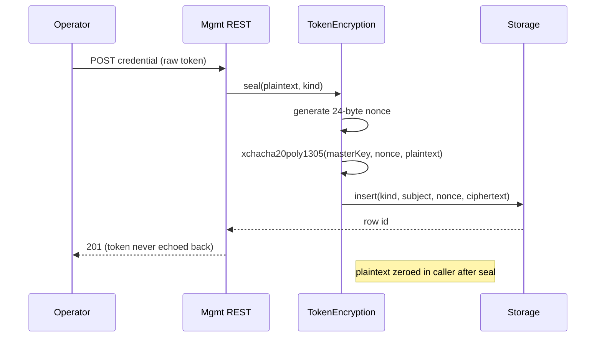
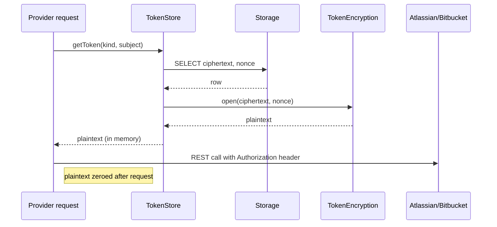

# Token Storage

> **TL;DR:** Atlassian, Bitbucket, and webhook-source tokens are sealed with XChaCha20-Poly1305 (envelope encryption pattern, single master key in v1). Master key is never in DB; lives in `TOKEN_MASTER_KEY` env var. Plaintext exists only in memory during request signing. Master-key rotation requires a manual re-encrypt drill (PCO-57).

The full design lives across [ADR-0002](../../adr/0002-token-encryption-noble-ciphers.md) and `src/security/tokenStore.ts` + `src/security/tokenEncryption.ts`. This doc is the operational + threat view.

---

## What is stored

Three classes of secret in the `encryptedTokens` table (kind enum):

| Kind | Used for | Source |
|---|---|---|
| `atlassian_api_token` | Jira + Confluence REST calls | Operator-provided at config time |
| `atlassian_oauth_refresh_token` | OAuth 3LO refresh dance (when auth_mode=oauth3lo) | Returned by Atlassian on consent |
| `bitbucket_app_password` | Bitbucket REST calls | Operator-provided at config time |
| `bitbucket_oauth_refresh_token` | OAuth 2.0 refresh (when auth_mode=oauth) | Returned by Bitbucket on consent |
| `webhook_shared_secret` | HMAC-SHA256 verification of incoming webhooks | Operator-provided per source |

All persisted via the same envelope.

## Cryptographic primitives

<figure>

<svg viewBox="0 0 1200 660" xmlns="http://www.w3.org/2000/svg" font-family="IBM Plex Sans, system-ui">
    <defs>
      <marker id="ar" viewBox="0 0 10 10" refX="9" refY="5" markerWidth="7" markerHeight="7" orient="auto-start-reverse">
        <path d="M0,0 L10,5 L0,10 z" fill="#43434a"/>
      </marker>
    </defs>

    <!-- column titles -->
    <text x="48" y="28" font-family="IBM Plex Mono" font-size="10.5" letter-spacing="1.4" fill="#9a9690">SEAL · WRITE PATH</text>
    <text x="660" y="28" font-family="IBM Plex Mono" font-size="10.5" letter-spacing="1.4" fill="#9a9690">OPEN · READ PATH</text>

    <!-- divider -->
    <line x1="600" y1="48" x2="600" y2="630" stroke="#e3e0d8" stroke-dasharray="3 3"/>

    <!-- master key trust island (top center, shared) -->
    <g transform="translate(440,52)">
      <rect width="320" height="64" rx="3" fill="#fbe7e4" stroke="#b8281d" stroke-width="1.5"/>
      <text x="160" y="22" text-anchor="middle" font-family="IBM Plex Mono" font-size="11" fill="#7a1d14">TOKEN_MASTER_KEY · 32 bytes hex</text>
      <text x="160" y="40" text-anchor="middle" font-family="IBM Plex Sans" font-size="11.5" font-weight="600" fill="#1a1a1c">env var only · NEVER persisted in DB</text>
      <text x="160" y="56" text-anchor="middle" font-family="IBM Plex Mono" font-size="10" fill="#7a1d14">single-key v1 · per-row data keys: PCO-57</text>
    </g>

    <!-- ============ SEAL PATH (left) ============ -->
    <!-- plaintext -->
    <g transform="translate(48,140)">
      <rect width="500" height="48" rx="3" fill="#fbeed8" stroke="#b96b16"/>
      <text x="14" y="20" font-family="IBM Plex Mono" font-size="10" fill="#7a4408">plaintext token</text>
      <text x="14" y="38" font-family="IBM Plex Mono" font-size="11.5" fill="#1a1a1c">{ "token": "ATATT3xFfGN0…", "metadata": { … } }</text>
    </g>

    <!-- nonce -->
    <g transform="translate(48,210)">
      <rect width="240" height="48" rx="3" fill="#fff" stroke="#c8c3b6"/>
      <text x="14" y="20" font-family="IBM Plex Mono" font-size="10" fill="#9a9690">fresh nonce · 24 bytes random</text>
      <text x="14" y="38" font-family="IBM Plex Mono" font-size="11.5" fill="#1a1a1c">7f a3 0c 19 …</text>
    </g>

    <!-- aead seal pill -->
    <g transform="translate(48,288)">
      <rect width="500" height="44" rx="22" fill="#1a1a1c"/>
      <text x="250" y="28" text-anchor="middle" font-family="IBM Plex Mono" font-size="12" fill="#fff">XChaCha20-Poly1305 · seal(masterKey, nonce, plaintext)</text>
    </g>
    <line x1="180" y1="258" x2="180" y2="288" stroke="#43434a" marker-end="url(#ar)"/>
    <line x1="298" y1="188" x2="298" y2="288" stroke="#43434a" marker-end="url(#ar)"/>
    <!-- master key in -->
    <path d="M460,116 C460,180 220,210 130,288" fill="none" stroke="#b8281d" stroke-dasharray="3 3" marker-end="url(#ar)"/>
    <text x="220" y="240" font-family="IBM Plex Mono" font-size="10" fill="#b8281d">masterKey</text>

    <!-- envelope (output) -->
    <g transform="translate(48,360)">
      <rect width="500" height="84" rx="3" fill="#dde9f2" stroke="#1f5f8a" stroke-width="1.5"/>
      <text x="14" y="22" font-family="IBM Plex Mono" font-size="10" fill="#1f5f8a">envelope · stored as auditable bundle</text>
      <!-- nonce segment -->
      <rect x="14" y="34" width="120" height="36" fill="#fff" stroke="#1f5f8a"/>
      <text x="74" y="48" text-anchor="middle" font-family="IBM Plex Mono" font-size="10" fill="#1f5f8a">nonce</text>
      <text x="74" y="62" text-anchor="middle" font-family="IBM Plex Mono" font-size="10" fill="#43434a">24 B</text>
      <!-- ciphertext segment -->
      <rect x="134" y="34" width="280" height="36" fill="#dde9f2" stroke="#1f5f8a"/>
      <text x="274" y="48" text-anchor="middle" font-family="IBM Plex Mono" font-size="10" fill="#1f5f8a">ciphertext</text>
      <text x="274" y="62" text-anchor="middle" font-family="IBM Plex Mono" font-size="10" fill="#43434a">N B</text>
      <!-- auth tag -->
      <rect x="414" y="34" width="72" height="36" fill="#ece1f3" stroke="#6e1a82"/>
      <text x="450" y="48" text-anchor="middle" font-family="IBM Plex Mono" font-size="10" fill="#6e1a82">tag</text>
      <text x="450" y="62" text-anchor="middle" font-family="IBM Plex Mono" font-size="10" fill="#43434a">16 B</text>
    </g>
    <line x1="298" y1="332" x2="298" y2="360" stroke="#43434a" marker-end="url(#ar)"/>

    <!-- DB row -->
    <g transform="translate(48,476)">
      <ellipse cx="32" cy="14" rx="32" ry="9" fill="#faf9f6" stroke="#c8c3b6"/>
      <rect x="0" y="14" width="64" height="60" fill="#faf9f6" stroke="#c8c3b6"/>
      <ellipse cx="32" cy="74" rx="32" ry="9" fill="#faf9f6" stroke="#c8c3b6"/>
      <text x="80" y="20" font-family="IBM Plex Mono" font-size="10" fill="#9a9690">encryptedTokens</text>
      <g font-family="IBM Plex Mono" font-size="11" fill="#43434a">
        <text x="80" y="38">(id, kind, subject, nonce, ciphertext, key_version, createdAt)</text>
        <text x="80" y="56" fill="#1a1a1c">→ row insert</text>
      </g>
    </g>
    <line x1="298" y1="444" x2="298" y2="476" stroke="#43434a" marker-end="url(#ar)"/>

    <!-- caller note -->
    <g transform="translate(48,576)">
      <text font-family="IBM Plex Mono" font-size="10.5" fill="#6f6e6a">caller zeroes plaintext after seal · best-effort (JS memory hygiene caveat documented)</text>
    </g>

    <!-- ============ OPEN PATH (right) ============ -->
    <!-- DB row source -->
    <g transform="translate(660,140)">
      <ellipse cx="32" cy="14" rx="32" ry="9" fill="#faf9f6" stroke="#c8c3b6"/>
      <rect x="0" y="14" width="500" height="48" fill="#faf9f6" stroke="#c8c3b6"/>
      <ellipse cx="32" cy="62" rx="32" ry="9" fill="#faf9f6" stroke="#c8c3b6"/>
      <text x="80" y="32" font-family="IBM Plex Mono" font-size="10" fill="#9a9690">encryptedTokens · SELECT</text>
      <text x="80" y="52" font-family="IBM Plex Mono" font-size="11" fill="#43434a">→ row { nonce, ciphertext+tag }</text>
    </g>

    <!-- aead open -->
    <g transform="translate(660,232)">
      <rect width="500" height="44" rx="22" fill="#1a1a1c"/>
      <text x="250" y="28" text-anchor="middle" font-family="IBM Plex Mono" font-size="12" fill="#fff">XChaCha20-Poly1305 · open(masterKey, nonce, ct)</text>
    </g>
    <line x1="910" y1="216" x2="910" y2="232" stroke="#43434a" marker-end="url(#ar)"/>
    <path d="M758,116 C 760,180 800,200 760,232" fill="none" stroke="#b8281d" stroke-dasharray="3 3" marker-end="url(#ar)"/>
    <text x="660" y="200" font-family="IBM Plex Mono" font-size="10" fill="#b8281d">masterKey</text>

    <!-- branch: success vs auth-fail -->
    <g transform="translate(660,304)">
      <line x1="250" y1="0" x2="100" y2="32" stroke="#1f6e54" marker-end="url(#ar)"/>
      <line x1="250" y1="0" x2="400" y2="32" stroke="#b8281d" marker-end="url(#ar)"/>
    </g>

    <!-- success -->
    <g transform="translate(660,344)">
      <rect width="220" height="76" rx="3" fill="#dceee5" stroke="#1f6e54"/>
      <text x="14" y="22" font-family="IBM Plex Mono" font-size="10" fill="#0e3d2f">tag verified · open OK</text>
      <text x="14" y="42" font-family="IBM Plex Sans" font-size="12" font-weight="600" fill="#0e3d2f">plaintext → in memory</text>
      <text x="14" y="62" font-family="IBM Plex Mono" font-size="10.5" fill="#0e3d2f">held only for outbound HTTP;</text>
      <text x="14" y="76" font-family="IBM Plex Mono" font-size="10.5" fill="#0e3d2f">zeroed after request.</text>
    </g>

    <!-- auth fail -->
    <g transform="translate(940,344)">
      <rect width="220" height="76" rx="3" fill="#fbe7e4" stroke="#b8281d"/>
      <text x="14" y="22" font-family="IBM Plex Mono" font-size="10" fill="#7a1d14">tag mismatch · TAMPER</text>
      <text x="14" y="42" font-family="IBM Plex Sans" font-size="12" font-weight="600" fill="#7a1d14">authentication failure</text>
      <text x="14" y="62" font-family="IBM Plex Mono" font-size="10.5" fill="#7a1d14">no partial decrypt — AEAD</text>
      <text x="14" y="76" font-family="IBM Plex Mono" font-size="10.5" fill="#7a1d14">structurally prevents it.</text>
    </g>

    <!-- consumer -->
    <g transform="translate(660,452)">
      <rect width="500" height="48" rx="3" fill="#fff" stroke="#c8c3b6"/>
      <text x="14" y="20" font-family="IBM Plex Mono" font-size="10" fill="#9a9690">provider request signing</text>
      <text x="14" y="38" font-family="IBM Plex Mono" font-size="11" fill="#43434a">REST → Atlassian / Bitbucket · `Authorization` header set, then plaintext zeroed</text>
    </g>
    <line x1="770" y1="420" x2="770" y2="452" stroke="#43434a" marker-end="url(#ar)"/>

    <!-- bottom rotation note -->
    <g transform="translate(660,548)">
      <text font-family="IBM Plex Mono" font-size="10.5" letter-spacing="1.4" fill="#9a9690">MASTER-KEY ROTATION (incident-grade · manual)</text>
      <text y="22" font-family="IBM Plex Mono" font-size="10.5" fill="#43434a">no auto-rewrap; runbook Incident C drill · long-term fix in PCO-57</text>
    </g>
  </svg>

<figcaption><strong>V5 — Token envelope encryption.</strong> Token envelope encryption per ADR-0002. Each seal generates a fresh 24-byte nonce; the AEAD construction (XChaCha20-Poly1305) produces an authenticated `nonce ‖ ciphertext ‖ tag` bundle. The 32-byte master key lives in `TOKEN_MASTER_KEY` only — never persisted in DB. Open returns either plaintext (tag verified) or a tamper-detection error; partial-decrypt-on-bad-tag is impossible by AEAD construction. Master-key rotation requires a re-encrypt drill (Incident C in runbook); PCO-57 tracks the long-term envelope-with-per-row-data-keys refactor. (See <a href="../../visualizations/v05-token-envelope.html">full visualization page</a>.)</figcaption>
</figure>


- **Cipher:** XChaCha20-Poly1305 (AEAD).
- **Library:** `@noble/ciphers` (audited primitives, pure JS, no native deps; ADR-0002).
- **Master key:** 32 bytes, hex-encoded, in `TOKEN_MASTER_KEY` env var. NOT persisted to disk by atl-mcp.
- **Per-record nonce:** 24 random bytes (`xchacha20poly1305` requires 24-byte nonce). Stored alongside ciphertext.
- **Authentication tag:** 16 bytes, included in ciphertext per AEAD construction.

## Envelope shape

Each `encryptedTokens` row stores:

| Column | Purpose |
|---|---|
| `id` | UUIDv7 primary key |
| `kind` | Enum (above) |
| `subject` | Identifier (e.g., Atlassian site URL, Bitbucket workspace, webhook source name) |
| `nonce` | 24 random bytes (`bytea`) |
| `ciphertext` | Encrypted payload + auth tag (`bytea`) |
| `createdAt` | When sealed |
| `rotatedFromId` | Previous row this one supersedes (for rotation history) |

**Plaintext shape** (after decryption):

```json
{
  "token": "<the-actual-secret>",
  "metadata": { "rotatedAt": "...", "expiresAt": "...", ... }
}
```

## Lifecycle

### Sealing (write path)



### Opening (read path, request signing)



The plaintext is held only for the duration of the outbound HTTP request. Best-effort zeroing after use; documented limitation (JavaScript cannot guarantee memory hygiene).

### Rotation (per-token)

When a token is rotated by Atlassian / Bitbucket / a webhook source:

1. Operator obtains the new token.
2. Operator submits via mgmt REST (or CLI tool).
3. New row written with same `kind` + `subject`. The new row's `rotatedFromId` references the prior row.
4. The prior row stays — historical audit entries reference its `id`. The token itself can be set to a tombstone value (zero-length ciphertext) optionally; **default behavior is to leave the prior ciphertext in place** so emergency rollback is possible.
5. Operator verifies new token works (probe call); if not, revert by inserting a new row with the prior token.

### Master-key rotation (incident-grade, manual)

This is the operationally hard case. The token store does **not** automatically re-encrypt all rows when `TOKEN_MASTER_KEY` changes. PCO-57 tracks the long-term fix (envelope encryption with per-row data keys).

For now, the rotation drill in [`../08-operations/runbook.md`](../08-operations/runbook.md) Incident C is the procedure:

1. **Pre-condition:** decide why rotating (compromise vs. scheduled).
2. **Stage:** generate the new master key.
3. **Re-encrypt:** offline tool (planned `scripts/security/rotate-master-key.mjs`) reads each row with the old key, re-encrypts with the new key, writes a new row, marks old row as superseded.
4. **Cut over:** atomically update `TOKEN_MASTER_KEY` env var and restart.
5. **Verify:** probe one token from each kind; confirm decrypts.
6. **Decommission:** old key gets erased from secret storage (with an extended retention period for emergency rollback — typical 7 days).

The procedure has not been exercised end-to-end against a production-shaped token corpus. Documented in [`../10-dr-bcp/audit-chain-recovery.md`](../10-dr-bcp/audit-chain-recovery.md) as a related drill.

## Threat coverage

Per [`threat-model.md`](threat-model.md):

| Threat | Mitigation here |
|---|---|
| T-2201 (exfiltrate tokens) | Envelope encryption; master key not in DB |
| T-2202 (token leak in logs) | Pino redaction; tokens never converted to string in log fields |
| T-2204 (forge upstream response) | Out of scope for this doc (TLS-level) |
| T-3303 (compromise signing key) | Different key class; see [`audit-chain-threat-model.md`](audit-chain-threat-model.md) |

The dominant residual risk: master-key compromise + DB read together produce full token disclosure. The PCO-57 envelope-encryption refactor splits per-row data keys so master-key compromise alone is insufficient.

## Tests

| Test | Path | What it proves |
|---|---|---|
| Round-trip seal/open | `tests/unit/security/tokenEncryption.test.ts` | Plaintext in equals plaintext out across many sizes |
| Tamper detection | Same file | Any byte flip in ciphertext or nonce fails to decrypt |
| Wrong key fails | Same file | Decrypt with wrong master key returns auth failure, not garbage |
| Repository contract | `tests/integration/storage/tokenStore.test.ts` | DB roundtrip works against pglite + Postgres |
| Test double | `src/security/tokenEncryption.testDouble.ts` | Lets non-encryption tests skip the crypto path while preserving the seal/open contract |

## Operational concerns

### What if `TOKEN_MASTER_KEY` is unset at startup?

Server fails to start (loud error). Tokens cannot be sealed nor opened without it. This is intentional: silent fallback to no-encryption would be a footgun.

### What if `TOKEN_MASTER_KEY` is malformed (not 32 bytes hex)?

Server fails to start. Validated in `src/config/env.ts`.

### What's the rotation cadence?

For v1: at-will (when there's a reason). No mandated rotation cadence is defined for token-store master key. The audit-signing key has its own rotation in [`audit-chain-threat-model.md`](audit-chain-threat-model.md).

### How are tokens scrubbed from logs?

Pino redaction config in `src/observability/logger.ts` redacts known field names (`token`, `apiToken`, `authorization`). Discipline: never put raw tokens into `info`-level log fields; if a token shape is needed for debugging, log only the fingerprint (first/last 4 chars).

## Linked artifacts

- **ADR:** [ADR-0002](../../adr/0002-token-encryption-noble-ciphers.md)
- **Code:** `src/security/tokenStore.ts`, `src/security/tokenEncryption.ts`, `src/security/tokenEncryption.testDouble.ts`
- **Tests:** `tests/unit/security/tokenEncryption.test.ts`, `tests/integration/storage/tokenStore.test.ts`
- **Threat model:** [`threat-model.md`](threat-model.md) T-2201, T-2202
- **Runbook:** [`../08-operations/runbook.md`](../08-operations/runbook.md) Incident C
- **DR:** [`../10-dr-bcp/recovery-objectives.md`](../10-dr-bcp/recovery-objectives.md)
- **Tracked:** PCO-57 (envelope encryption refactor)

---

*Last reviewed: 2026-04-25 by Chris.*
