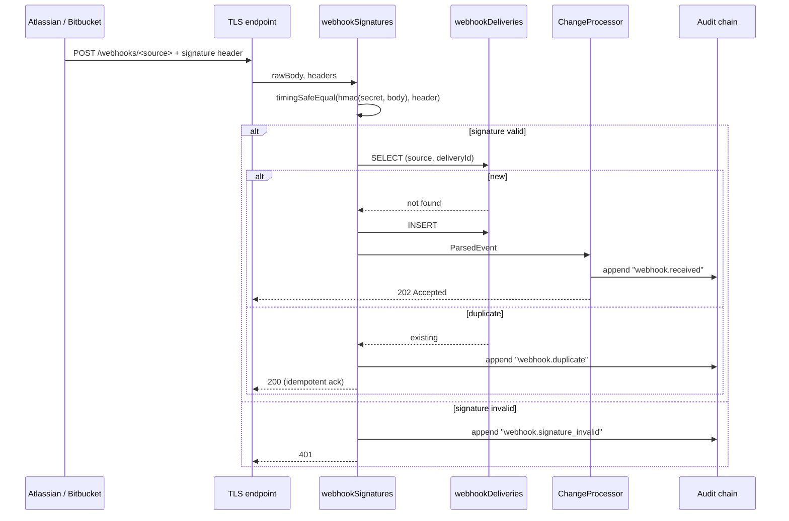

# Webhook Verification

> **TL;DR:** Inbound webhooks (Atlassian + Bitbucket) are HMAC-SHA256 signed per source. The shared secret per source is stored in the encrypted token store. Verification happens before the body is parsed; deduplication uses a deterministic delivery ID. Replay protection is bounded by the dedup table's retention window. v6 §26.

Component-level threat model. Parent: [`threat-model.md`](threat-model.md).

---

## Why webhooks exist

The orchestrator needs to know about state changes that happen *outside* its provisioning path:

- An issue moved between statuses in Jira.
- A page was edited in Confluence.
- A PR was merged in Bitbucket.
- ACL changed (a user lost permission to a project).

Without webhooks, the orchestrator either polls (expensive, slow) or assumes static state (wrong). Webhooks fix this — but webhook ingestion is a **public attack surface**: a URL the orchestrator listens on, accepting POSTs.

## Threat surface

- **T-1103: Forge webhook delivery.** Attacker POSTs a fabricated event.
- **T-1104: Replay captured webhook.** Attacker captures a valid signed delivery and re-POSTs it later.
- **DoS:** attacker floods the webhook endpoint.
- **Information leakage via verification timing:** attacker probes for valid endpoints by timing differences.

## Defense layers

### Layer 1: HMAC-SHA256 signature

Every source has a shared secret. The source signs the request body with the secret and includes the signature in a header (e.g., `X-Hub-Signature-256` for Atlassian, `X-Event-Key` + signature for Bitbucket). The orchestrator computes the same HMAC and compares.

**Code:** `src/security/webhookSignatures.ts`. Constant-time compare via `node:crypto.timingSafeEqual` (no early-return on first mismatched byte).

**Per-source secret:** stored in `encryptedTokens` with `kind = webhook_shared_secret`, `subject = <source name>`. See [`token-storage.md`](token-storage.md).

**Verification happens BEFORE body parsing.** A malicious body cannot trigger a parser exploit before signature verification.

### Layer 2: Deduplication

Each delivery has a deterministic ID provided by the source (Atlassian's `X-Atlassian-Webhook-Identifier`, Bitbucket's request UUID). The orchestrator stores `(source, deliveryId, receivedAt)` in `webhookDeliveries`. Re-deliveries are detected by primary key violation.

**Code:** `src/storage/schema/webhookDeliveries.ts` (M10 work; partial in v1).

**Dedup window:** 30 days default. Older entries are pruned. A replay older than 30 days would be processed; mitigation: secret rotation cadence shorter than dedup window for high-risk sources.

### Layer 3: Timestamp tolerance

When the source provides a timestamp, the orchestrator rejects requests whose timestamp is more than 5 minutes from server time. Bounds replay window even within the dedup TTL.

**Note:** not all sources provide timestamps. Where they don't, we rely on dedup alone.

### Layer 4: Rate limiting at endpoint

The webhook endpoint has a per-source rate limit (configured at the reverse-proxy / load-balancer layer, not in atl-mcp itself). Out of v1 application scope; documented as deployment guidance in [`../09-deployment/deployment-targets.md`](../09-deployment/deployment-targets.md).

## Verification flow



**Note that signature failures and duplicates are themselves audit events.** A surge of `signature_invalid` is a probe pattern; a surge of `duplicate` is a replay attempt. Detection is post-hoc; alerting on these counters is documented in [`../08-operations/alerting.md`](../08-operations/alerting.md).

## Per-source detail

### Atlassian (Jira + Confluence)

- **Header:** `X-Hub-Signature-256` (Jira) / Confluence-specific signature header.
- **Algorithm:** HMAC-SHA256.
- **Body shape:** Atlassian webhook payload (JSON; varies by event type).
- **Source URL pattern:** `${ATLASSIAN_SITE_URL}` is the source we expect; `Origin` header is checked.

### Bitbucket

- **Header:** `X-Hub-Signature` (HMAC-SHA256 over body).
- **Algorithm:** HMAC-SHA256.
- **Body shape:** Bitbucket webhook payload (JSON; varies by event type — push, PR, comment).

### Future partners (post-v1)

When adding a webhook source: register the shared secret in `encryptedTokens`, declare the signature header pattern in a new entry in the verifier registry, document the body shape. Any new webhook surface goes through threat model review.

## Configuration

```text
WEBHOOK_SHARED_SECRETS={"atlassian":"<32-byte-hex>","bitbucket":"<32-byte-hex>"}
```

Or, for production, secrets land in `encryptedTokens` (`kind = webhook_shared_secret`) and the env var is left empty.

## Failure modes

| Failure | Symptom | Action |
|---|---|---|
| Wrong secret loaded | All deliveries return 401 | Verify `WEBHOOK_SHARED_SECRETS` matches source's configured secret |
| Body modified by proxy | All deliveries return 401 | Inspect proxy logs; some proxies rewrite bodies (gzip-then-decode) — webhook handler reads raw bytes only |
| Source clock skew | Random rejections (if timestamp tolerance applied) | Check NTP on source side |
| Dedup table grows unbounded | DB size grows | Verify pruning is running (cron in M10+) |

## Tests

| Test | Path | What it proves |
|---|---|---|
| Valid signature accepted | `tests/unit/security/webhookSignatures.test.ts` | Round-trip happy path |
| Tampered body rejected | Same file | Any byte change in body → signature fails |
| Wrong secret rejected | Same file | Secret-A signs, Secret-B verifies → fail |
| Constant-time compare | Same file | Timing differences are bounded (high-noise environment masks micro-differences but the API is constant-time) |
| Dedup behavior | (Pending; M10 work) | Replay → idempotent 200, no double-processing |

## Linked artifacts

- **Spec:** v6 §26 (Webhook ingestion + change data capture)
- **Code:** `src/security/webhookSignatures.ts`, `src/storage/schema/webhookDeliveries.ts`
- **Tests:** `tests/unit/security/webhookSignatures.test.ts`
- **Threat model:** [`threat-model.md`](threat-model.md) (T-1103, T-1104)
- **Token storage:** [`token-storage.md`](token-storage.md) (where shared secrets live)
- **Operations:** [`../08-operations/runbook.md`](../08-operations/runbook.md), [`../08-operations/alerting.md`](../08-operations/alerting.md)

---

*Last reviewed: 2026-04-25 by Chris.*
