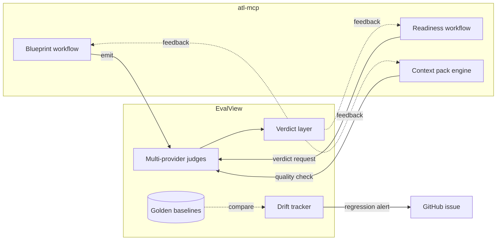

# Eval-view Integration

> **TL;DR:** Wholesale adoption of eval-view per v6 §31.1. Multi-provider LLM-as-judge for blueprint outputs, context packs, readiness verdicts. Drift tracker compares current outputs vs. golden baselines. Auto-PR from incident detection. M11 work; designed but not wired.

This is one of the most architecturally significant testing decisions for the project. The blueprint workflow's adversarial verifier is the precursor; eval-view is the full landing.

---

## What eval-view does

Per `docs/partners/eval-view.md` and v6 §31.1:

- **LLM-as-judge:** an evaluator LLM judges another LLM's output.
- **Multi-provider:** judges from multiple providers (Anthropic + OpenAI + Google + others) vote / consensus.
- **Verdict layer:** combine multi-provider judgments into a final verdict.
- **Drift tracker:** compare current outputs to golden baselines; flag regressions.
- **Auto-PR from incidents:** when judges flag a regression, open a PR with the failing case + suggested fix.

## Where atl-mcp uses it

### Blueprint validation (M4+)

The adversarial verification triplet (v6 §18.1) is the local precursor:

- **Emit:** generate blueprint via sampling.
- **Critique:** different prompt evaluates the blueprint.
- **Accept/reject:** decision based on critique.

Eval-view extends this to multi-provider, with verdicts from 3+ providers and consensus logic.

### Readiness verdict (M8+)

Per v6 §17.2: 4-tier verdict (Ready / Almost / Risky / Not). The verdict is LLM-judged. Eval-view delivers the multi-provider variant:

- 3 providers judge.
- Consensus → Ready.
- Disagreement → Risky (operator review).

### Context-pack quality (M7+)

Generated context packs are quality-gated:
- Completeness (covers the issue's scope).
- Accuracy (no contradictions).
- Compactness (within budget).

Eval-view judges this; failed gates surface to the operator.

### Test golden baselines

Some tests use golden baselines:
- Sample blueprint outputs.
- Sample readiness verdicts.
- Sample context packs.

Drift tracker compares current outputs to baselines; flags regressions in CI.

## Integration shape (planned, M11)



## Configuration

When wired (M11):

```text
EVAL_VIEW_PROVIDERS=anthropic,openai,google
EVAL_VIEW_CONSENSUS_THRESHOLD=2/3
EVAL_VIEW_DRIFT_BASELINE_REPO=...
EVAL_VIEW_AUTO_PR=true
```

Each judge needs its own API key, configured separately.

## Why multi-provider

Single-provider judging is biased toward that provider's failure modes. Multi-provider:

- Catches provider-specific blind spots.
- Provides natural sanity check (3 disagreeing providers = something interesting).
- Reduces over-fitting to one model's preferences.

Cost: 3× judge calls. Worth it for high-stakes gates.

## Why drift tracking

Without baselines, "is this output good?" depends on the moment. With baselines: "is this output as good as the version we shipped 3 months ago?"

Captures:
- Model-version regressions (newer model worse than older for this use case).
- Prompt-version regressions.
- Workflow regressions (refactor that broke something).

## What's NOT in scope

- **Replacing human review.** Eval-view augments, not replaces. Final decisions remain human.
- **Real-time per-request judging.** Cost-prohibitive. Used for canary outputs + golden runs.
- **Provider-by-provider routing of customer requests.** Out of scope.

## Status

- v1: adversarial triplet (single-provider) is the precursor; landed in M4.
- M11: full eval-view integration.
- Post-v1: tune thresholds, expand judge set, refine baselines.

## Linked artifacts

- **Spec:** v6 §31.1 (eval-view wholesale)
- **Partner guide:** [`../../partners/eval-view.md`](../../partners/eval-view.md)
- **Sibling:** [`strategy.md`](strategy.md), [`security-test-plan.md`](security-test-plan.md)
- **Workflow:** [`../04-design/module-workflows.md`](../04-design/module-workflows.md)

---

*Last reviewed: 2026-04-25 by Chris.*
