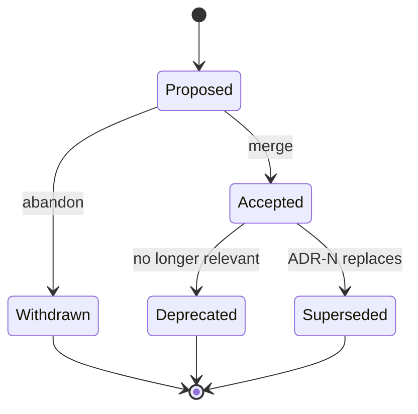

# ADR Process

> **TL;DR:** ADRs use MADR 4.0 format ([F-122](../../partners/madr.md)) with [adr.github.io](../../partners/adr-github-io.md) START + DoD criteria ([F-123](../../partners/adr-github-io.md)). Sequential numbers, no gaps. New ADRs are `proposed` → `accepted` on merge. Superseding doesn't delete; status field updates.

The ADR process for atl-mcp is documented canonically at [`docs/adr/0000-adr-process.md`](../../adr/0000-adr-process.md). This SDLC doc cross-links + summarizes; the canonical source stays in `docs/adr/`.

---

## When to write an ADR

Write an ADR when:

- A decision affects multiple modules or external systems.
- A reasonable alternative was considered and rejected.
- A future maintainer would want to know "why this and not that?"
- The decision changes the threat model.
- The decision changes a public API surface.

Examples that earned an ADR (current 6):

- ADR-0001: pglite for dev (DB choice).
- ADR-0002: token encryption library choice.
- ADR-0003: Confluence body format default.
- ADR-0004: Bitbucket auth choice.
- ADR-0005: audit signing pipeline design.

Examples that did NOT earn an ADR:

- Use TypeScript (no real alternative).
- Use pino (default for Node).
- Use vitest over jest (greenfield; obvious choice).

The bar: "the reasoning is non-obvious AND someone might second-guess it."

## ADR template

Use [`../templates/adr-template.md`](../templates/adr-template.md). MADR 4.0 shape.

Sections:
- Title (`ADR-NNNN: <imperative present-tense>`).
- Status (`proposed | accepted | deprecated | superseded by ADR-NNNN`).
- Context (forcing function, constraints).
- Decision drivers (criteria; 3-7).
- Considered options (2-5; pros + cons each).
- Decision outcome (chosen + rationale + consequences).
- Validation (how we'll know it was right).
- Linked artifacts.

## Lifecycle

Once accepted, ADRs are **immutable** except for status field changes. Corrections happen in successor ADRs, not edits.

## Numbering

Sequential. No gaps. Proposed ADRs reserve a number when filed.

If an ADR is withdrawn before merge: the number stays reserved (gaps in the wild are confusing). Document the withdrawal as a one-line ADR with status `withdrawn` and a brief rationale.

## Review

Accepting an ADR requires:

1. Reviewer agreement that the considered options are reasonable.
2. Reviewer agreement that the decision is defensible against the drivers.
3. Reviewer agreement that the consequences are honestly stated (not just upsides).

For v1 single-maintainer: self-review + sleep on it. Genuine doubt = re-review.

## Superseding

When a new ADR replaces an old one:

- New ADR has a `Supersedes ADR-NNNN` line.
- Old ADR's status becomes `superseded by ADR-MMMM`.
- Both stay in `docs/adr/`.

Don't delete superseded ADRs — they're history.

## Decision log

The decision log ([`decision-log.md`](decision-log.md)) is a rolled-up index of all ADRs + significant non-ADR decisions. It's the navigation surface; the ADRs themselves remain canonical.

## Anti-patterns

- **ADRs as design docs.** ADRs should be 1-2 pages. If you can't say it in 2 pages, decompose.
- **ADRs without alternatives.** "We did X" without "we considered Y and Z" is documentation, not a decision record.
- **ADRs that pretend there were no tradeoffs.** Honest cons are mandatory.
- **ADRs for trivial choices.** Don't ADR the lint config; do ADR the major library swap.

## Linked artifacts

- **Canonical source:** [`docs/adr/0000-adr-process.md`](../../adr/0000-adr-process.md)
- **MADR template:** [`docs/partners/madr.md`](../../partners/madr.md) (F-122)
- **START + DoD criteria:** [`docs/partners/adr-github-io.md`](../../partners/adr-github-io.md) (F-123)
- **Template:** [`../templates/adr-template.md`](../templates/adr-template.md)
- **Sibling docs:** [`change-management.md`](change-management.md), [`decision-log.md`](decision-log.md), [`code-review.md`](code-review.md)
- **All ADRs:** [`docs/adr/`](../../adr/)

---

*Last reviewed: 2026-04-25 by Chris.*
