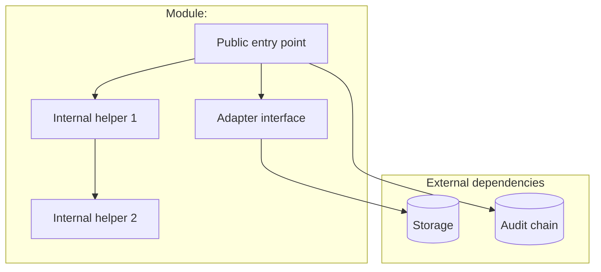

# Module: [name]

> **TL;DR:** What this module is, what it owns, what it does NOT own, and the one diagram that captures its shape.

Use this template for each `04-design/module-*.md` doc. One per top-level `src/` subdirectory.

---

## Purpose

Two or three sentences on what this module is responsible for. Include:

- The single thing it owns (e.g., "the policy decision layer that gates every state-changing operation").
- The single thing it explicitly does NOT own (e.g., "this module does NOT decide what *should* be allowed — it executes a configured policy adapter; the rules live in `policyAdapters/`").
- The milestone it reached production quality (e.g., "M1 baseline; M11 enriches with run-time-evaluated rules").

## Public surface

The exported types, functions, classes that other modules use. Keep this **alphabetized by symbol** so it's easy to scan during review.

| Symbol | Kind | Signature | Purpose |
|---|---|---|---|
| `policyDecisionLayer` | function | `(req: PolicyDecisionRequest) => PolicyDecision` | Single entry point. Calls the configured adapter; appends an audit entry; returns the decision. |
| `PolicyDecision` | type | `{ effect, obligations, confidence, reasons }` | Output shape. |
| `PolicyDecisionRequest` | type | `{ projectId, intent, context }` | Input shape. |
| `PolicyIntent` | type | union of action verbs | What the caller is trying to do. |

If the module exports more than ~15 symbols, the public surface may be too wide — flag and consider splitting.

## Architecture

The module's internal shape. C4-L3 component diagram in mermaid, scoped to this module:

## Key flows

For each non-trivial flow through the module, include either:

- A reference to a sequence diagram in [`docs/sdlc/04-design/sequence-diagrams.md`](../04-design/sequence-diagrams.md), or
- A short inline mermaid `sequenceDiagram` if the flow is module-local.

## Data model

If the module owns persistent state, document the tables (cross-link to [`docs/sdlc/05-data/schema.md`](../05-data/schema.md)). For domain-only modules: list the types this module owns from [`docs/sdlc/05-data/domain-model.md`](../05-data/domain-model.md).

## Configuration

Env vars this module reads (cross-link to [`docs/sdlc/09-deployment/secrets-provisioning.md`](../09-deployment/secrets-provisioning.md)):

| Var | Required | Default | Purpose |
|---|---|---|---|
| `MODULE_X_FEATURE` | No | `false` | … |

## Failure modes

Things that go wrong inside this module:

- **Failure mode 1.** What it looks like, what triggers it, how it's surfaced to callers, what the audit log records.
- **Failure mode 2.** …
- **Cascading effects.** What downstream modules see when this module fails.

## Test surface

What tests cover this module:

- **Unit:** subject areas in `tests/unit/<module>/` — list.
- **Integration:** in `tests/integration/<module>/` — list.
- **Live:** any tests gated behind env vars.
- **Adversarial:** any threat-model-driven tests.

Note coverage gaps. Be honest about what's not tested.

## Concurrency

How this module handles concurrent calls:

- Is the public entry point reentrant?
- Are there shared mutable resources (caches, locks)?
- What's the failure mode under contention?

If the module is a coordinator (queue, worker, session registry), this section is the heart of the doc.

## Performance characteristics

Known costs:

- Latency: typical, p99.
- Throughput: max sustained calls/sec.
- Memory: per-call vs. resident.

If we don't have benchmarks yet, say so and link to the relevant section in [`docs/sdlc/15-capacity/benchmarks.md`](../15-capacity/benchmarks.md).

## Tradeoffs

Decisions specific to this module that aren't worth their own ADR but should be visible:

- "We chose X over Y because Z. The cost is W."

For decisions that DID warrant an ADR, link them; don't restate.

## Roadmap

What's next for this module:

- Open tickets: PCO-XX, PCO-YY.
- Milestone-gated work: feature flags, future scope.
- Known limitations marked for v2: [`docs/demo/known-limitations.md`](../../demo/known-limitations.md).

## Linked artifacts

- Code: `src/<module>/`
- Spec: v6 §X.Y
- ADRs: relevant
- Threat model: relevant
- Tests: relevant
- Partner guides: relevant finding IDs

---

## Style rules

- **Single owner, single responsibility.** If "what does this module own" is more than one sentence, the module is too big.
- **Public surface alphabetized.** Easy to compare in review.
- **Diagrams scoped.** Module diagrams stop at the module's edge; cross-module flows go in sequence diagrams.
- **Honest about gaps.** No coverage gaps hidden; no "production-quality" claims without test paths.
- **Length.** 2-5 pages. If shorter, it's probably under-spec'd; if longer, the module is too big.
