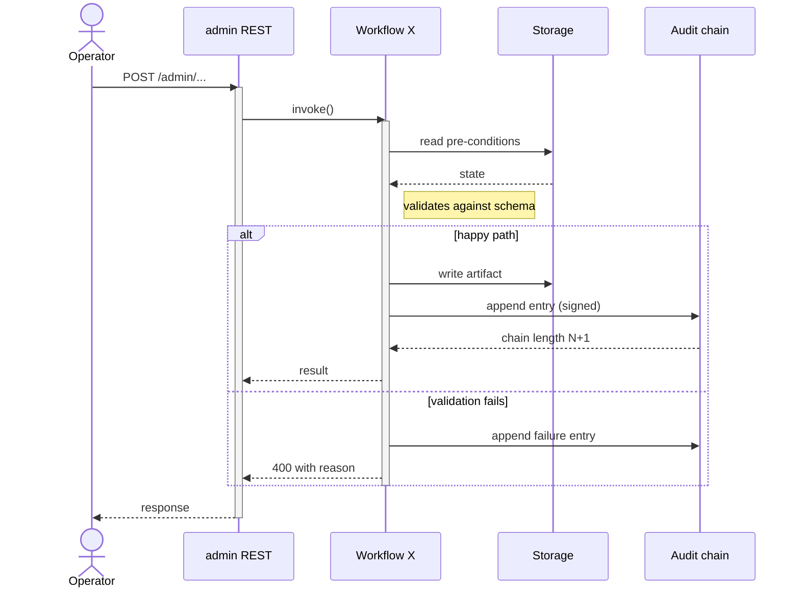

# Sequence Diagram: [workflow name]

> **TL;DR:** What flow this captures, the actors involved, the trust boundaries crossed, and the failure modes shown.

A sequence diagram in atl-mcp's SDLC docs has four parts: the diagram, the narrative, the failure-mode annotations, and the cross-references.

---

## Workflow

What flow this captures. One sentence. Examples: "MCP intake → blueprint" or "Audit chain write with key rotation in flight."

## Pre-conditions

What must be true before the flow starts. Examples:

- Project exists in state DRAFT_INTAKE.
- Atlassian credentials are loaded.
- Audit signing key is registered.

## Diagram

Mermaid `sequenceDiagram`. Conventions:

- **Lifelines** are participants, not classes — name by role ("MCP transport", "Policy layer") not by file.
- **Solid arrows** for synchronous calls, **dashed arrows** for async / response.
- **Notes** for invariants and side effects.
- **Activations** (`activate`/`deactivate`) for non-trivial work.
- **Alt** blocks for branches; **opt** for optional steps; **par** for parallel.

## Narrative

Walk the diagram in prose for someone who doesn't read mermaid. Numbered to match the diagram steps:

1. Operator POSTs to `/admin/...` (admin REST, port 3001).
2. The REST handler invokes the Workflow X coordinator.
3. Workflow X reads pre-conditions from storage; validates against the schema in `src/domain/...`.
4. **Happy path:** workflow writes the artifact and appends a signed audit entry.
5. **Validation failure:** workflow records the failure as an audit entry too — refusal IS an audit-worthy event.

The narrative explains the **why** of each step. The diagram shows the **what**.

## Trust boundaries crossed

List each boundary the flow crosses, with the auth + audit obligation:

- **Operator → REST API:** authentication via <method>; admin REST is loopback-only.
- **REST → Workflow:** internal call, no boundary.
- **Workflow → Storage:** internal; tenant-scope check enforced.
- **Workflow → Audit chain:** internal; every write is an audit event.

If a sequence crosses a boundary without an obligation listed, it's a finding for the threat model.

## Failure modes shown

For each `alt` or error path in the diagram:

- **Validation failure:** what triggers it, what the operator sees, what the audit chain records.
- **Storage failure (DB unreachable):** how the flow degrades; whether retry happens.
- **Audit write failure:** **fail closed** — operation cannot complete without audit entry. Reference v6 §30.1.
- **Concurrent invocation:** what serialization/locking applies.

Failure modes that aren't shown are listed here too, with rationale ("not shown: rate-limit on Atlassian — handled by retry layer at HTTP boundary, not relevant to this sequence").

## Post-conditions

What's true after the flow completes. Examples:

- Project state is now BLUEPRINT_GENERATED.
- Audit chain length increased by 1 (or 2 if validation failed).
- Storage row in `projectBlueprints` matches the input within retention policy.

## Linked artifacts

- Code: `src/workflows/...`, `src/storage/repositories/...`
- Tests: `tests/integration/...`
- Spec: v6 §X.Y
- Threat model: [`docs/sdlc/06-security/threat-model.md`](../06-security/threat-model.md) §<component>
- Trust boundaries: [`docs/sdlc/02-architecture/trust-boundaries.md`](../02-architecture/trust-boundaries.md)

---

## Style rules

- **Roles, not classes.** "Workflow" not "BlueprintWorkflowImpl".
- **Side effects called out.** Audit writes, DB writes, external calls all visible.
- **Failures explicit.** No happy-path-only diagrams.
- **Mermaid first.** PNG/draw.io only when mermaid runs out of expressiveness.
- **Narrative + diagram, both.** Diagrams alone don't survive context loss; narrative alone is harder to scan.
