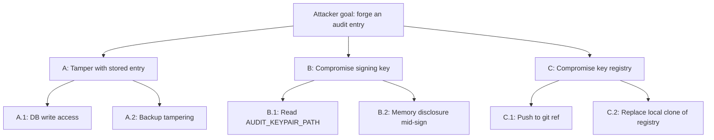

# Threat model: [component or trust boundary]

> **TL;DR:** What this component is, what assets it protects, what threats apply, and what controls mitigate them. STRIDE-organized; each row crosses a known threat with a control and a test.

Use this template for each new component / trust boundary added to the system. Living document — re-review every release.

---

## Scope

- **Component / boundary:** name and one-line purpose.
- **Authoritative code path(s):** `src/...`
- **What enters this component:** inputs, callers, sources.
- **What leaves this component:** outputs, sinks, sub-systems.
- **Out of scope for this model:** dependencies handed off elsewhere.

## Assets

What this component is responsible for protecting. Examples:

- **Confidentiality:** tokens, audit log payload contents, customer PII.
- **Integrity:** audit chain, policy decisions, schema migrations.
- **Authenticity:** webhook signatures, audit signatures.
- **Availability:** preflight discovery results, MCP session handling.

For each asset, name the **trust level** required: PUBLIC / INTERNAL / PRIVATE / SECRET (per [`docs/sdlc/05-data/classification.md`](../05-data/classification.md)).

## Trust boundaries crossed

The boundary or boundaries this component sits on. Reference [`docs/sdlc/02-architecture/trust-boundaries.md`](../02-architecture/trust-boundaries.md).

For each boundary: who is on the trusted side, who is on the untrusted side, and what auth + audit obligations the component has at that boundary.

## STRIDE table

For each STRIDE category, list the threats that apply to this component. Each row:

| Threat ID | Category | Threat (in attacker's voice) | Asset(s) at risk | Likelihood | Impact | Mitigating control | Validating test |
|---|---|---|---|---|---|---|---|
| T-NNNN | S/T/R/I/D/E | "I [attacker action] to [outcome]" | <asset> | low/med/high | low/med/high | <control + path> | <test path> |

STRIDE = Spoofing / Tampering / Repudiation / Information disclosure / Denial of service / Elevation of privilege.

**Threats unworked for now** are explicit, not omitted. If a threat is in scope but unmitigated, it gets a row with "deferred to PCO-XX" in the control column. Hidden threats are worse than known-unmitigated ones.

## Attack trees

For at least one high-impact threat, draw the attack tree showing how an attacker would actually reach the asset. Mermaid:

Annotate each leaf with: control that prevents it (or "unmitigated; tracked PCO-XX").

## Adversaries

Who would do this? Profile types:

- **Curious insider** — operator or developer with system access; motivated by curiosity, not harm.
- **Malicious insider** — same access, malicious intent.
- **External attacker via public surface** — only sees public endpoints.
- **External attacker with stolen creds** — has API token or webhook secret.
- **Supply-chain attacker** — compromises a dependency.

Not every model needs every adversary; pick the relevant ones.

## Residual risk

After controls, what's left? Be honest. Examples:

- "An adversary with both signing-key access AND DB write access can forge entries. We accept this because both accesses imply broader compromise we can't defend against in code."
- "An adversary with stolen API token can issue arbitrary writes to Atlassian. The audit chain records who did it, but the writes happen. Token rotation drill (Incident C) is the prevention; revocation latency is the residual exposure."

## Testing the model

How would we know if this model is wrong?

- Adversarial test cases listed by threat ID — see [`docs/sdlc/07-testing/security-test-plan.md`](../07-testing/security-test-plan.md).
- Penetration test scope: yes / no / planned.
- Bug bounty in scope: not v1; documented in [`docs/sdlc/06-security/vulnerability-disclosure.md`](../06-security/vulnerability-disclosure.md).

## Linked artifacts

- Component code: `src/...`
- Tests: `tests/...`
- ADRs: relevant decisions
- Spec sections: v6 §X.Y
- Parent threat model: [`docs/sdlc/06-security/threat-model.md`](../06-security/threat-model.md)
- Controls matrix: [`docs/sdlc/06-security/controls-matrix.md`](../06-security/controls-matrix.md)
- Data classification: [`docs/sdlc/05-data/classification.md`](../05-data/classification.md)

---

## Style rules

- **Threats in attacker's voice.** "I read the AUDIT_KEYPAIR_PATH file" beats "an attacker reads".
- **Threats are testable.** If you can't write a test that demonstrates the threat, it's a hypothesis, not a threat.
- **Controls are concrete.** "Encrypted at rest" with no path is not a control; "`src/security/tokenStore.ts:sealToken` using XChaCha20-Poly1305 per ADR-0002" is.
- **Likelihood/impact is calibrated.** Use the same scale across the project; don't mix "1-5" with "low/med/high" within one document.
