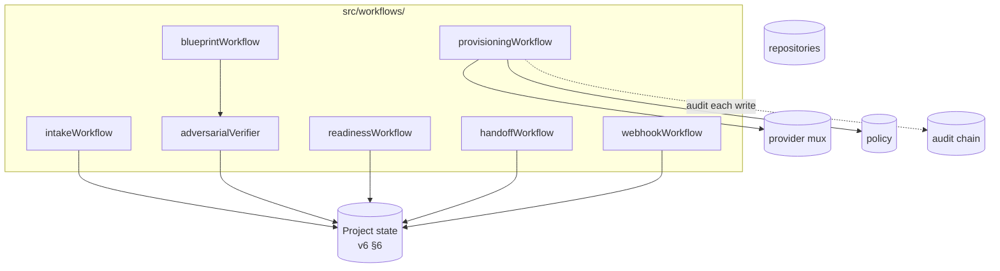

# Module — Workflows

> **TL;DR:** State-machine coordinators for multi-step operations. Intake → blueprint, blueprint → plan → execute, readiness, handoff, webhook ingestion. Pure logic; no persistence (calls into storage). Each workflow advances the project state machine (v6 §6) and emits audit entries on every transition.

## Purpose

Owns:
- The state-machine logic: which transitions are allowed, what each transition requires.
- Coordination of multi-step pipelines (intake → blueprint → plan → execute → handoff).
- The adversarial verification triplet (v6 §18.1) for blueprint outputs.
- The hunk-level review gate (v6 §18.3) for risky writes (M6c).

Does NOT own:
- Storage (delegates to repositories).
- Provider calls (delegates to providers).
- Policy enforcement (delegates to policy decision layer).
- The MCP tool entry points (those wrap the workflows).

## Public surface

| Symbol | Kind | Purpose |
|---|---|---|
| `intakeWorkflow` | factory | Capture intake → ProjectIntake |
| `blueprintWorkflow` | factory | Intake → ProjectBlueprint with sampling |
| `provisioningWorkflow` | factory | Plan → execute → audit |
| `readinessWorkflow` | factory | Compute readiness rubric |
| `handoffWorkflow` | factory | Generate ManifestSpawn |
| `webhookWorkflow` | factory | Process incoming graph events |
| `adversarialVerifier` | function | Three-pass validation (emit, critique, accept) |

## Architecture



## Key flows

### Intake → blueprint

See [`sequence-diagrams.md`](sequence-diagrams.md) "Intake to blueprint".

1. Workflow validates ProjectIntake against schema.
2. Calls sampling provider chain (per v6 §23).
3. Resulting blueprint passes adversarial triplet:
   - **Emit:** generate the blueprint.
   - **Critique:** different prompt evaluates blueprint against criteria.
   - **Accept/reject:** decision based on critique outcome + thresholds.
4. On accept: persist blueprint; advance state to `BLUEPRINT_VALIDATED`.
5. On reject: persist failure with reasons; state `VALIDATION_FAILED`.

### Plan → execute

1. Workflow loads blueprint + profile.
2. Planner (separate module) produces ArtifactPlan.
3. Workflow returns plan for operator preview.
4. Operator approves; workflow invokes executors.
5. Each executor write → policy decision → external write → audit entry.
6. On partial failure: state preserved so re-run completes the rest.

### Webhook ingestion

1. Webhook arrives, verified by `webhookVerify`.
2. Workflow normalizes the event into `GraphChangeEvent`.
3. Detects drift if the event diverges from blueprint expectations.
4. State transitions: e.g., `READY_FOR_BUILD` → `DRIFT_DETECTED`.
5. Audit entry per ingestion.

## State machine

Per v6 §6: 13 states, plus `VALIDATION_FAILED` side state.

```
DRAFT_INTAKE → INTAKE_RECEIVED → BLUEPRINT_DRAFTED → BLUEPRINT_VALIDATED
  → PROVISIONING_PLANNED → PROVISIONING_PREVIEWED → PROVISIONING_EXECUTED
  → CONTEXT_PACKED → READINESS_CHECKED → READY_FOR_BUILD → BUILD_IN_PROGRESS
  → DRIFT_DETECTED (side) → ARCHIVED
```

Allowed transitions are encoded in `src/domain/projectState.ts`. Invalid transitions throw `IllegalStateTransitionError`.

## Failure modes

- **Sampling provider unavailable** — workflow returns degraded mode (e.g., manual blueprint draft); state stays in DRAFTED.
- **Adversarial verifier rejects** — VALIDATION_FAILED; reasons preserved.
- **Mid-execute failure** — state stays in PROVISIONING_EXECUTED; partial successes recorded; re-run is idempotent.
- **Concurrent workflow on same project** — serialized via PHASE-STATE.json (v6 §6.1).

## Test surface

| Test | Path |
|---|---|
| Blueprint workflow | `tests/unit/workflows/blueprintWorkflow.test.ts` |
| Blueprint validator | `tests/unit/validators/blueprintValidator.test.ts` |
| State machine transitions | `tests/unit/domain/projectState.test.ts` |
| In-memory project repo (fixture) | `tests/unit/workflows/inMemoryProjectRepository.ts` |
| Sampling adapter | `tests/unit/mcp/sampling.test.ts` |

## Concurrency

- One workflow per project at a time (PHASE-STATE.json serializes).
- Within a workflow, sub-operations may parallelize (e.g., a planner can fan out).

## Performance

- Intake: < 100 ms (DB write only).
- Blueprint: dominated by sampling latency; 5-30 s typical.
- Plan: < 3 s (DB reads + planning).
- Execute: dominated by provider calls; can be minutes for large plans.

## Tradeoffs

- **Adversarial triplet for blueprints** vs. single-pass: catches more failures; cost is 3× sampling time. Worth it.
- **PHASE-STATE.json file lock** vs. DB advisory lock: file is simpler, ops-friendly, and supports inspection. Cost: requires shared filesystem in multi-replica scenarios (post-v1 concern).

## Roadmap

- M4: blueprint workflow + sampling provider chain.
- M5: planner.
- M6a/b/c: executors.
- M8: readiness workflow.
- M9: handoff workflow.
- M10: webhook workflow.

## Linked artifacts

- **Spec:** v6 §5 (core flow), §6 (state machine), §18 (write safety), §23 (sampling)
- **Code:** `src/workflows/`, `src/domain/projectState.ts`
- **Sibling modules:** [`module-mcp-runtime.md`](module-mcp-runtime.md), [`module-storage.md`](module-storage.md), [`module-providers-atlassian.md`](module-providers-atlassian.md), [`module-providers-vcs.md`](module-providers-vcs.md), [`module-security.md`](module-security.md)
- **Sequence:** [`sequence-diagrams.md`](sequence-diagrams.md)

---

*Last reviewed: 2026-04-25 by Chris.*
