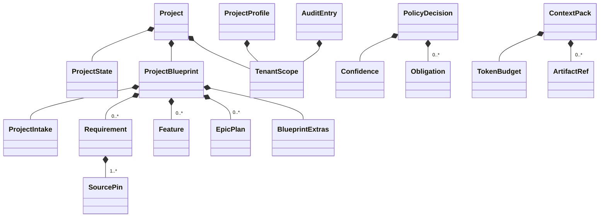
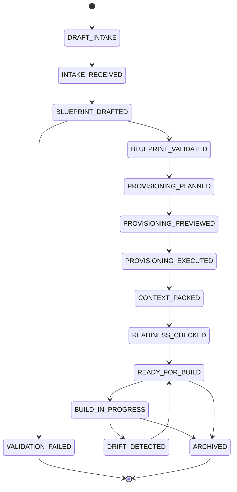

# Domain Model

> **TL;DR:** 18 typed entities in `src/domain/`. Distinguishes "domain types" (in-memory, business logic) from "schema" (DB tables). Some domain types map 1:1 to tables; others are sub-aggregates serialized inside JSONB. Round-trip serialization is unit-tested.

The domain model is the canonical type system; storage is one of its serializations. Build agents see domain types via MCP outputs; code reasons about domain types throughout.

---

## Entity catalog

| Type | File | Purpose |
|---|---|---|
| `ProjectState` | `projectState.ts` | 13-state state machine |
| `ProjectBlueprint` | (composite) | Root aggregate; sub-types below |
| `ProjectIntake` | `projectIntake.ts` | Captured raw content (markdown / UIO) + sourcePins |
| `Requirement` | `requirement.ts` | Atomic user story / acceptance criterion |
| `Feature` | `epicPlan.ts` (uses) | High-level feature with stories |
| `EpicPlan` | `epicPlan.ts` | Release epic with stories + timeline |
| `BlueprintExtras` | `blueprintExtras.ts` | Architecture, security, testing, release plan |
| `SourcePin` | `sourcePin.ts` | Upstream source reference |
| `ProjectProfile` | `projectProfile.ts` | Preflight discovery output |
| `AclEntry` | `aclEntry.ts` | ACL cache |
| `AuditEntry` | `auditEntry.ts` | Signed audit log entry |
| `PolicyDecision` | `policyDecision.ts` | Policy evaluation result |
| `ContextPack` | `contextPack.ts` | Bounded redacted context |
| `TenantScope` | `tenantScope.ts` | Single-tenant runaway / multi-tenant seam |
| `TokenBudget` | `tokenBudget.ts` | Per-request, per-session limits |
| `MCPSessionProfile` | `mcpSessionProfile.ts` | Session metadata |
| `Confidence` | `confidence.ts` | Numeric + categorical |
| `ArtifactRef` | `artifactRef.ts` | Uniform artifact identifier |
| `TraceLink` | `traceLink.ts` | Source-pin traceability |
| `ProjectGraph` | `projectGraph.ts` | Aggregated change graph (M10) |

That's 18 distinct types (some are factored into multiple files).

## Type hierarchy



## State machine: `ProjectState`

13 states from v6 §6:



`VALIDATION_FAILED` is a side state; `DRIFT_DETECTED` cycles back to `READY_FOR_BUILD` after re-sync. Transitions are enforced in `src/domain/projectState.ts`; invalid transitions throw `IllegalStateTransitionError`.

## Highlights per type

### `Confidence` (dual representation)

```typescript
interface Confidence {
  numeric: number       // 0.0 to 1.0
  categorical: "low" | "medium" | "high"
}
```

Why both: numeric for math; categorical for human reasoning + alert thresholds.

### `TenantScope` (multi-tenant runway seam)

```typescript
interface TenantScope {
  tenantId: string
  instanceUrl?: string
}
```

v1 has `defaultTenantScope()` returning a fixed value. Post-v1, `resolveScope(sessionId)` derives per-session.

### `ArtifactRef` (uniform identifier)

```typescript
interface ArtifactRef {
  kind: "jira-issue" | "confluence-page" | "vcs-branch" | "vcs-pr"
  key: string
  displayName?: string
  url?: string
}
```

Used everywhere artifacts cross system boundaries — audit entries, traces, context packs.

### `TokenBudget`

```typescript
interface TokenBudget {
  perRequest: number
  perSession: number
  overflow: "reject" | "truncate"
}
```

Per v6 §16.1; targets a specific model's context size.

## Serialization

Every domain type round-trips JSON cleanly. This is enforced by `tests/unit/domain/serialization.test.ts` — every type has a corresponding serialization round-trip test.

```typescript
const original = makeFixture()
const serialized = JSON.stringify(original)
const restored = parseAs<TypeName>(serialized)
expect(restored).toEqual(original)
```

When adding a new domain type, the serialization test is part of the iron-law (test-first) requirement.

## Validation

Zod schemas accompany each type for input validation:

```typescript
const ProjectIntakeSchema = z.object({
  // ...
}).strict()
```

`.strict()` rejects unknown keys — important for input boundaries (MCP tool inputs).

## Linked artifacts

- **Spec:** v6 §10 (full domain model)
- **Code:** `src/domain/`
- **Tests:** `tests/unit/domain/`
- **Schema:** [`schema.md`](schema.md)
- **Module:** [`../04-design/module-storage.md`](../04-design/module-storage.md)

---

*Last reviewed: 2026-04-25 by Chris.*
