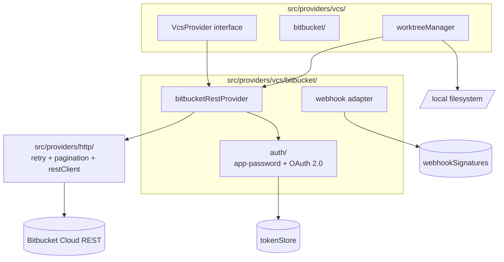
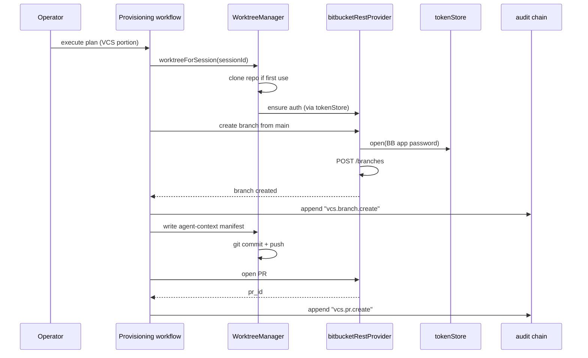

# Module — VCS Provider (Bitbucket)

> **TL;DR:** Bitbucket Cloud REST v2.0 client. Default auth: app password (ADR-0004); OAuth 2.0 supported as alternative. Per-session worktree manager for safe concurrent provisioning (v6 §24.5). Webhook signature verification via the shared `webhookSignatures` primitive. `VcsProvider` interface designed for future GitHub / GitLab implementations (post-v1; v6 §3 non-goals). Every state-changing call generates an audit entry.

The VCS module is intentionally bounded to Bitbucket Cloud for v1. The interface (`VcsProvider`) is provider-agnostic so future providers slot in cleanly; the implementation is Bitbucket-specific.

---

## Purpose

Owns:
- Auth flows for Bitbucket Cloud (app password + OAuth 2.0).
- Bitbucket REST v2.0 client: repos, branches, commits, files, PRs.
- Per-session worktree manager (concurrency-safe; v6 §24.5).
- VCS-specific webhook handling (signature verify + dedup hooks).
- The abstract `VcsProvider` contract (provider-agnostic).

Does NOT own:
- Provisioning logic (workflows + planner own).
- The MCP tool entry (`project_provision_execute` for VCS work; M6c).
- Token storage (delegates to `tokenStore` from the security module).
- Webhook verification primitives (delegates to `webhookSignatures`).
- Future GitHub / GitLab implementations (v6 §3 non-goals; would land as separate impl modules).

---

## Public surface

| Symbol | Kind | Signature | Purpose |
|---|---|---|---|
| `VcsProvider` | interface | abstract | The provider-agnostic contract (list repos, create branch, write file, open PR, etc.) |
| `bitbucketRestProvider` | factory | `(config) => VcsProvider` | REST-backed Bitbucket impl |
| `bitbucketAppPasswordAuth` | function | `(creds) => AuthHeader` | App-password Authorization header builder |
| `bitbucketOAuth2Auth` | function | `(creds) => AuthHeader` | OAuth 2.0 Bearer header (with refresh) |
| `WorktreeManager` | class | `manage()` / `cleanup()` | Per-session checkout management |
| `worktreeForSession` | function | `(sessionId) => Worktree` | Get / create the session-scoped worktree |
| `verifyBitbucketWebhook` | function | `(rawBody, headers) => boolean` | Wraps `webhookSignatures` with Bitbucket header conventions |

---

## Architecture

The interface (`VcsProvider`) is the abstraction — the planner / executor talks to it. The Bitbucket-specific implementation (`bitbucket/`) is separable.

---

## Key flows

### Provisioning a branch + agent-context manifest (M6c)

The worktree manager's job: keep concurrent provisioning of the same repo from interfering. Each session gets its own checkout directory.

### Worktree lifecycle

- **Created** on first use per session (lazy).
- **Reused** within the session for subsequent operations.
- **Cleaned up** on session end OR on explicit operator request.
- **Multiple sessions** = multiple worktrees of the same repo (separate directories).

The directory naming includes a session prefix to avoid collisions. Cleanup is idempotent.

### Webhook ingestion (M10+)

1. Bitbucket POSTs to the orchestrator's webhook ingress.
2. `verifyBitbucketWebhook` validates HMAC-SHA256.
3. Body parsed; normalized into a `GraphChangeEvent`.
4. Workflow processes; audit entry written.

The signature verification happens BEFORE the body is parsed (defense-in-depth).

---

## Authentication

### App password (default, v1 per ADR-0004)

| Field | Value |
|---|---|
| Setup | Operator generates a Bitbucket app password with required scopes (repo:read, repo:write, pullrequest:write) |
| Storage | Encrypted at rest in `encryptedTokens` (kind = `bitbucket_app_password`) |
| Header | `Authorization: Basic <base64(workspace:app-password)>` |
| Rotation | Manual; runbook documents the procedure |

Pros:
- Simple ops (no refresh dance).
- No race conditions on refresh.
- Works for service-account-style usage.

Cons:
- Per-user (tied to a Bitbucket account).
- Manual rotation.

### OAuth 2.0 (alternative)

| Field | Value |
|---|---|
| Setup | Operator registers an OAuth consumer in Bitbucket; goes through OAuth flow |
| Storage | Refresh token in `encryptedTokens` (kind = `bitbucket_oauth_refresh_token`) |
| Header | `Authorization: Bearer <access-token>` |
| Refresh | Automatic via the auth module |
| Rotation | Bitbucket-side via OAuth consumer settings |

Pros:
- Per-user delegation; supports multi-user scenarios.
- Tokens auto-refresh.

Cons:
- Refresh races (mitigation: single-flight cache; same approach as Atlassian PCO-59).
- More auth moving parts.

ADR-0004 documents the choice rationale.

---

## Failure modes

### 401 / auth failure

**Symptom:** Bitbucket REST calls return 401.

**Cause:** App password expired / revoked / wrong workspace.

**Recovery:** Operator rotates per Bitbucket UI; updates the sealed token via mgmt REST.

**Audit:** the auth failure is audited.

### Worktree disk full

**Symptom:** `git clone` or write operations fail with ENOSPC.

**Cause:** worktrees consuming disk; cleanup failed; logs growing.

**Recovery:** investigate retention; clean up stale worktrees; expand disk.

**Audit:** logged + alert.

### Concurrent push conflict (409)

**Symptom:** Bitbucket returns 409 on push.

**Cause:** another writer pushed to the branch between the worktree's last fetch and our push.

**Recovery:** worktree retries with rebase + re-push. Up to 3 attempts before failing the operation.

**Audit:** retries logged.

### No Bitbucket creds in env

**Symptom:** VCS executor (M6c) can't run; the dogfooded portfolio environment hit this.

**Cause:** `BITBUCKET_APP_PASSWORD` not set.

**Recovery:** graceful degradation — VCS executor disabled; Jira and Confluence executors continue.

**Audit:** the missing-creds condition is logged at startup.

### Webhook signature failure

**Symptom:** Bitbucket webhook returns 401.

**Cause:** wrong shared secret OR a probe.

**Recovery:** rotate shared secret if config drift; investigate if probe.

---

## Tests

| Test | Path | What it proves |
|---|---|---|
| App-password auth | `tests/unit/providers/vcs/bitbucketAuth.test.ts` | Authorization header construction |
| Webhook signatures | `tests/unit/security/webhookSignatures.test.ts` | HMAC-SHA256 verify + constant-time compare |
| REST live (gated) | `tests/integration/providers/vcs/bitbucketRestProvider.test.ts` | Real Bitbucket read path; gated by `RUN_LIVE_TESTS=1` |
| Worktree manager | `tests/integration/providers/vcs/worktreeManager.test.ts` | Concurrent worktrees + cleanup + idempotent re-clone |

Coverage gaps:
- **OAuth 2.0 flow** — auth path exists; live testing pending.
- **PR-creation idempotency** — designed; integration test pending M6c.
- **Concurrent push retry** — mocked path tested; live race condition harder to reproduce.

---

## Concurrency

- **One worktree per session.** No shared filesystem state across sessions.
- **HTTP calls** within a session are sequential or fan-out per workflow.
- **Worktree manager itself** is concurrency-safe at the directory level (separate dirs per session).
- **Token store** access is concurrency-safe (each call independent).

Push conflicts are handled at the git level via rebase + retry — Bitbucket's optimistic concurrency model.

---

## Performance characteristics

| Operation | Typical | p99 |
|---|---|---|
| List branches | < 500 ms | < 2 s |
| Create branch | < 1 s | < 3 s |
| Push (small commit) | < 2 s | < 5 s |
| Open PR | < 1 s | < 3 s |
| Worktree create (first clone) | < 10 s for moderate repo | < 30 s for large repo |
| Worktree reuse (subsequent ops) | < 100 ms | < 500 ms |

Performance is bounded by Bitbucket's API + git operation cost. Worktree first-clone is the slowest path; subsequent operations are fast.

---

## Tradeoffs

### App password vs. OAuth for v1 default

**Chose:** app password.

**Pro:** simpler ops; no refresh races; sufficient for single-tenant single-user.

**Con:** doesn't support delegated multi-user scenarios cleanly.

**Reference:** [ADR-0004](../../adr/0004-bitbucket-app-password-vs-oauth.md).

### Per-session worktree vs. shared

**Chose:** per-session.

**Pro:** concurrency safety at the worktree level. No cross-session contention.

**Con:** disk usage scales with session count.

**Mitigation:** session TTL ensures cleanup; manager handles eviction.

### Bitbucket Cloud only vs. + Data Center

**Chose:** Cloud only.

**Pro:** bounded scope; deeper integration; one auth model.

**Con:** customers running Bitbucket Data Center / Server are unsupported in v1.

**Reference:** v6 §3 non-goals; revisit when there's customer demand.

### REST v2.0 vs. v1

**Chose:** v2.0.

**Pro:** Bitbucket's current API; better featured; documented.

**Con:** none material.

---

## Roadmap

- **M3 closes** when worktree manager is robust + webhook surface is fully wired.
- **M6c** (VCS executor) lands after M5 (planner) and M6a/b. The first shippable VCS slice.
- **M10:** webhook ingestion + dedup end-to-end.
- **Post-v1:**
  - GitHub provider implementing the same `VcsProvider` interface.
  - GitLab provider.
  - Bitbucket Data Center support.

The provider abstraction is the leverage point — adding a new VCS is bounded work.

---

## Linked artifacts

- **Spec:** v6 §13 (VCS artifacts), §19 (provider interfaces), §24.5 (per-session worktree), §26 (webhook ingestion)
- **ADR:** [ADR-0004](../../adr/0004-bitbucket-app-password-vs-oauth.md)
- **Code:** `src/providers/vcs/`, `src/providers/Provider.ts`, `src/security/webhookSignatures.ts`
- **Sibling modules:** [`module-providers-atlassian.md`](module-providers-atlassian.md), [`module-security.md`](module-security.md), [`module-storage.md`](module-storage.md)
- **Tests:** `tests/unit/providers/vcs/`, `tests/integration/providers/vcs/`
- **Threat model:** [`../06-security/webhook-verification.md`](../06-security/webhook-verification.md)
- **Tracking:** webhook delivery dedup (M10); GitHub provider (post-v1)

---

*Last reviewed: 2026-04-25 by Chris.*
