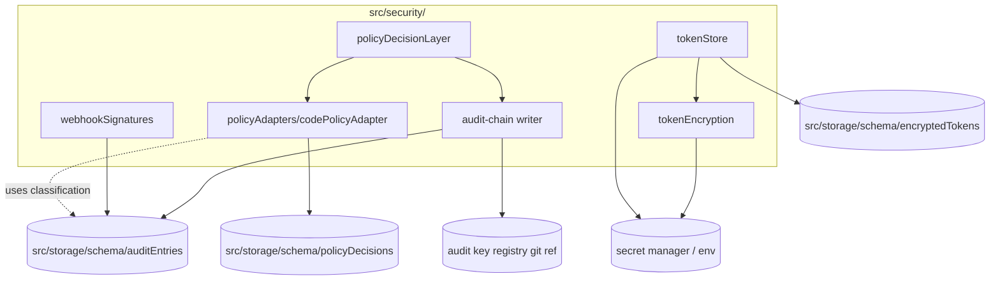

# Module — Security

> **TL;DR:** Cross-cutting security primitives. Owns the policy decision layer (gates state changes), the audit chain writer (hash-linked + ed25519-signed), the token store (XChaCha20-Poly1305 envelope), and the webhook signature verifier (HMAC-SHA256). The single entry point per concern is the discipline: every state-change passes through `policyDecisionLayer.evaluate()`; every token read goes through `tokenStore.open()`; every webhook is verified before parsing. Per-component threat models in [`../06-security/`](../06-security/).

The security module is small in lines of code but disproportionately important. Bypassing any of its entry points = a real defect (caught by review, ideally also by lint/AST checks in M11+).

---

## Purpose

Owns the cross-cutting security primitives:

- **Policy decision layer** (`policyDecisionLayer.ts`) — gates every state-changing operation; default deny in strict mode; adapter pattern for richer rules.
- **Code-policy adapter** (`policyAdapters/codePolicyAdapter.ts`) — v1 default adapter; conservative built-in rules.
- **Token sealing/opening** (`tokenEncryption.ts` + `tokenStore.ts`) — XChaCha20-Poly1305 envelope per ADR-0002; plaintext only in memory at request time.
- **Webhook signature verification** (`webhookSignatures.ts`) — HMAC-SHA256 + constant-time compare.
- **Audit-chain construction** — the hash-chain + signing logic; storage lives in `src/storage/schema/auditEntries.ts`.

Does NOT own:
- The audit-entry schema itself (storage owns; this module operates on it).
- Provider-specific auth flows (each provider's `auth/` directory owns).
- Policy *rules* — those live in adapters; this module holds the contract.
- Secret provisioning (deploy-platform concern; this module assumes secrets arrive through env / mount).

---

## Public surface

| Symbol | Kind | Signature | Purpose |
|---|---|---|---|
| `policyDecisionLayer.evaluate` | function | `(req: PolicyDecisionRequest) => Promise<PolicyDecision>` | Single entry: every state-change passes through. Returns effect + obligations + confidence + reasons. |
| `PolicyDecision` | type | `{ effect, obligations, confidence, reasons }` | Output shape |
| `PolicyDecisionRequest` | type | `{ projectId, intent, context }` | Input shape |
| `Obligation` | type | discriminated union | Constraints to honor downstream (redact_field, rate_limit, require_review, audit_extra) |
| `codePolicyAdapter` | impl | implements `PolicyAdapter` | Default v1 adapter |
| `tokenStore.seal` | function | `(plaintext, kind, subject) => Promise<TokenId>` | Persist plaintext as encrypted row |
| `tokenStore.open` | function | `(kind, subject) => Promise<string>` | Decrypt to plaintext (in memory only) |
| `tokenStore.rotate` | function | `(kind, subject, newPlaintext) => Promise<TokenId>` | Supersedes prior; preserves history for rollback |
| `tokenEncryption.seal/open` | low-level | XChaCha20-Poly1305 wrappers | Used by tokenStore; testable in isolation |
| `tokenEncryption.testDouble` | impl | implements the encryption contract without crypto | Fake for non-encryption tests |
| `verifyWebhookSignature` | function | `(rawBody, signatureHeader, secret) => boolean` | HMAC-SHA256 verify; constant-time compare |
| `auditChainAppend` | function | `(entry) => Promise<AuditId>` | Append a signed entry to the chain |

---

## Architecture



Each primitive has a clear ownership boundary. `policyDecisionLayer` orchestrates; the others are leaf primitives.

---

## Key flows

### Policy evaluation

Every state-changing operation in the orchestrator calls `policyDecisionLayer.evaluate()`. The flow:

```mermaid
sequenceDiagram
    participant Caller as Workflow / executor
    participant Layer as policyDecisionLayer
    participant Adapter as codePolicyAdapter
    participant Audit as audit chain
    participant Decisions as policyDecisions table

    Caller->>Layer: evaluate(req)
    Layer->>Adapter: evaluate(req)
    Adapter->>Adapter: apply rules
    Adapter-->>Layer: PolicyDecision
    Layer->>Decisions: insert structured record
    Layer->>Audit: append "policy.decision" entry (signed)
    Layer-->>Caller: decision

    alt decision.effect = deny
        Caller->>Caller: throw PolicyDeniedError
    else require_approval
        Caller->>Caller: pause for human approval
    else allow
        Caller->>Caller: honor obligations; proceed
    end
```

The decision is **always** persisted: once in `policyDecisions` (queryable via SQL), once in `auditEntries` (tamper-evident). Redundancy is intentional — different consumers, different ergonomics.

### Token seal/open

Sealing (write):
1. Generate 24-byte random nonce.
2. `xchacha20poly1305.seal(masterKey, nonce, plaintext)` → ciphertext + auth tag.
3. Insert row in `encryptedTokens`: `(id, kind, subject, nonce, ciphertext, ...)`.
4. Return token row id.

Opening (read):
1. Query `encryptedTokens` for `(kind, subject)`.
2. `xchacha20poly1305.open(masterKey, nonce, ciphertext)` → plaintext (or throw on auth failure).
3. Return plaintext.
4. Caller must zero plaintext after use (best-effort; JS limitation).

### Webhook verify

1. Read raw body bytes (BEFORE parsing JSON or any structured interpretation).
2. Compute `HMAC-SHA256(secret, body)`.
3. `crypto.timingSafeEqual(computed, signatureHeader)`.
4. Return boolean. **Caller never proceeds past this** unless the result is true.

The "before parsing" rule is critical: a malicious body can't trigger a parser exploit before signature verification.

### Audit chain append

1. Look up the prior entry's serialized canonical form (RFC 8785 JCS).
2. Compute `prevHash = SHA-256(prior canonical)`.
3. Compute `payloadHash = SHA-256(this entry's payload, JCS-canonicalized)`.
4. Compute `chainHash = SHA-256(prevHash || payloadHash)`.
5. Resolve current signing key from the registry git ref.
6. Sign `chainHash` with ed25519.
7. Insert row with all fields.
8. Return entry id.

Failure to write = **fail closed** (the calling operation aborts). Documented in v6 §30.1.

---

## Threat coverage

Per-component threat models (in [`../06-security/`](../06-security/)):

- [`policy-decision-layer.md`](../06-security/policy-decision-layer.md) — T-PDL-* (bypass, wrong decision, obligation skip, runtime tamper).
- [`token-storage.md`](../06-security/token-storage.md) — T-2201, T-2202 (exfil, log leak).
- [`webhook-verification.md`](../06-security/webhook-verification.md) — T-1103, T-1104 (forge, replay).
- [`audit-chain-threat-model.md`](../06-security/audit-chain-threat-model.md) — T-3302 through T-3306 (forge, key compromise, registry compromise, silent fail, clock manipulation).

Parent: [`../06-security/threat-model.md`](../06-security/threat-model.md).

---

## Configuration

Per [`../09-deployment/secrets-provisioning.md`](../09-deployment/secrets-provisioning.md):

| Var | Required | Default | Purpose |
|---|---|---|---|
| `TOKEN_MASTER_KEY` | Yes (non-dev) | — | 32-byte hex master key for envelope encryption |
| `AUDIT_KEYPAIR_PATH` | No | `./.orchestrator-audit-keypair.json` | Audit signing keypair file |
| `AUDIT_KEY_REGISTRY_REF` | Yes (non-dev) | — | Git ref for the public-key registry |
| `WEBHOOK_SHARED_SECRETS` | Conditional | — | JSON map of source → HMAC-SHA256 secret |
| `POLICY_ADAPTER` | No | `code` | Adapter selection (only `code` in v1) |
| `POLICY_STRICT_MODE` | No | `true` for `production`, `false` for `dev` | Strict mode treats unknown intents as deny |

Failure to load any of these (where required) causes startup failure with a clear error message. Silent fallback is **not** a defensible choice for security primitives.

---

## Failure modes

### Master key unset at startup

**Symptom:** Application fails to start with a clear error.

**Recovery:** set `TOKEN_MASTER_KEY` per [`../09-deployment/secrets-provisioning.md`](../09-deployment/secrets-provisioning.md). Don't proceed with token features until set.

### Master key malformed

**Symptom:** Startup fails with "expected 64 hex chars, got X."

**Recovery:** correct the key; restart.

### Audit keypair missing

**Symptom:** Startup fails (or auto-generates in dev tier only).

**Recovery:** in production, mount the keypair via secret manager. In dev, the bootstrap script generates one.

### Registry git ref unreachable

**Symptom:** New audit-chain writes fail closed (cannot resolve key id to public key for verification).

**Recovery:** check git ref reachability; check replication to secondary host. Existing chain remains verifiable; new writes blocked until restored.

### Policy adapter throws

**Symptom:** A policy evaluation throws an unexpected error.

**Recovery:** the layer catches + treats as `effect: deny` with `confidence: low` (fail safe). The throw is logged + audited.

### Webhook signature mismatch

**Symptom:** verification returns false.

**Recovery:** the calling endpoint returns 401; the failure is audited. If the rate of mismatches is high: a probe is suspected (alert).

---

## Tests

| Test | Path | What it proves |
|---|---|---|
| Token encryption round-trip | `tests/unit/security/tokenEncryption.test.ts` | Plaintext in = plaintext out; tamper detected |
| Wrong-key fails | Same file | Decrypt with wrong master key → auth failure, not garbage |
| Code-policy adapter | `tests/unit/security/codePolicyAdapter.test.ts` | All intents return canonical decision shape; lethal-trifecta path works |
| Webhook signatures | `tests/unit/security/webhookSignatures.test.ts` | Valid accepted; tampered rejected; constant-time compare |
| Token store integration | `tests/integration/storage/tokenStore.test.ts` | Real DB roundtrip across pglite + Postgres |
| Audit chain integrity | `tests/integration/storage/auditRepository.test.ts` | Chain construction; tamper detection; fail-closed behavior |

Coverage gaps:
- **Master-key rotation drill** — manual today; planned automation post-v1 (PCO-57).
- **Audit signing key rotation** end-to-end — designed; integration test pending (M11).
- **Lethal-trifecta detection adversarial cases** — needs broader corpus.

---

## Concurrency

- **Policy evaluation:** stateless; no shared mutable state. Reentrant.
- **Token seal/open:** uses no shared state per call. Master key held in memory.
- **Webhook verify:** stateless.
- **Audit chain writes:** serialized at the storage layer (each entry depends on prior). The writer holds an advisory lock for the duration of an append.

Performance implication: audit-chain throughput is bounded by serialization. At v1 scale (100 entries/sec sustained target), this is fine; at higher scale, batching or sharding becomes relevant.

---

## Performance characteristics

| Operation | Typical | p99 |
|---|---|---|
| Policy evaluation (in-memory adapter) | < 1 ms | < 5 ms |
| Token seal | < 5 ms | < 20 ms |
| Token open (DB read + decrypt) | < 5 ms | < 20 ms |
| HMAC-SHA256 verify | < 1 ms | < 5 ms |
| Audit chain append (sign + insert) | < 20 ms | < 100 ms |

These are dominated by I/O (DB write, key registry git lookup), not crypto. The crypto operations themselves are < 100µs.

---

## Tradeoffs

### Single policy adapter (code) for v1 vs. plug-in framework

**Chose:** code-only.

**Pro:** simpler. Rule changes are PRs with full review.

**Con:** rule changes require redeploy.

**Mitigation:** OPA / Cedar adapters can plug in behind the same interface in M7+ if needed.

### Master encryption key as single point vs. envelope w/ per-row keys

**Chose:** single master for v1.

**Pro:** simpler implementation.

**Con:** master-key compromise = all tokens decryptable. Master-key rotation = manual re-encrypt drill (Incident C).

**Mitigation:** PCO-57 tracks the envelope-encryption refactor.

### Fail-closed on audit failure vs. continue

**Chose:** fail-closed.

**Pro:** integrity preserved over availability. v6 §30.1.

**Con:** audit-chain outage takes the orchestrator down with it.

**Mitigation:** the audit chain has its own redundancy story (PITR + key registry replication).

### Hash-chain + ed25519 vs. simpler audit log

**Chose:** hash-chain + ed25519.

**Pro:** tamper-evident; cheap verification.

**Con:** key management complexity (registry git ref, rotation procedure).

**Reference:** [ADR-0005](../../adr/0005-audit-signing-pipeline.md) for the full rationale.

---

## Roadmap

- **M11:** full audit-chain wraps every executor (currently partial).
- **M11:** rotation drills exercised end-to-end against staging fixture.
- **PCO-51:** per-tenant key isolation spike (multi-tenant prerequisite).
- **PCO-57:** envelope encryption refactor (master-key rotation made cheap).
- **Post-v1:** OPA / Cedar adapter exploration if needed.

---

## Linked artifacts

- **Spec:** v6 §7.2 (policy decision layer), §30 (audit + security), §30.1 (audit chain), §38 (lethal trifecta + ACL ranking)
- **ADRs:** [ADR-0002](../../adr/0002-token-encryption-noble-ciphers.md), [ADR-0005](../../adr/0005-audit-signing-pipeline.md)
- **Code:** `src/security/`
- **Threat models:** [`../06-security/threat-model.md`](../06-security/threat-model.md), [`../06-security/policy-decision-layer.md`](../06-security/policy-decision-layer.md), [`../06-security/token-storage.md`](../06-security/token-storage.md), [`../06-security/webhook-verification.md`](../06-security/webhook-verification.md), [`../06-security/audit-chain-threat-model.md`](../06-security/audit-chain-threat-model.md), [`../06-security/lethal-trifecta.md`](../06-security/lethal-trifecta.md)
- **Sibling modules:** [`module-storage.md`](module-storage.md), [`module-mcp-runtime.md`](module-mcp-runtime.md), [`module-providers-atlassian.md`](module-providers-atlassian.md)
- **Audit data:** [`../05-data/audit-trail.md`](../05-data/audit-trail.md)
- **Tracking:** PCO-51 (multi-tenant), PCO-57 (envelope encryption)

---

*Last reviewed: 2026-04-25 by Chris.*
