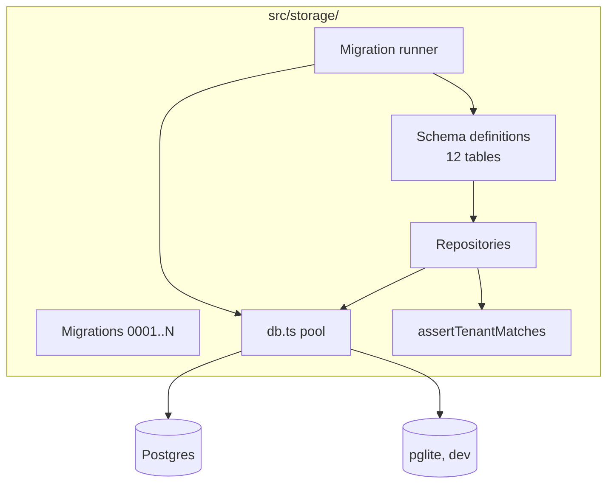
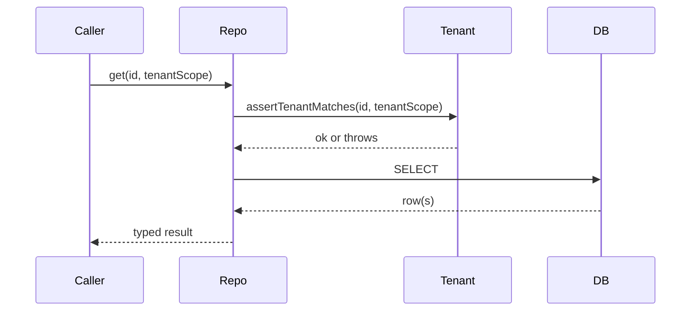

# Module — Storage

> **TL;DR:** Drizzle-typed schema, repositories with tenant-scope enforcement, migration runner with rehearsal mode. Postgres in production, pglite in dev (ADR-0001). All writes go through repositories; no raw SQL outside this module. Idempotency at the schema level (unique constraints) + at the repo level (deterministic upsert).

## Purpose

Owns:
- The schema (12 tables; `src/storage/schema/`).
- The migration runner including rehearsal mode (PCO-13).
- All repositories — every read/write to Postgres goes through them.
- Tenant-scope enforcement at the repo boundary.

Does NOT own:
- Schema changes outside the migration system. (Anything changing the schema is a versioned migration.)
- Cross-table business logic (that lives in workflows).

## Public surface

| Symbol | Kind | Purpose |
|---|---|---|
| `migrationRunner` | function | Apply migrations idempotently; supports rehearsal mode |
| `db` | function | Returns a Drizzle DB instance scoped to a tenant |
| `projectRepository` | factory | CRUD for projects |
| `auditEntriesRepository` | factory | Append-only audit chain writes + reads |
| `policyDecisionRepository` | factory | Policy decision history |
| `mcpSessionProfileRepository` | factory | Session state |
| `tokenStore` | factory | Sealed token CRUD (calls `tokenEncryption`) |
| `aclRepository` | factory | ACL cache reads/writes |
| `traceLinkRepository` | factory | Source-pin traceability |
| `contextPackRepository` | factory | Context pack persistence (M7) |
| `readinessRepository` | factory | Readiness reports |
| `projectProfileRepository` | factory | Preflight profile persistence |
| `assertTenantMatches` | guard | Throws on cross-tenant access |

## Architecture

## Key flows

### Migration with rehearsal

See [`sequence-diagrams.md`](sequence-diagrams.md). Runner steps:

1. Acquire advisory lock (single-runner).
2. Read `_migrations` to determine pending migrations.
3. For each pending migration in order:
   - If rehearsal mode: spin up a temp DB, apply prior migrations, apply pending, run post-conditions; tear down.
   - Apply to target.
   - Record in `_migrations` metadata.
4. Release lock.

Rehearsal failure: stops the runner; the migration is NOT applied to target. Operator must investigate.

### Repository read

Tenant-scope check is mandatory; bypassing it is a defect.

## Data model

12 tables; full ER diagram in [`../05-data/schema.md`](../05-data/schema.md).

Highlights:
- `projects` — root aggregate; blueprint stored as JSONB.
- `auditEntries` — append-only, hash-chained, signed (ADR-0005).
- `encryptedTokens` — sealed via XChaCha20-Poly1305 (ADR-0002).
- `policyDecisions` — structurally redundant with audit entries; queryable via SQL.
- `_migrations` — runner metadata; the table that tracks "what's been applied."

## Failure modes

- **Migration mid-flight crash** — Incident B class. Recovery via [`../08-operations/runbook.md`](../08-operations/runbook.md) "Migration runner stuck."
- **Connection pool exhaustion** — alert via `db_query_failure_rate`. Increase pool size or investigate long-running queries.
- **Tenant-scope violation** — defect; should never happen. The thrown error is captured in audit logs.
- **Audit-write fails** — fail closed. Documented in [`../06-security/audit-chain-threat-model.md`](../06-security/audit-chain-threat-model.md).

## Test surface

| Test | Path |
|---|---|
| Repository contract | `tests/integration/storage/repositories.test.ts` |
| Audit chain integrity | `tests/integration/storage/auditRepository.test.ts` |
| Token store seal/open | `tests/integration/storage/tokenStore.test.ts` |
| Migration rehearsal | `tests/integration/storage/migrationRehearsal.test.ts` |
| Tenant scope | `tests/unit/domain/tenantScope.test.ts` |

## Concurrency

- Connection pool serves concurrent reads.
- Writes serialized at the row level by Postgres (default).
- Migration runner uses advisory locks for single-runner.
- Audit chain writes serialize the chain (each entry depends on the previous; the runner's locking ensures no parallel chain heads).

## Performance

- Reads: < 5 ms p99 for indexed lookups.
- Writes: < 20 ms p99 for typical inserts.
- Migration apply: depends on migration; rehearsal adds ~1s overhead per migration.

## Tradeoffs

- **Drizzle ORM** vs. raw SQL: chose Drizzle for type-safe queries. Cost: another abstraction layer.
- **JSONB blueprints** vs. fully normalized: blueprints have heterogeneous shapes; JSONB is the ergonomic choice. Cost: harder to query individual fields without GIN indexes.
- **Migration runner replaces Drizzle's built-in runner** vs. accepting Drizzle's: rehearsal is novel, not in Drizzle. Cost: maintain a custom runner.

## Roadmap

- M11: pruning cron jobs for retention.
- Post-v1: per-tenant DB sharding (multi-tenant prerequisite).

## Linked artifacts

- **Spec:** v6 §10 (domain), §28 M1, §6.1 (PHASE-STATE)
- **ADR:** [ADR-0001](../../adr/0001-pglite-for-dev.md)
- **Code:** `src/storage/`
- **Schema doc:** [`../05-data/schema.md`](../05-data/schema.md)
- **Migrations doc:** [`../05-data/migrations.md`](../05-data/migrations.md)
- **Tests:** see test surface
- **Tracking:** PCO-13 (rehearsal), PCO-56 (vacuumed-row gap)

---

*Last reviewed: 2026-04-25 by Chris.*
