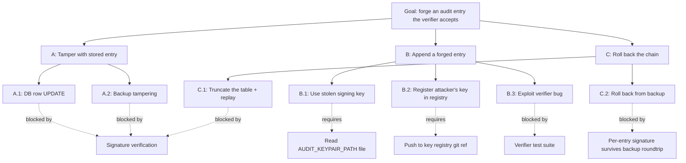

# Audit Chain Threat Model

> **TL;DR:** The audit chain is hash-linked + ed25519-signed + key-registry in a git ref. An adversary needs DB write access AND signing-key access AND key-registry-push access to forge an entry undetected. This doc walks the attack tree per defense layer, documents the genesis case, and specifies the rotation procedure.

Component-level threat model. Parent: [`threat-model.md`](threat-model.md). Decision rationale: [ADR-0005](../../adr/0005-audit-signing-pipeline.md).

---

## Component scope

- **What it is:** append-only log of every state change in atl-mcp; tamper-evident.
- **Code:** `src/storage/schema/auditEntries.ts`, plus repositories in `src/storage/repositories/`.
- **Persistence:** Postgres `auditEntries` table (rehearsed via pglite in dev).
- **Verifier:** offline CLI tool (planned per ADR-0005).
- **Spec:** v6 §30.1.

## Entry shape (recap)

| Column | Purpose |
|---|---|
| `id` | UUIDv7 (sortable) |
| `actor` | session or operator that initiated |
| `operation` | verb + object (e.g. `jira.issue.create`) |
| `payload` | canonical JSON (RFC 8785 JCS) of inputs + outputs |
| `prev_hash` | SHA-256 of previous entry's full canonical serialization (incl. its signature). NULL for genesis. |
| `payload_hash` | SHA-256(`payload`) |
| `chain_hash` | SHA-256(`prev_hash` ‖ `payload_hash`) |
| `signature` | ed25519 over `chain_hash` |
| `key_id` | identifier resolved through the key registry |
| `ts` | server-generated timestamp |

## Trust assumptions

| Assumption | Why we make it | If broken |
|---|---|---|
| The signing key file (mode 0400) is readable only by the server uid | OS-level file permissions | Forgery becomes possible; rotate immediately |
| The key registry git ref is push-protected | Git host security (signed commits, branch protection) | Attacker can register their key as active; chain integrity collapses |
| The Postgres DB is accessed only by the server process | Application-deploy hygiene | DB-write attacker can append junk entries (caught by signature) but not forge valid ones unless they also have the key |
| Server clock is roughly correct (within seconds) | NTP / cloud host clock | Timestamps misorder; chain order survives via prev_hash; verifier flags large skews |
| Git host is uncompromised | Standard git provider security model | Out of scope; if GitHub/Bitbucket/internal git is compromised, the world is on fire |

## Attack tree

The goal: forge an audit entry that the verifier accepts as valid.

### Attack A: tamper with stored entries

Modifying any stored field changes either `prev_hash` (next entry's reference) or `payload_hash` (this entry's). The `chain_hash` recomputes to a different value; the signature no longer verifies.

**Detection:** offline verifier walks the chain in order, recomputes each `chain_hash`, validates each signature. First-tampered entry surfaces with line: "verification failed at entry K: chain_hash mismatch" or "signature invalid".

**Residual risk:** detection is post-hoc. A long-running tamper that's never verified accumulates impact. Mitigation: scheduled verifier run (operationally; not yet automated in v1) and `/admin/health/audit` health endpoint that runs a partial walk on each call.

### Attack B: append a forged entry

The attacker writes a new entry that looks valid.

**B.1 Stolen signing key.** Attacker reads `AUDIT_KEYPAIR_PATH` and signs a forged `chain_hash`. The forged entry verifies. **This is the worst case** because forensics can't distinguish forged from legitimate.

- Mitigation: file permissions (mode 0400, server uid). Rotation procedure (below) limits temporal exposure.
- Detection: the rotation event itself is an audit entry; if rotation happened without operator action, that's the trigger.
- Recovery: rotate. Mark forged entries (no automated way; relies on operator to identify by content + timing).

**B.2 Register attacker's key.** Attacker pushes to the key registry git ref and registers their key as `active`. New entries signed with the attacker key now verify, because the verifier resolves `key_id` through the registry.

- Mitigation: git host's branch protection + signed commits. Operationally separate from the server host.
- Detection: anomalous registry pushes (git history audit). The registry ref's commit log is itself an audit trail.
- Recovery: revert the bad commit; entries signed with the attacker key are flagged by verifier (no longer resolvable to a "trusted" key).

**B.3 Verifier bug.** The verifier itself has a bug that accepts invalid chains.

- Mitigation: verifier test suite covering tamper / forgery / replay scenarios (`tests/integration/storage/auditRepository.test.ts` partial coverage; full verifier CLI is M11 work).
- Detection: cross-verification (two independent verifier implementations would catch this; v1 has only one).

### Attack C: roll back the chain

The attacker truncates entries and "starts over" from a synthetic genesis.

**C.1 Truncate + replay:** unlike a single tamper, this attacks the *length* invariant. The verifier doesn't directly know "what length the chain should be" without an external pin.

- Mitigation: the chain length itself is recorded in the `/admin/health/audit` response, observable externally. Capacity planning records expected chain length growth rate.
- Detection: anomaly in chain length (sudden drop; unexpected genesis timestamp).

**C.2 Roll back from backup:** if a backup is restored that predates an entry, the entry is lost; the chain has fewer entries.

- Mitigation: backup procedure documented in [`../10-dr-bcp/backup-strategy.md`](../10-dr-bcp/backup-strategy.md); restoration is itself an audit-loggable event.
- Detection: same as C.1.

## The genesis block (and why it has no signed predecessor)

The first entry has `prev_hash = NULL`. This is the chicken-and-egg case: there's no prior entry to chain to.

- **Verifier behavior:** treats `prev_hash IS NULL` as a special case for entry 1 only. Reports "chain length 1, genesis only" or "genesis followed by N entries".
- **Why not seed with a synthetic prior?** A synthetic prior would itself need to be signed, requiring a key, which would be the system's first key with no provenance. The NULL is structurally singular: one entry has it, by construction.
- **Defensive check:** verifier asserts that exactly one entry in the chain has `prev_hash = NULL`. Multiple genesis entries means tampering or rollback.
- **Exposure:** the genesis is signed normally — the same signing key is used. `chain_hash` is just `SHA-256(payload_hash)` for the genesis case.

## Key rotation procedure

The procedure that makes the rotation invariants hold:

1. **Pre-condition:** decide why rotating (compromise vs. scheduled). Cadence is at-will for v1; no mandated period.
2. **Stage:** generate a new keypair. Tool: `scripts/security/audit-keys-init.ts` (or similar; M11 hardening).
3. **Register:** push the new public key to the key registry git ref. The commit message is the rotation event description (auditable).
4. **Activate:** update the orchestrator's `AUDIT_KEYPAIR_PATH` to the new private key. Restart so the new keypair loads.
5. **Sign the rotation event:** the next audit entry written is the rotation announcement, signed with the *new* key. This entry references the old `key_id` in its payload.
6. **Decommission:** the old private key file gets removed after a retention period (recommended: 7 days). The public-half stays in the registry forever — historical entries reference it by `key_id`.

The verifier handles a chain with multiple `key_id`s by walking the registry's commit history: at the timestamp of entry K, what was the `active` key? That key signs K. The registry is git, so the answer is reproducible.

### What rotation does NOT do

- It does NOT re-sign historical entries. Each entry is signed once, by whatever key was active at write time.
- It does NOT alter the chain. New entries chain on as before.
- It does NOT erase the old public key. Historical verification needs it.

### Open question (resolved in ADR-0005)

The registry as **branch** (mutable) vs **tag** (immutable): branch + log-the-rotation-event chosen for operational simplicity. Tag-based registry would be verifiability-stronger; revisit if compromise occurs.

## Validation

What tests prove this design holds:

- **Tamper detection:** `tests/integration/storage/auditRepository.test.ts` flips a byte and asserts verifier fails.
- **Genesis special case:** same file; asserts a 1-entry chain validates.
- **Rotation handling:** (M11; not yet implemented). Rotation event + entry signed with new key; verifier accepts both eras.
- **Hash determinism:** same payload produces same `payload_hash` regardless of JSON ordering (RFC 8785 JCS).

## Linked artifacts

- **ADR:** [ADR-0005](../../adr/0005-audit-signing-pipeline.md)
- **Spec:** v6 §30.1
- **Code:** `src/storage/schema/auditEntries.ts`, `src/storage/repositories/policyDecisionRepository.ts`
- **Tests:** `tests/integration/storage/auditRepository.test.ts`
- **Parent threat model:** [`threat-model.md`](threat-model.md) (T-3302, T-3303, T-3304, T-3305, T-3306)
- **Audit trail data ref:** [`../05-data/audit-trail.md`](../05-data/audit-trail.md)
- **Recovery procedure:** [`../10-dr-bcp/audit-chain-recovery.md`](../10-dr-bcp/audit-chain-recovery.md)
- **Demo mirror:** [`docs/demo/architecture.md`](../../demo/architecture.md) (audit chain section)

---

*Last reviewed: 2026-04-25 by Chris.*
