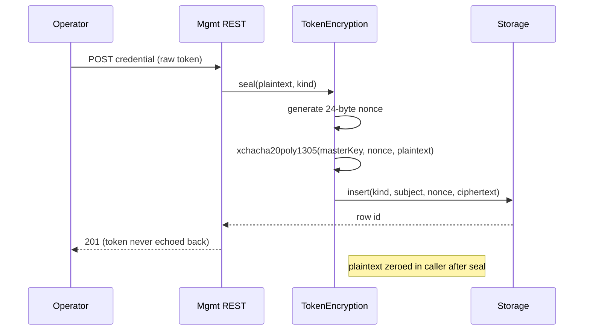
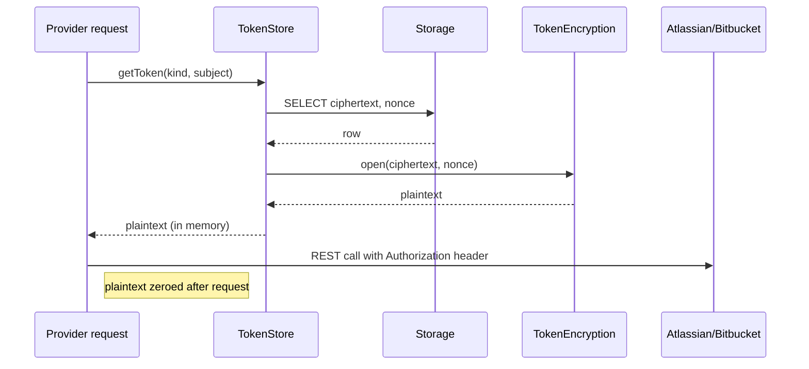

# Token Storage

> **TL;DR:** Atlassian, Bitbucket, and webhook-source tokens are sealed with XChaCha20-Poly1305 (envelope encryption pattern, single master key in v1). Master key is never in DB; lives in `TOKEN_MASTER_KEY` env var. Plaintext exists only in memory during request signing. Master-key rotation requires a manual re-encrypt drill (PCO-57).

The full design lives across [ADR-0002](../../adr/0002-token-encryption-noble-ciphers.md) and `src/security/tokenStore.ts` + `src/security/tokenEncryption.ts`. This doc is the operational + threat view.

---

## What is stored

Three classes of secret in the `encryptedTokens` table (kind enum):

| Kind | Used for | Source |
|---|---|---|
| `atlassian_api_token` | Jira + Confluence REST calls | Operator-provided at config time |
| `atlassian_oauth_refresh_token` | OAuth 3LO refresh dance (when auth_mode=oauth3lo) | Returned by Atlassian on consent |
| `bitbucket_app_password` | Bitbucket REST calls | Operator-provided at config time |
| `bitbucket_oauth_refresh_token` | OAuth 2.0 refresh (when auth_mode=oauth) | Returned by Bitbucket on consent |
| `webhook_shared_secret` | HMAC-SHA256 verification of incoming webhooks | Operator-provided per source |

All persisted via the same envelope.

## Cryptographic primitives

- **Cipher:** XChaCha20-Poly1305 (AEAD).
- **Library:** `@noble/ciphers` (audited primitives, pure JS, no native deps; ADR-0002).
- **Master key:** 32 bytes, hex-encoded, in `TOKEN_MASTER_KEY` env var. NOT persisted to disk by atl-mcp.
- **Per-record nonce:** 24 random bytes (`xchacha20poly1305` requires 24-byte nonce). Stored alongside ciphertext.
- **Authentication tag:** 16 bytes, included in ciphertext per AEAD construction.

## Envelope shape

Each `encryptedTokens` row stores:

| Column | Purpose |
|---|---|
| `id` | UUIDv7 primary key |
| `kind` | Enum (above) |
| `subject` | Identifier (e.g., Atlassian site URL, Bitbucket workspace, webhook source name) |
| `nonce` | 24 random bytes (`bytea`) |
| `ciphertext` | Encrypted payload + auth tag (`bytea`) |
| `createdAt` | When sealed |
| `rotatedFromId` | Previous row this one supersedes (for rotation history) |

**Plaintext shape** (after decryption):

```json
{
  "token": "<the-actual-secret>",
  "metadata": { "rotatedAt": "...", "expiresAt": "...", ... }
}
```

## Lifecycle

### Sealing (write path)



### Opening (read path, request signing)



The plaintext is held only for the duration of the outbound HTTP request. Best-effort zeroing after use; documented limitation (JavaScript cannot guarantee memory hygiene).

### Rotation (per-token)

When a token is rotated by Atlassian / Bitbucket / a webhook source:

1. Operator obtains the new token.
2. Operator submits via mgmt REST (or CLI tool).
3. New row written with same `kind` + `subject`. The new row's `rotatedFromId` references the prior row.
4. The prior row stays — historical audit entries reference its `id`. The token itself can be set to a tombstone value (zero-length ciphertext) optionally; **default behavior is to leave the prior ciphertext in place** so emergency rollback is possible.
5. Operator verifies new token works (probe call); if not, revert by inserting a new row with the prior token.

### Master-key rotation (incident-grade, manual)

This is the operationally hard case. The token store does **not** automatically re-encrypt all rows when `TOKEN_MASTER_KEY` changes. PCO-57 tracks the long-term fix (envelope encryption with per-row data keys).

For now, the rotation drill in [`../08-operations/runbook.md`](../08-operations/runbook.md) Incident C is the procedure:

1. **Pre-condition:** decide why rotating (compromise vs. scheduled).
2. **Stage:** generate the new master key.
3. **Re-encrypt:** offline tool (planned `scripts/security/rotate-master-key.mjs`) reads each row with the old key, re-encrypts with the new key, writes a new row, marks old row as superseded.
4. **Cut over:** atomically update `TOKEN_MASTER_KEY` env var and restart.
5. **Verify:** probe one token from each kind; confirm decrypts.
6. **Decommission:** old key gets erased from secret storage (with an extended retention period for emergency rollback — typical 7 days).

The procedure has not been exercised end-to-end against a production-shaped token corpus. Documented in [`../10-dr-bcp/audit-chain-recovery.md`](../10-dr-bcp/audit-chain-recovery.md) as a related drill.

## Threat coverage

Per [`threat-model.md`](threat-model.md):

| Threat | Mitigation here |
|---|---|
| T-2201 (exfiltrate tokens) | Envelope encryption; master key not in DB |
| T-2202 (token leak in logs) | Pino redaction; tokens never converted to string in log fields |
| T-2204 (forge upstream response) | Out of scope for this doc (TLS-level) |
| T-3303 (compromise signing key) | Different key class; see [`audit-chain-threat-model.md`](audit-chain-threat-model.md) |

The dominant residual risk: master-key compromise + DB read together produce full token disclosure. The PCO-57 envelope-encryption refactor splits per-row data keys so master-key compromise alone is insufficient.

## Tests

| Test | Path | What it proves |
|---|---|---|
| Round-trip seal/open | `tests/unit/security/tokenEncryption.test.ts` | Plaintext in equals plaintext out across many sizes |
| Tamper detection | Same file | Any byte flip in ciphertext or nonce fails to decrypt |
| Wrong key fails | Same file | Decrypt with wrong master key returns auth failure, not garbage |
| Repository contract | `tests/integration/storage/tokenStore.test.ts` | DB roundtrip works against pglite + Postgres |
| Test double | `src/security/tokenEncryption.testDouble.ts` | Lets non-encryption tests skip the crypto path while preserving the seal/open contract |

## Operational concerns

### What if `TOKEN_MASTER_KEY` is unset at startup?

Server fails to start (loud error). Tokens cannot be sealed nor opened without it. This is intentional: silent fallback to no-encryption would be a footgun.

### What if `TOKEN_MASTER_KEY` is malformed (not 32 bytes hex)?

Server fails to start. Validated in `src/config/env.ts`.

### What's the rotation cadence?

For v1: at-will (when there's a reason). No mandated rotation cadence is defined for token-store master key. The audit-signing key has its own rotation in [`audit-chain-threat-model.md`](audit-chain-threat-model.md).

### How are tokens scrubbed from logs?

Pino redaction config in `src/observability/logger.ts` redacts known field names (`token`, `apiToken`, `authorization`). Discipline: never put raw tokens into `info`-level log fields; if a token shape is needed for debugging, log only the fingerprint (first/last 4 chars).

## Linked artifacts

- **ADR:** [ADR-0002](../../adr/0002-token-encryption-noble-ciphers.md)
- **Code:** `src/security/tokenStore.ts`, `src/security/tokenEncryption.ts`, `src/security/tokenEncryption.testDouble.ts`
- **Tests:** `tests/unit/security/tokenEncryption.test.ts`, `tests/integration/storage/tokenStore.test.ts`
- **Threat model:** [`threat-model.md`](threat-model.md) T-2201, T-2202
- **Runbook:** [`../08-operations/runbook.md`](../08-operations/runbook.md) Incident C
- **DR:** [`../10-dr-bcp/recovery-objectives.md`](../10-dr-bcp/recovery-objectives.md)
- **Tracked:** PCO-57 (envelope encryption refactor)

---

*Last reviewed: 2026-04-25 by Chris.*
